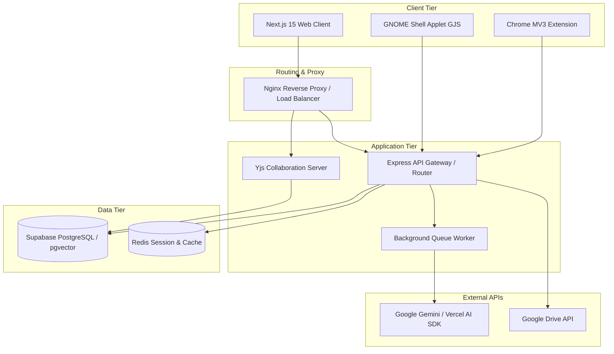

# Cortex — Bilingual Collaborative Academic Second Brain

Cortex is a comprehensive, multi-platform collaborative academic workspace designed for university students. It combines real-time note-taking, a shared academic registry, AI-powered study assistance, habit tracking, and multi-platform study integration (Chrome Extension & GNOME widget).

Developed as a Graduation Project at Menoufia University (Faculty of Electronic Engineering, Computer Science & Engineering Division) for the academic year 2025/2026.

---

## 🌟 Key Features

### 1. Bilingual Collaborative Rich Text Editor
* **Slate.js & Plate.js Canvas:** A robust block-based editor featuring 20+ plugins, slash commands, and inline AI assistance.
* **Real-time Sync (Yjs):** Keystrokes are converted to binary-serialized updates and synchronized with active collaborators via WebSockets.
* **Myers Diff Version History:** Automated document snapshots saved every 30 seconds with delta comparison highlighting additions (green) and deletions (red).

### 2. AI Study Assistant & Semantic Search (RAG)
* **Intelligent RAG Pipeline:** Documents are chunked (800 chars with 150-char overlap), embedded using Google Gemini (`gemini-embedding-001`), and queried with `pgvector` cosine similarity (`match_notes`).
* **Multi-Model Orchestration:** Supports Google Gemini, OpenAI, Anthropic, and Groq APIs with automatic intent classification using Vercel AI SDK.
* **AI Copilots:** Includes an Editor AI writer, Note AI summarizer, and a Global Library Assistant.

### 3. Academic Registry & Resource Catalog
* **Hierarchical Topology:** Organizes university data from Universities → Colleges → Majors → Year Levels → Courses → Resources.
* **Google Drive Embedding:** Native rendering of slides and papers inside Next.js with secure `iframe` viewers and average rating database triggers.
* **Admin Verification workflow:** Student/faculty credentials upload, admin verification queue, and automated role/permission escalations.

### 4. Daily Planner & Productivity Analytics
* **Habit Streaks:** SQL Common Table Expressions (CTEs) and window functions calculate active and longest streaks directly on PostgreSQL.
* **Optimistic Updates:** Task toggles and planner edits execute optimistically on the client using TanStack Query.
* **Social Study Groups:** Student groups, friend lists, and a live study leaderboard ranked by focus minutes and contribution points.

### 5. Multi-Platform Extensions
* **Chrome Extension (MV3):** Background service worker tracking study timers, logging sessions, and using `declarativeNetRequest` rules to block distracting domains.
* **GNOME Shell Applet (GJS):** Native Linux desktop menu-bar widget showing active Pomodoro progress and remaining minutes, with automatic GNOME system dark/light theme icon switching.

---

## 🏗️ System Architecture

Cortex uses a highly decoupled three-tier system architecture:



---

## 📁 Repository Structure

```
├── backend/            # Express.js & TypeScript API Backend
│   ├── src/
│   │   ├── controllers/ # Request validation and router binding
│   │   ├── services/    # Business logic & external API integration
│   │   ├── repositories/# Database data access layers
│   │   └── server.ts
├── frontend/           # Next.js 15 Web Application
│   ├── app/            # App router setup with next-intl bilingual routing
│   ├── components/     # UI elements (Plate.js canvas, modals, search)
│   └── messages/       # English (en.json) & Arabic (ar.json) dictionaries
├── supabase/           # Supabase Database schema and migrations
│   ├── migrations/     # 44 migrations covering tables, functions, & RLS
├── extension/          # Chrome MV3 extension (Pomodoro & Site Blocker)
├── gnome-extension/    # GNOME Shell status applet (GJS)
└── docs/               # Detailed Project Graduation Documentation
```

---

## 📚 Graduation Documentation Index

Detailed documentation for each of the 7 presentation chapters is located in the [docs/](./docs/) directory:

| Section | Title | Technical Reference | Presentation Script |
|---|---|---|---|
| **1** | System Architecture & Technology Decisions | [section_1_technical.md](./docs/section_1_technical.md) | [section_1_presentation.md](./docs/section_1_presentation.md) |
| **2** | Authentication & User Profiles | [section_2_technical.md](./docs/section_2_technical.md) | [section_2_presentation.md](./docs/section_2_presentation.md) |
| **3** | Collaborative Note-taking & Rich Text Editing | [section_3_technical.md](./docs/section_3_technical.md) | [section_3_presentation.md](./docs/section_3_presentation.md) |
| **4** | AI-Powered Academic Assistant & RAG | [section_4_technical.md](./docs/section_4_technical.md) | [section_4_presentation.md](./docs/section_4_presentation.md) |
| **5** | Academic Registries & Resource Catalog | [section_5_technical.md](./docs/section_5_technical.md) | [section_5_presentation.md](./docs/section_5_presentation.md) |
| **6** | Daily Planner, Habits & Pomodoro | [section_6_technical.md](./docs/section_6_technical.md) | [section_6_presentation.md](./docs/section_6_presentation.md) |
| **7** | Admin Panel, Deployment, i18n & Extension | [section_7_technical.md](./docs/section_7_technical.md) | [section_7_presentation.md](./docs/section_7_presentation.md) |

For a complete layout map, see the [Documentation Index README](./docs/README.md).

## 🛠️ Getting Started

For a comprehensive step-by-step guide on how to configure your local environments, spin up the frontend and backend servers concurrently, and load the Chrome and GNOME extensions, please refer to the:

👉 **[Local Running and Development Guide (DEVELOPMENT.md)](./DEVELOPMENT.md)**