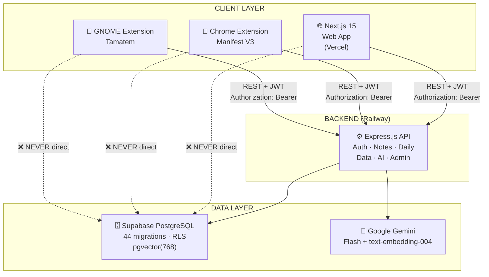
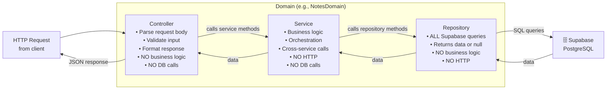
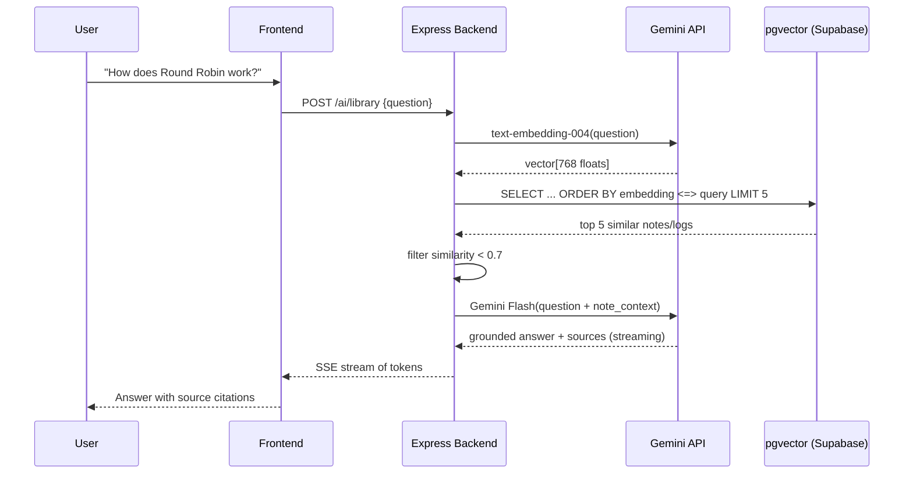
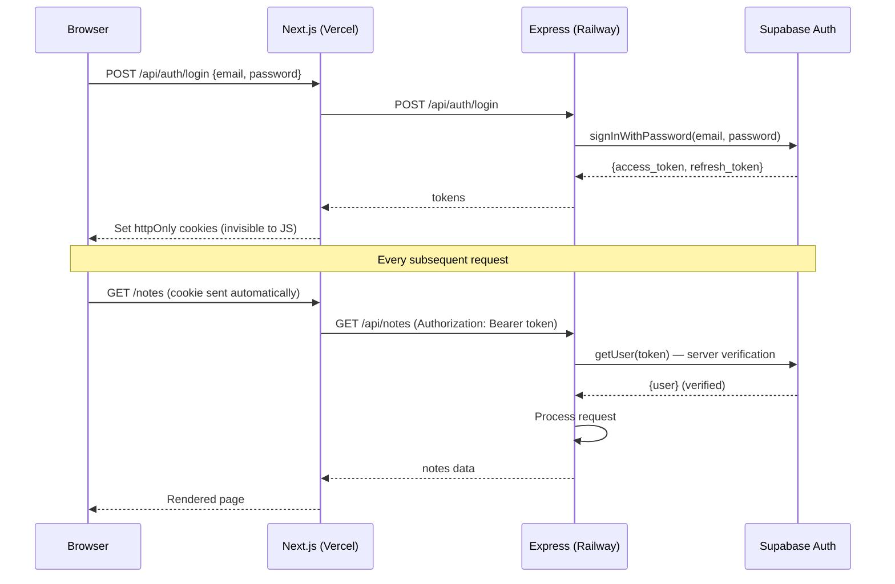
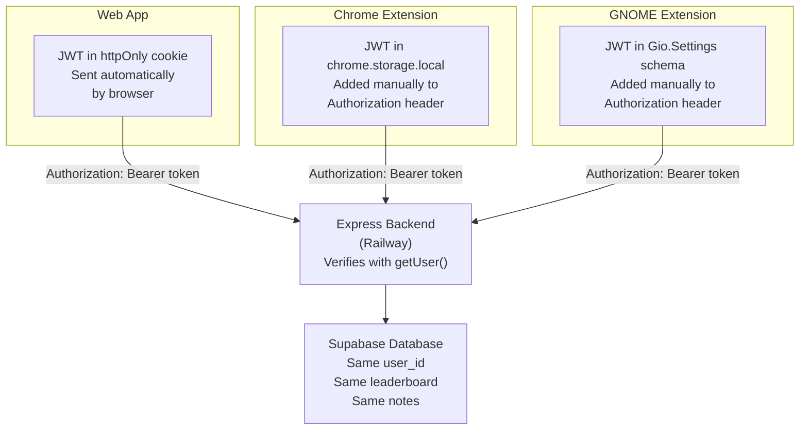
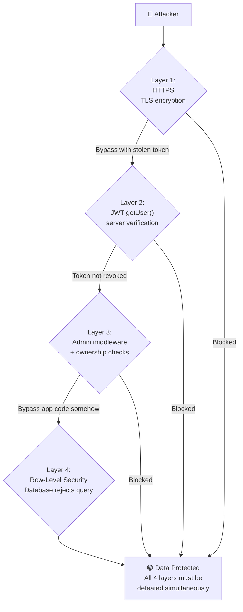

# Section 1 — Master Study Guide
# System Architecture, Technology Decisions & Project Vision
### Cortex — Bilingual AI-Powered Academic Workspace

> **How to use this guide:**
> Read through it once, then use the flash questions at the end of each section as self-tests. Before the presentation, run through the Q&A bank until every answer is instant and confident. This section is yours to own — you are the architect. You understand the *why* behind everything.

> **🇪🇬 ازاي تستخدم الـ guide ده:**
> اقراه مرة كاملة أول حاجة، وبعدين استخدم الـ flash questions في آخر كل section كـ self-test. قبل الـ presentation، كرّر الـ Q&A bank لحد ما كل إجابة بتيجي بسرعة وبثقة. الـ section ده بتاعك انت — انت الـ architect. انت اللي فاهم الـ why وراء كل حاجة.

---

## PART 0 — THE BIG PICTURE (Own This First)

### What Is Cortex, in One Sentence?
Cortex is a unified, bilingual, AI-powered academic workspace for Egyptian university students — replacing five disconnected apps with one coherent system.

> **🇪🇬 جملة واحدة:** Cortex هو workspace أكاديمي موحّد وـ bilingual ومدعوم بالـ AI للطلبة المصريين — بيحل محل خمس apps منفصلة بـ system واحد متكامل.

### What Makes Cortex Different From Other Note Apps?
Three things:
1. **Integration** — five complete systems that share data, context, and intelligence
2. **AI grounded in YOUR notes** — not the internet, not generic training data
3. **Cross-platform beyond the browser** — a native GNOME Shell extension in the Linux desktop itself

> **🇪🇬 الفرق عن باقي الـ apps:**
> 1. **Integration** — خمس systems كاملة بتشارك data وـ context وذكاء مع بعض
> 2. **AI من notes بتاعتك** — مش من الإنترنت، مش من training data عامة
> 3. **Cross-platform فعلي** — GNOME Shell extension في الـ Linux desktop نفسه

### The Five Problems It Solves
| Tool students use | Problem | Cortex replaces it with |
|-------------------|---------|------------------------|
| Google Docs | No AI, no structure, disconnected from courses | Notes System with inline AI |
| WhatsApp group | Expires, unsearchable, unorganized | Resource Registry |
| Phone timer app | Knows nothing about study context | Pomodoro with subject labeling + leaderboard |
| Phone calendar | Disconnected from notes and study data | Daily Journal with AI embeddings |
| ChatGPT | Knows nothing about YOUR notes | Library Assistant (RAG over YOUR library) |

### The One Architectural Rule
```
Client → Express Backend → Supabase   ✅ ALWAYS
Client → Supabase directly            ❌ NEVER
```
Memorize this. It is the answer to a dozen different questions.

> **🇪🇬 القاعدة الوحيدة:** كل client — web app، Chrome extension، GNOME extension — لازم يعدي على الـ Express backend. ما حدش بيكلم الـ database مباشرة. أبداً. ليه؟ عشان الـ service role key بتاع Supabase — اللي بيتجاوز كل الـ security — بيعيش بس على الـ Railway server. لو client وصل للـ database مباشرة، ده تهديد أمني خطير.

---

## PART 1 — THE FIVE SYSTEMS

### 1.1 Collaborative Notes

**What it is:** A full rich-text writing environment, not a text file.

**Editor technology:** Plate.js (built on Slate.js)
- Produces **structured JSON** (not HTML — this matters for AI)
- Every block = a typed JSON node with children
- 20+ plugins: headings, code blocks, tables, images, checklists, embeds

**Key features:**
- `/` slash command → insert any block type
- `/ai` command → AI panel opens inline, writes/edits/comments directly in the document
- `Ctrl+J` → AI acts on selected text
- Auto-save: debounced 2-second timer (user never manually saves)

**Organization:**
- Nested folders (folders inside folders)
- Color-coded tags + filter bar
- Archive system: soft delete with restore, or permanent delete

**Collaboration:**
- Share with specific users → viewer or editor permission
- Publish publicly → shareable URL, accessible without login

**AI sidebar tools (three buttons):**
1. **Summarize** — local extractive algorithm, no API call, instant
2. **Suggest Tags** — local NLP word frequency analysis, no API call
3. **Embed** — calls Gemini `text-embedding-004`, stores `vector(768)` in database

**Why Plate.js and not Quill?**
Plate.js → JSON tree → easily walkable by the backend to extract plain text for AI
Quill → HTML → must parse and strip tags → fragile and unreliable

---

### 1.2 University Resource Registry

**What it is:** A structured, admin-managed catalog of the university's academic content.

**Hierarchy:**
```
University → College → Major → Year Level → Course → Resources + Doctors
```

**Per course:**
- Resources: PDFs, links, videos (uploaded by admins)
- Doctors: professors who teach the course
- Both `name_en` and `name_ar` for every entity

**Profile personalization:**
- After profile setup (university + college + major), the catalog auto-filters to the student's curriculum
- The student sees their courses front and center, not buried under other departments

**Admin-only writes:** Students browse and download. Only admins can add/edit/delete catalog content.

**Database schema key:**
```
universities (id, name_en, name_ar)
  └── colleges (id, university_id, name_en, name_ar)
        └── majors (id, college_id, name_en, name_ar)
              └── year_levels (id, major_id, level)
                    └── courses (id, year_level_id, code, name_en, name_ar, credits)
                          ├── resources (id, course_id, title, type, url)
                          └── course_doctors (course_id, doctor_id)
```

---

### 1.3 Daily Journal & Calendar

**What it is:** A per-day structured workspace that builds a semester-long academic diary.

**Three components per day:**
1. **Rich text note** — same Plate.js editor as the notes system
2. **Task list** — JSONB in the database; optimistic UI (checkbox responds instantly)
3. **Highlight** — "your best achievement today" (journaling habit)

**Calendar view:** A dot appears on every date where an entry exists. Click any date = open that day's log.

**The AI connection (critical to understand):**
Every time a daily log is saved, `syncLogEmbedding()` runs asynchronously. It converts the log's `content_text` to a `vector(768)` and stores it in the `daily_logs.embedding` column. Later, the Library Assistant searches BOTH notes and daily logs by vector similarity. You can ask "what was I studying last Tuesday?" and it finds the relevant entry by meaning, not keyword.

**`UNIQUE(user_id, log_date)`** constraint in the database — one row per user per day.

---

### 1.4 Habits, Pomodoro & Social Leaderboard

**Habits:**
- User defines habits with frequency: daily, weekly, monthly, or custom (e.g., specific days of the week)
- `target_days int[]` in the database stores which days the habit applies
- Streak calculation: SQL CTEs and window functions group consecutive logged days

**Pomodoro:**
- 25 min focus → 5 min break → repeat 4 times → 15 min long break
- Every session logged to `pomodoro_sessions` with: `user_id`, `subject`, `duration_minutes`, `source` ('web' | 'chrome' | 'gnome'), `completed_at`

**Social layer:**
- Friend requests via `friendships` table (`requester_id`, `addressee_id`, `status`: pending/accepted/blocked)
- Study groups: create a group, start a shared session
- Weekly leaderboard: `get_friends_leaderboard()` SQL RPC function aggregates focus minutes since last Monday, then resets

**Cross-client sync:** Sessions logged from Chrome extension or GNOME extension carry the same `user_id`. They appear on the same leaderboard as web sessions.

---

### 1.5 AI Library Assistant (RAG)

**RAG = Retrieval-Augmented Generation**

The full pipeline, step by step:
```
1. User asks a question in natural language
   ↓
2. Embed the question → text-embedding-004 → vector(768)
   ↓
3. pgvector cosine search:
   SELECT ... ORDER BY embedding <=> $query_vector LIMIT 5
   WHERE user_id = $user_id
   ↓
4. Filter: discard results with similarity < 0.7
   ↓
5. Build context string from top-N results
   ↓
6. Send to Gemini Flash:
   "Answer ONLY from these notes. Cite sources."
   ↓
7. Stream grounded answer with source citations
```

**Why this is better than ChatGPT:**
ChatGPT answers from training data — generic, may not match your professor's explanations.
Library Assistant answers from YOUR notes — specific to what YOU studied, how YOUR professor taught it.

---

## PART 2 — THE TWO EXTENSIONS

### 2.1 Chrome Extension — Cortex Focus

**Standard:** Manifest V3 (the current, modern Chrome extension standard)

**Five tabs:**
1. Timer — Pomodoro timer
2. Blocker — site blocking management
3. Social — friends' current focus status
4. History — past sessions
5. Settings — link to Cortex account

**How the timer works:**
- Runs in a **background service worker** (not the popup)
- Chrome's `alarms` API fires tick events with precision even when the browser is minimized
- The popup is just a UI — close it, the timer keeps running

**How the blocker works:**
- `chrome.declarativeNetRequest` — NOT a content script or JavaScript overlay
- Adds `block` rules as dynamic rules when a session starts
- Removes rules when session ends
- Blocks at the HTTP level — browser never initiates the connection to the blocked domain
- Cannot be bypassed by the user

**Authentication:**
- JWT stored in `chrome.storage.local`
- Included in `Authorization: Bearer <token>` header on every API call
- Same JWT as the web app — one login, one account

### 2.2 GNOME Extension — Tamatem (`tamatem@frey.dev`)

**What is GNOME?** The desktop environment on Ubuntu, Fedora, and most Linux distributions. Computer science students often run Linux as their primary OS.

**What Tamatem does:**
- Persistent Pomodoro timer in the **system top bar** (always visible, no browser tab required)
- OS-level site blocking (hosts/DNS modification — not browser-specific)
- Session sync to Cortex backend via `Soup.Session` (GNOME's HTTP library)

**Technology:** GJS (GNOME JavaScript), GNOME Shell APIs (`St.Label`, `GLib`, `Gio.Settings`, `Soup.Session`)

**Authentication:** JWT stored in GNOME's `Gio.Settings` schema. Included as `Authorization: Bearer <token>` in every API call.

**Shell versions supported:** GNOME Shell 48–50

**Why this matters:** A student can study on their Linux desktop without a browser open, still log sessions, still appear on the leaderboard. Cortex reaches beyond the browser entirely.

---

## PART 3 — THE ARCHITECTURE

### 3.1 The One Rule (Again — It's That Important)

```
Frontend (any client)
    ↓  REST + JWT
Express Backend (Railway)
    ↓  Supabase service role key
Supabase Database
```

**Why?** The Supabase service role key bypasses ALL RLS policies. It must never reach a client. It lives only on Railway.

### 3.2 Three-Layer Backend Pattern

Every domain has exactly three files:

| Layer | Responsibility | What it does NOT do |
|-------|---------------|---------------------|
| Controller | Parse HTTP request, validate input, format response | Business logic, database calls |
| Service | Business logic, orchestration, cross-service calls | HTTP handling, database calls |
| Repository | All Supabase queries | Business logic, HTTP handling |

**Seven domains:** Auth, Notes, Daily, Data, AI, Admin, Workspace

**The constraint:** No Supabase import outside a Repository file. Ever.

**Why this matters:**
- Replace the database → change only Repository files
- Test business logic → no database needed
- New team member → learn one domain, understand all seven

### 3.3 Three Clients, One API

All three clients authenticate identically:
- **Web app:** JWT in httpOnly cookie → browser sends automatically
- **Chrome extension:** JWT in `chrome.storage.local` → manually adds to header
- **GNOME extension:** JWT in `Gio.Settings` → manually adds to header

All three call the same Express backend URL with `Authorization: Bearer <token>`. The backend does not know or care which client is calling. It verifies the token and processes the request identically.

---

## PART 4 — TECHNOLOGY DECISIONS

### Master Decision Table

| Technology | Chosen over | The real reason |
|------------|------------|-----------------|
| **Plate.js** | Quill, TipTap | JSON AST → clean AI text extraction. Quill → HTML → fragile parsing. |
| **Gemini** | OpenAI, Anthropic | Best Arabic. 100-400× cheaper. Only provider with both chat AND embedding. |
| **Supabase** | Firebase, raw PostgreSQL | RLS + pgvector + Auth in one service. Firebase = NoSQL, incompatible schema. |
| **Next.js 15** | Vite SPA | Server Components → instant catalog render. Admin guards run server-side. |
| **Separate Express** | Next.js API routes | Service role key isolation. One API for three clients. |
| **declarativeNetRequest** | Content script | Blocks at network layer. Cannot be bypassed. MV3 compliant. |
| **GNOME extension** | Nothing | Linux desktop integration. CS students on Linux. No browser needed. |
| **next-intl** | Manual i18n | First-class Arabic/English from day one. RTL CSS logical properties. |

### Deep Dive: Why Plate.js?

The backend processes note content for AI features. It must extract clean plain text from the document. 

**Plate.js document:**
```json
{"type":"doc","children":[
  {"type":"h1","children":[{"text":"OS Chapter 5"}]},
  {"type":"p","children":[{"text":"CPU scheduling..."}]}
]}
```
Extract plain text: recursive tree walk, collect all `text` leaves. Deterministic. Fast. Always correct.

**Quill document:**
```html
<h1>OS Chapter 5</h1>
<p>CPU scheduling...</p>
<pre class="ql-syntax">...</pre>
```
Extract plain text: parse HTML, strip tags, handle `ql-syntax`, handle `<br>` vs `\n`, handle special characters. Fragile. Breaks with new block types.

**This single decision enabled every AI feature.**

### Deep Dive: Why Gemini?

Three winning factors:
1. **Arabic quality** — tested with academic Arabic text from Egyptian university materials. Gemini consistently produced better comprehension and generation than OpenAI or Anthropic at equivalent settings.
2. **Cost** — Gemini Flash: $0.075 / million tokens. GPT-4: $10–30 / million tokens. That is 130–400× more expensive. For a student platform where we pay per AI call, this is the difference between viability and bankruptcy.
3. **Both chat AND embeddings** — Anthropic has no embedding model. Without an embedding model, there is no RAG, no Library Assistant. OpenAI has embeddings but at a higher cost tier. Gemini's `text-embedding-004` is high quality and included in the same API key.

### Deep Dive: Why Supabase?

Three specific capabilities:

**1. Row-Level Security (RLS)**
Policies are SQL expressions attached to each table. They execute at the database level, not the application level.

```sql
-- Even if the app code makes a wrong query, the database rejects it
CREATE POLICY "notes_select" ON notes FOR SELECT
  USING (user_id = auth.uid() OR is_public = true OR 
         id IN (SELECT note_id FROM note_shares WHERE user_id = auth.uid()));
```

**2. pgvector**
PostgreSQL extension for vector similarity search. One line to create a vector column:
```sql
ALTER TABLE notes ADD COLUMN embedding vector(768);
```
And a simple SQL query for semantic search:
```sql
SELECT id, title, 1 - (embedding <=> $query) AS similarity
FROM notes WHERE user_id = $user_id
ORDER BY embedding <=> $query LIMIT 5;
```

**3. Managed Auth**
JWT lifecycle, refresh token rotation, server-side cookie helpers — handled without custom implementation.

**Why not Firebase?** Firebase is a NoSQL document database. Our schema has 44 SQL migrations with complex foreign key relationships, JOINs, and RLS policies. This is fundamentally a relational data model.

### Deep Dive: Why Next.js Server Components?

**Problem with SPA (Vite/React):** The course catalog has hundreds of courses. The browser must:
1. Load HTML
2. Download and parse JavaScript
3. Make API call to fetch catalog data
4. Render the catalog

The user sees a loading spinner for steps 2–4. This is slow and poor UX.

**With Next.js Server Components:** The catalog component is a Server Component. When the browser requests `/data`, Next.js renders the entire catalog to HTML on the server, including all course data. The browser receives finished HTML. Instant display. No JavaScript loading state. No separate data fetch.

**Admin security benefit:** The admin layout has a `requireAdmin()` check. This runs on the server before the admin page is rendered. There is no client-side JavaScript to bypass. A non-admin user requesting `/admin` gets a server-side redirect before a single byte of the admin page is sent.

---

## PART 5 — SECURITY ARCHITECTURE

### Four Layers of Defense

```
┌─────────────────────────────────────────┐
│  Layer 1: HTTPS Everywhere              │
│  TLS encryption on all three platforms  │
└─────────────────────────┬───────────────┘
                          ↓
┌─────────────────────────────────────────┐
│  Layer 2: Authentication                │
│  JWT verified via supabase.auth.getUser │
│  (server-to-server, not just signature) │
└─────────────────────────┬───────────────┘
                          ↓
┌─────────────────────────────────────────┐
│  Layer 3: Authorization                 │
│  Admin middleware, ownership checks     │
│  in Service layer                       │
└─────────────────────────┬───────────────┘
                          ↓
┌─────────────────────────────────────────┐
│  Layer 4: Row-Level Security            │
│  Database rejects unauthorized queries  │
│  even if layers 1–3 are bypassed        │
└─────────────────────────────────────────┘
```

### getUser() vs getSession() — Know This Difference

| Method | Verification | Security |
|--------|-------------|---------|
| `supabase.auth.getSession()` | Reads cookie locally, does NOT verify with server | JWT might be forged or revoked; local trust |
| `supabase.auth.getUser(token)` | Makes server-to-server call to Supabase; cryptographically verifies + checks revocation | Strong: cannot be spoofed |

Cortex **always uses `getUser()`** for server-side session validation. Never `getSession()`.

### httpOnly Cookies

The JWT on the web app is stored in an httpOnly cookie.
- **httpOnly** = JavaScript cannot read it (not via `document.cookie` or `fetch`)
- XSS attack that injects JavaScript cannot steal the token
- Cookie is sent automatically by the browser on every request
- Cookie attributes: `httpOnly: true`, `secure: true`, `sameSite: 'lax'`

### The Service Role Key

Supabase's service role key bypasses ALL RLS policies. It can read and modify any data in the database.

**Where it lives:** Railway environment variable `SUPABASE_SERVICE_ROLE_KEY`
**Where it does NOT live:** Vercel, any client code, Chrome extension, GNOME extension

This is not an oversight — it is an explicit architectural constraint enforced by the one rule.

---

## PART 6 — DEPLOYMENT

### Three-Platform Deployment

| Platform | What it hosts | Key detail |
|----------|-------------|------------|
| **Vercel** | Next.js frontend | Global CDN, auto-deploy on git push, only has `NEXT_PUBLIC_*` env vars |
| **Railway** | Express backend | Docker container, auto-restart on crash, has the service role key |
| **Supabase** | Database + Auth | Managed PostgreSQL, 44 migrations, pgvector, Auth |

### Environment Variable Isolation (Critical Security)

`NEXT_PUBLIC_` prefix in Next.js means the variable is bundled into client-side JavaScript. These are **public** by design:
- `NEXT_PUBLIC_API_URL` — the Express backend URL (public)
- `NEXT_PUBLIC_SUPABASE_URL` — Supabase project URL (public)
- `NEXT_PUBLIC_SUPABASE_ANON_KEY` — Supabase anon key (safe to expose; RLS protects the data)

Non-prefixed variables on Railway are **server-only**:
- `SUPABASE_SERVICE_ROLE_KEY` — bypasses RLS; must NEVER reach the client
- `GEMINI_API_KEY` — AI API billing key
- `DATABASE_URL` — direct database connection string

### The API Proxy (CORS Solution)

Next.js rewrites proxy `/api/*` calls through the Vercel domain:
```javascript
// next.config.ts
rewrites: () => [{
  source: '/api/:path*',
  destination: `${process.env.NEXT_PUBLIC_API_URL}/api/:path*`
}]
```
The browser calls `/api/notes` → Next.js forwards to Railway's Express server. The browser never sees the Railway URL. No CORS preflight for cross-origin calls.

---

## PART 7 — DATABASE SCHEMA REFERENCE

### Core Tables You Must Know

**`profiles`** — one per user, extends `auth.users`
```sql
id uuid                    -- matches auth.users(id)
name text
role text                  -- 'user' | 'admin'
university_id, college_id, major_id uuid (foreign keys)
year_level int
```
Created by a **database trigger** when user registers (INSERT on auth.users → trigger → INSERT on profiles).

**`notes`** — the note document
```sql
id uuid
user_id uuid               -- owner
title text
content jsonb              -- Plate.js JSON AST
content_text text          -- extracted plain text (for AI)
embedding vector(768)      -- null until user embeds
is_public boolean          -- publishable without login
is_archived boolean
folder_id uuid
```

**`daily_logs`** — one per user per day
```sql
id uuid
user_id uuid
log_date date
content jsonb              -- Plate.js JSON
content_text text
highlight text
tasks jsonb                -- [{id, text, completed, order}]
embedding vector(768)      -- filled by syncLogEmbedding()
UNIQUE(user_id, log_date)
```

**`pomodoro_sessions`** — one per session
```sql
id uuid
user_id uuid
subject text
duration_minutes int
source text                -- 'web' | 'chrome' | 'gnome'
completed_at timestamptz
```

**`habits`** + **`habit_logs`**
```sql
-- habits
frequency text             -- 'daily' | 'weekly' | 'monthly' | 'custom'
target_days int[]          -- e.g., [1,2,3,4,5] = weekdays only

-- habit_logs
habit_id uuid
log_date date
```

**`note_shares`**
```sql
note_id uuid
user_id uuid
permission text            -- 'viewer' | 'editor'
```

**`friendships`**
```sql
requester_id uuid
addressee_id uuid
status text                -- 'pending' | 'accepted' | 'blocked'
```

---

## PART 8 — THE AI SYSTEM IN DEPTH

### Three AI Layers

| Layer | Name | Trigger | Uses API? | Speed |
|-------|------|---------|-----------|-------|
| 1 | Editor AI | `/ai` command or `Ctrl+J` | Yes — streams | Realtime streaming |
| 2a | Summarize | Sidebar button | No — local algorithm | Instant |
| 2b | Suggest Tags | Sidebar button | No — local NLP | Instant |
| 2c | Embed Note | Sidebar button | Yes — text-embedding-004 | ~1 second |
| 3 | Library Assistant | Library modal | Yes — both embedding + Gemini | ~2–4 seconds |

### Layer 1: Editor AI in Detail

**Intent classification first:**
```typescript
const { object } = await generateObject({
  schema: z.object({
    action: z.enum(['generate', 'edit', 'comment']),
    hasSelection: z.boolean()
  }),
  prompt: `User prompt: "${prompt}". Selected text: "${selection || 'none'}"`
});
```

Based on the classified intent:
- `generate` → "Write new content based on this prompt"
- `edit` → "Transform the selected text as requested"
- `comment` → "Add explanatory annotations to the selected text"

Then `streamText()` streams the response token-by-token into the document.

### Layer 2a: Summarize (Local Extractive)

```
1. Split content_text into sentences
2. Score each sentence by TF-IDF:
   - Count meaningful word occurrences
   - Weight words appearing in headings higher
3. Select top 5 sentences by score
4. Return them in original reading order
```
No API call. Runs in milliseconds. Free.

### Layer 2b: Tag Suggestion (Local NLP)

```
1. Tokenize content_text (split on whitespace and punctuation)
2. Filter out common English/Arabic stopwords
3. Count remaining term frequencies
4. Return top-N terms (sorted by frequency)
```
No API call. Runs in milliseconds. Free.

### Layer 3: Library Assistant RAG Pipeline

**The embedding model:** `text-embedding-004` (Google's production embedding model)
- Produces 768-dimensional vectors
- Trained to encode semantic meaning — similar texts → similar vectors

**pgvector similarity search:**
```sql
SELECT id, title, content_text,
       1 - (embedding <=> $query_vector) AS similarity
FROM notes
WHERE user_id = $user_id
  AND embedding IS NOT NULL
ORDER BY embedding <=> $query_vector
LIMIT 5;
```
`<=>` is the pgvector cosine distance operator. `1 - cosine_distance = cosine_similarity`. Values near 1.0 = very similar. Values near 0.0 = unrelated.

**The similarity threshold:** Results with similarity < 0.7 are discarded. This prevents false positives — returning notes that are mathematically close but not actually relevant.

**The system prompt for grounded answers:**
```
You are an academic assistant. Answer the user's question using ONLY the provided notes.
For each fact, cite which note it came from using: [Source: Note Title].
If the notes do not contain enough information, say so clearly.
Do not use knowledge outside the provided notes.
```

**The daily log embedding:** `syncLogEmbedding()` runs asynchronously after every log save. It extracts `content_text` from the log, calls `text-embedding-004`, and stores the result in `daily_logs.embedding`. Daily logs are included in Library Assistant searches alongside notes.

---

## PART 9 — NUMBERS TO KNOW

| Metric | Value | Why it matters |
|--------|-------|----------------|
| Database migrations | 44 | Entire schema history, version-controlled |
| Backend domains | 7 | Auth, Notes, Daily, Data, AI, Admin, Workspace |
| API endpoints | 50+ | Full platform coverage |
| Frontend routes | 15+ | App Router, SSR, admin-guarded |
| Plate.js plugins | 20+ | Rich text capabilities |
| AI layers | 3 | Editor, Note Tools, Library Assistant |
| AI providers supported | 4 | OpenAI, Anthropic, Groq, Google |
| i18n keys per language | 200+ | Complete bilingual coverage |
| Client applications | 3 | Web, Chrome, GNOME |
| Deployment platforms | 3 | Vercel, Railway, Supabase |
| TypeScript lines | 15,000+ | Full-stack, typed throughout |
| Vector dimensions | 768 | text-embedding-004 output |
| JWT access token lifetime | 1 hour | Auto-refreshed by middleware |
| JWT refresh token lifetime | 60 days | User stays logged in passively |

---

## PART 10 — FLASH QUESTIONS (Self-Test)

> **🇪🇬 ازاي تستخدم الـ section ده:** اقرا الـ ❓ الأول وحاول تجاوب بسرعة من داخلك، بعدين شوف الـ ✅ تحته تتأكد. لو الإجابة متجيتش فوراً، ارجع للـ Part المناسب وذاكر.

### Architecture
❓ What is the one architectural rule that governs all client-database communication?
✅ All clients go through the Express backend. No client ever calls Supabase directly.

> **🇪🇬 عربي:** كل client لازم يعدي على الـ Express backend. ما حدش client يكلم Supabase مباشرة.

❓ Why does this rule exist?
✅ The Supabase service role key bypasses all RLS policies. It must live exclusively on the server (Railway). If any client had direct Supabase access with this key, a bug or attack could expose any data in the database.

> **🇪🇬 عربي:** الـ service role key بتاع Supabase بيتجاوز كل الـ RLS policies. لازم يعيش بس على Railway. لو client وصله، أي bug أو هجوم ممكن يفضح كل الـ data في الـ database.

❓ What are the three layers of the backend, and what is each responsible for?
✅ Controller (HTTP: parse request, format response), Service (business logic, orchestration), Repository (all database calls, nothing else).

> **🇪🇬 عربي:** Controller — بيتعامل مع HTTP. Service — بيتعامل مع الـ business logic. Repository — بيتعامل مع الـ database بس. محدش يعدي على دوره.

❓ What happens if you put a Supabase query in a Controller?
✅ This violates the three-layer pattern. Database logic in the Controller makes it impossible to test business logic in isolation, and mixes concerns that should be separate.

> **🇪🇬 عربي:** ده بيكسر الـ pattern. الـ database logic في الـ Controller بيخلي الـ business logic مستحيل testing بشكل isolated.

### Technology
❓ Why Plate.js over Quill?
✅ Plate.js produces structured JSON — the backend can walk the tree to extract clean text for AI. Quill produces HTML — parsing HTML for AI input is fragile and error-prone.

> **🇪🇬 عربي:** Plate.js بينتج JSON منظم — الـ backend يمشي عليه ويطلع plain text للـ AI. Quill بينتج HTML — الـ parsing هش وبيتكسر مع أي block type جديد.

❓ Name three reasons we chose Google Gemini.
✅ Best Arabic language quality, dramatically cheaper (100–400× less than GPT-4), and the only major provider offering both quality chat AND quality embedding models in one API.

> **🇪🇬 عربي:** أحسن عربي في الـ AI، أرخص 100-400 ضعف من GPT-4، والوحيد اللي عنده chat model كويس وembedding model كويس في نفس الـ API.

❓ Why is a separate Express backend better than Next.js API routes for this project?
✅ Two reasons: (1) Service role key must be isolated from Vercel; API routes run on Vercel next to the frontend. (2) Three separate clients need one API; that API should not be a Next.js implementation detail.

> **🇪🇬 عربي:** سببين. (1) الـ service role key لازم يبقى بعيد عن Vercel. (2) تلات clients مختلفين محتاجين API واحد مشترك، مش implementation detail جوّا Next.js.

❓ Why does Next.js improve catalog performance over a Vite SPA?
✅ Server Components render the catalog to HTML on the server. The browser receives finished HTML instantly — no JavaScript loading state, no separate data fetch needed.

> **🇪🇬 عربي:** Server Components بتـrender الـ catalog كـ HTML على الـ server. الـ browser بياخد HTML جاهز فوراً — ما فيش loading state ولا API call منفصل.

❓ What is `declarativeNetRequest` and why did we use it?
✅ Chrome's Manifest V3 API for network-level site blocking. It blocks at the HTTP request level — the browser never initiates the connection. Cannot be bypassed by the user. Content-script overlays can be bypassed; `declarativeNetRequest` cannot.

> **🇪🇬 عربي:** Chrome API بيحجب المواقع على مستوى الـ HTTP request — الـ browser ما بيبداش الاتصال خالص. ما فيش JavaScript trick تيتفادىه زي content script.

### Security
❓ What is the difference between `getSession()` and `getUser()`?
✅ `getSession()` reads the JWT from the local cookie without verifying it with Supabase's servers — a manipulated cookie could pass. `getUser(token)` makes a server-to-server call to cryptographically verify the JWT AND check it hasn't been revoked. Cortex always uses `getUser()`.

> **🇪🇬 عربي:** `getSession()` بيقرا الـ JWT من الـ cookie محلياً من غير ما يتأكد من Supabase. `getUser()` بيتصل بـ Supabase ليتحقق cryptographically ويتأكد إنه ماتمتش revoked. احنا بنستخدم `getUser()` دايماً.

❓ What makes httpOnly cookies more secure than `localStorage` for JWT storage?
✅ httpOnly cookies are invisible to JavaScript. An XSS attack that injects JavaScript cannot access `document.cookie` to steal the token. `localStorage` is accessible to any JavaScript on the page.

> **🇪🇬 عربي:** httpOnly cookie ما بيشوفهاش الـ JavaScript خالص. لو في XSS attack، الـ JavaScript المحقون ما يقدرش يسرق الـ token. الـ localStorage متاح لأي JavaScript.

❓ What are Row-Level Security policies?
✅ SQL expressions attached to database tables that execute at the PostgreSQL level on every query. Even if application code makes an incorrect query, the database rejects it if it violates the policy. Defense in depth.

> **🇪🇬 عربي:** شروط SQL مربوطة بجداول الـ database، بتتنفّذ على مستوى PostgreSQL على كل query. حتى لو في بع في الـ app code، الـ database بيرفض الـ query لو بتكسر الـ policy.

❓ What are the four layers of security defense in Cortex?
✅ (1) HTTPS everywhere, (2) JWT verification via `getUser()`, (3) Admin middleware and ownership checks, (4) Row-Level Security at the database level.

> **🇪🇬 عربي:** (1) HTTPS في كل حتة، (2) JWT verification عن طريق `getUser()`، (3) Admin middleware وتحقق من الملكية، (4) RLS على مستوى الـ database.

### Extensions
❓ How does the Chrome extension keep the timer running when the popup is closed?
✅ The timer runs in a background service worker, not the popup. Chrome's `alarms` API fires tick events at precise intervals even when the popup is closed and Chrome is minimized.

❓ What is the GNOME extension and who is it for?
✅ Tamatem (`tamatem@frey.dev`) is a GNOME Shell extension for Linux desktop users. It puts a persistent Pomodoro timer in the Linux system top bar, blocks sites at the OS level, and syncs sessions to the same Cortex backend. CS students on Linux (Ubuntu, Fedora) get native desktop integration without needing a browser tab open.

❓ How do three different clients (web, Chrome, GNOME) share the same leaderboard?
✅ All three store the user's JWT and send it as `Authorization: Bearer <token>` to the same Express backend. The backend verifies the token, finds the user ID, and logs the session to `pomodoro_sessions`. The leaderboard query aggregates all sessions by `user_id`, regardless of which client logged them.

### AI
❓ What is RAG?
✅ Retrieval-Augmented Generation. Instead of asking an AI to answer from its training data, you first retrieve relevant content from a knowledge base (using semantic search), then ask the AI to answer based only on that retrieved content. The answer is grounded in specific sources, not general knowledge.

❓ What is a text embedding?
✅ A mathematical representation of text as a vector of numbers (768 floats in our case). Texts with similar meanings produce vectors that are close together in mathematical space. This enables "search by meaning" — finding relevant text without exact keyword matches.

❓ Why can the Library Assistant sometimes be more useful than ChatGPT for studying?
✅ The Library Assistant answers from the student's own notes — meaning the answers reflect the student's specific professor's explanations, the student's own examples, and what was actually taught in their courses. ChatGPT answers from general training data, which may be generic or not match the professor's specific approach.

❓ What does `syncLogEmbedding()` do and why is it important?
✅ After every daily log save, it asynchronously converts the log's text to a 768-dimensional vector and stores it in `daily_logs.embedding`. This makes every past day's study session semantically searchable via the Library Assistant — you can ask "what was I studying about scheduling algorithms last week?" and the system finds it by meaning.

### Deployment
❓ What is on Vercel, Railway, and Supabase?
✅ Vercel = Next.js frontend + global CDN. Railway = Express backend (the service role key lives here). Supabase = PostgreSQL database + pgvector + Auth.

❓ Why is the environment variable split important?
✅ `NEXT_PUBLIC_*` variables on Vercel are bundled into client JavaScript — they are public. Non-public secrets (service role key, Gemini API key) must never have the `NEXT_PUBLIC_` prefix and must never be on Vercel. Putting the service role key on Vercel would expose it to anyone who inspects the browser's JavaScript.

❓ What is the API proxy in Next.js, and why does it help?
✅ `next.config.ts` rewrites `/api/*` to the Railway backend URL. The browser sees requests to the Vercel domain — the actual Railway URL is hidden. This also avoids CORS issues from cross-origin requests.

---

## PART 11 — NARRATIVE STORYLINES (For the Presentation)

### The Opening Hook
"We lived this problem. Five tools, zero connection between them. Every context switch loses momentum. We built the system we wished we had."

### The Architecture Hook
"One rule. Everything else is implementation detail. No client touches the database directly. Ever."

### The Plate.js Hook
"A single technology choice — Plate.js over Quill — enabled every AI feature. JSON versus HTML. That is the difference between an AI feature that works reliably and one that breaks on edge cases."

### The Gemini Hook
"We needed Arabic. We needed cost-efficiency at scale. We needed embeddings and chat in one API. Only one provider met all three criteria. Every technical decision has a reason."

### The Extensions Hook
"We built a GNOME Shell extension. Not because it was easy — it was not. Because our users live in their Linux desktop, and we wanted Cortex to live there too. One login. Everywhere."

### The Closing Hook
"44 migrations. 50 API endpoints. Three clients. Three AI systems. Not to impress with numbers — but to show that every one of these exists because a real student need required it."

---

## PART 12 — QUICK REFERENCE CARD

Print or memorize. This is everything you need at a glance.

```
CORTEX AT A GLANCE
════════════════════════════════════════════════════════════

PRODUCT:
  ✦ 5 integrated systems (Notes, Registry, Daily, Habits/Pomodoro, AI)
  ✦ 3 clients (Web App, Chrome Extension, GNOME Extension)
  ✦ Bilingual: Arabic + English, RTL from day one

ARCHITECTURE:
  ✦ Rule #1: Frontend → Express Backend → Supabase (NEVER direct)
  ✦ Rule #2: Service Role Key lives ONLY on Railway
  ✦ Rule #3: RLS protects every table at database level
  ✦ Pattern: Controller → Service → Repository (7 domains)

TECHNOLOGY:
  ✦ Frontend:  Next.js 15 + React 19 + Plate.js + TanStack Query
  ✦ Backend:   Express.js + TypeScript
  ✦ Database:  Supabase PostgreSQL 15 + pgvector vector(768)
  ✦ AI:        Google Gemini (Flash chat + text-embedding-004)
  ✦ Auth:      Supabase Auth (JWT + httpOnly cookies)
  ✦ Chrome:    Manifest V3 + declarativeNetRequest
  ✦ GNOME:     GJS + GNOME Shell APIs (v48-50)
  ✦ Deploy:    Vercel (frontend) + Railway (backend) + Supabase

KEY NUMBERS:
  ✦ 44 SQL migrations     ✦ 7 backend domains
  ✦ 50+ API endpoints     ✦ 15+ frontend routes
  ✦ 3 AI systems          ✦ 4 AI providers supported
  ✦ 200+ i18n keys        ✦ 15,000+ TypeScript lines
  ✦ 768 vector dimensions ✦ 1hr JWT access / 60d refresh

AI PIPELINE:
  1. Question → text-embedding-004 → vector(768)
  2. pgvector cosine search → top-5 similar notes
  3. Filter similarity < 0.7
  4. Notes + question → Gemini Flash (grounded response)
  5. Stream answer + source citations

SECURITY LAYERS:
  1. HTTPS everywhere
  2. getUser() JWT verification (server-to-server)
  3. Admin middleware + ownership checks
  4. RLS at database level

════════════════════════════════════════════════════════════
```

---

## PART 13 — ARCHITECTURE DIAGRAMS (Visual Reference)

### Diagram 1: Full System Architecture



---

### Diagram 2: Three-Layer Backend Pattern



---

### Diagram 3: RAG Pipeline (Library Assistant)



---

### Diagram 4: JWT Authentication Flow



---

### Diagram 5: Three-Client Data Flow



---

### Diagram 6: Security Defense in Depth



---

## PART 14 — TIMED PRESENTATION DRILL

Use this as a self-test before the real presentation. Time yourself. Each item should take no more than the seconds listed.

| Drill item | Target time | Notes |
|------------|-------------|-------|
| State the one architectural rule + why it exists | 30 seconds | "Client → Express → Supabase. Never direct. Because the service role key..." |
| Name all 5 systems with one-sentence descriptions each | 90 seconds | Notes, Registry, Daily, Habits/Pomodoro, Library Assistant |
| Explain why Plate.js over Quill | 45 seconds | JSON vs HTML, AI text extraction |
| Explain 3 reasons Gemini was chosen | 60 seconds | Arabic, cost (100-400×), both chat and embeddings |
| Explain the RAG pipeline in 5 steps | 60 seconds | Question → embed → search → filter → Gemini |
| Name 3 of the 4 security layers | 30 seconds | HTTPS, getUser(), admin middleware, RLS |
| Explain what the GNOME extension does and who it's for | 45 seconds | Linux desktop, top bar timer, CS students |
| State why we didn't use Next.js API routes | 30 seconds | Key isolation + three clients need one API |
| Name the 3 deployment platforms and what each hosts | 30 seconds | Vercel=frontend, Railway=backend, Supabase=database |
| State 5 key project metrics | 30 seconds | 44 migrations, 50+ endpoints, 3 clients, 3 AI systems, 15K+ TS lines |

**Total: ~8 minutes** — your section is 14–16 minutes. The drill covers the most asked-about topics. If you can answer all 10 confidently and quickly, you are ready.

---

## PART 15 — LIKELY COMMITTEE QUESTIONS (Ranked by Probability)

### Very Likely (prepare first)

1. **"What is the advantage of your AI approach over simply using ChatGPT?"**
   The Library Assistant retrieves from the student's own notes using semantic search (RAG), then instructs Gemini to answer ONLY from those notes. The answer reflects the student's specific study materials, their professor's exact terminology, and their personal understanding — not a generic internet answer.

2. **"Why did you build a GNOME extension? Isn't a website enough?"**
   CS students frequently use Linux as their primary environment. A GNOME extension integrates Cortex into their daily workflow — persistent timer in the system bar, site blocking at the OS level — without requiring a browser tab open. It's a competitive differentiator no other academic platform offers.

3. **"How does the system ensure one student cannot see another student's notes?"**
   Three layers. (1) The Express middleware authenticates the JWT and sets `req.user.id`. (2) The Repository layer adds `WHERE user_id = $req.user.id` to all note queries. (3) PostgreSQL Row-Level Security policies reject any query that returns another user's private notes, even if the application code has a bug.

4. **"Why not use Firebase or MongoDB instead of Supabase?"**
   Firebase is a NoSQL document database. Our data model has complex relational structure: 44 migrations, foreign key hierarchies, multi-table JOINs, and RLS policies. These require a relational database. Additionally, Firebase does not support vector similarity search (pgvector). Supabase gives us PostgreSQL, pgvector, Auth, and RLS in a managed service.

5. **"How does the social leaderboard work across different devices and platforms?"**
   All three clients (web, Chrome, GNOME) call `POST /pomodoro/sessions` on the Express backend when a session completes. Each session carries the user's JWT → the backend extracts the user ID → stores the session in `pomodoro_sessions` with the `source` field. The leaderboard query aggregates all sessions by `user_id` since the last Monday, regardless of source.

### Moderately Likely

6. **"What happens if two users edit the same shared note simultaneously?"**
   Currently, last save wins — the note does not support real-time concurrent editing. It is on the roadmap using Supabase Realtime or Yjs CRDTs. For now, this is acceptable for the academic use case where true simultaneous co-editing is rare.

7. **"How did you handle Arabic text in the AI system?"**
   Google Gemini's `text-embedding-004` model and Gemini Flash both support Arabic natively and produce quality results. We tested them with Arabic academic text from Egyptian university materials. The note editor stores Arabic content as Unicode in the JSON AST without any special handling — Arabic is just text. The RTL layout is handled by CSS logical properties, not by the AI layer.

8. **"What is pgvector and how does it work?"**
   pgvector is a PostgreSQL extension that adds a `vector(n)` column type and implements approximate nearest-neighbor search algorithms. We store 768-float vectors in notes and daily logs. When searching, we compute cosine distance between the query vector and every stored vector using `<=>` operator, returning the closest matches. An IVFFlat index speeds this up for large collections.

9. **"How much does this cost to run?"**
   At student project scale: Vercel (free tier), Railway (~$5/month for the Express server), Supabase (free tier — 500MB, 50K MAU), Gemini API (free tier generous for low traffic). Total: approximately $5/month. The Gemini cost is volume-dependent; at production scale, $0.075/M tokens keeps costs predictable.

10. **"Can this platform scale to thousands of students?"**
    The architecture supports it. Vercel's global CDN handles frontend scaling automatically. Railway can scale the Express service vertically or horizontally. Supabase's managed PostgreSQL scales with connection pooling and read replicas. The biggest bottleneck would be Gemini API rate limits and costs at high volume — manageable with caching and rate limiting.

---
