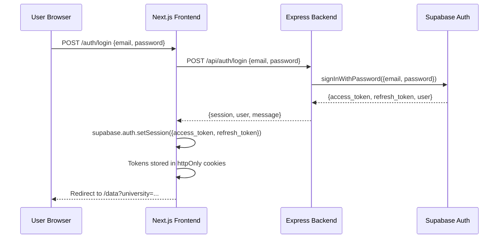
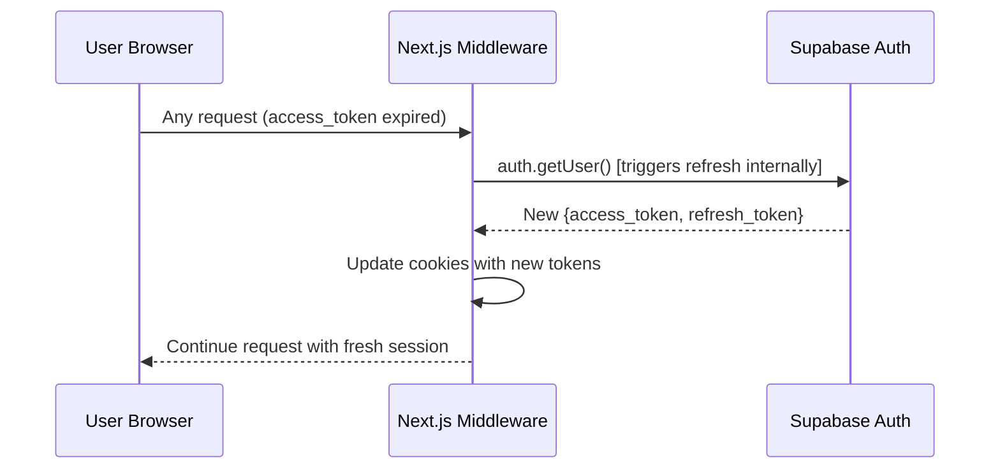
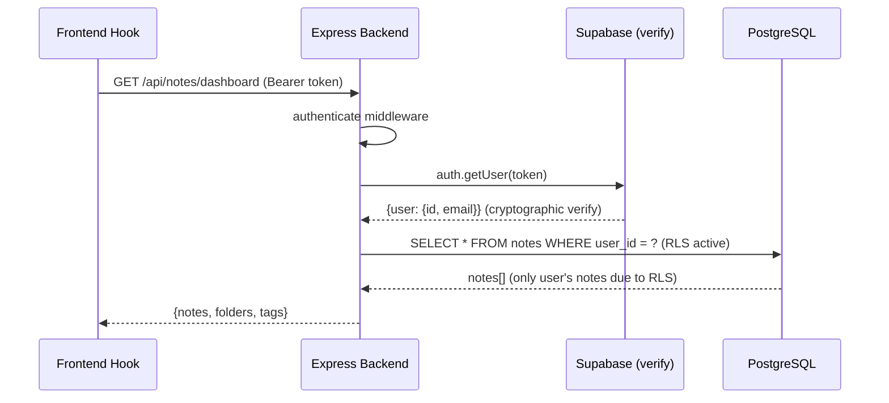

# Section 2 — Technical Reference
# Authentication, Session Management & User Profiles

**Section:** Authentication & User Management  
**System:** Cortex — Bilingual Academic Workspace

---

## 1. Overview

Authentication in Cortex is a two-layer security system. The first layer is **Supabase Auth** — a managed auth service that handles credential storage, JWT issuance, and token refresh. The second layer is the **Express backend middleware** that independently verifies every incoming JWT before any business logic executes.

This two-layer design means that even if a bug existed in the first layer (which it cannot, since Supabase is managed), the second layer would still protect the database. Conversely, all data access is protected by Row-Level Security at the database level — a third layer.

The complete auth flow is:
```
User submits credentials
    → Express AuthController.login()
    → AuthService.login()
    → AuthRepository.signIn() [calls Supabase Auth]
    → Supabase issues {access_token, refresh_token}
    → Frontend stores tokens via Supabase SSR cookie helpers
    → Subsequent requests: Authorization: Bearer <access_token>
    → Express auth middleware: supabase.auth.getUser(token) [server-side verify]
    → req.user = { id, email } attached
    → Controller/Service proceeds
```

---

## 2. Frontend Auth Infrastructure

### 2.1 Two Supabase Client Types

Cortex requires two different Supabase client configurations because Next.js runs code in two distinct environments:

**Browser Client** (`frontend/lib/supabase/client.ts`):
```typescript
import { createBrowserClient } from '@supabase/ssr'

export function createClient() {
  return createBrowserClient(
    process.env.NEXT_PUBLIC_SUPABASE_URL!,
    process.env.NEXT_PUBLIC_SUPABASE_ANON_KEY!
  )
}
```
This client uses the **Anon Key** (safe to expose publicly). It is used in client components for accessing the current session object. It cannot perform admin operations or bypass RLS.

**Server Client** (`frontend/lib/supabase/server.ts`):
```typescript
import { createServerClient } from '@supabase/ssr'
import { cookies } from 'next/headers'

export async function createClient() {
  const cookieStore = await cookies()
  return createServerClient(
    process.env.NEXT_PUBLIC_SUPABASE_URL!,
    process.env.NEXT_PUBLIC_SUPABASE_ANON_KEY!,
    {
      cookies: {
        getAll() { return cookieStore.getAll() },
        setAll(cookiesToSet) {
          cookiesToSet.forEach(({ name, value, options }) =>
            cookieStore.set(name, value, options)
          )
        },
      },
    }
  )
}
```
This server-side client reads the auth session from httpOnly cookies on every server component render. It is also used for session refresh in middleware.

### 2.2 Next.js Middleware — Session Refresh

`frontend/lib/supabase/middleware.ts` runs on **every request** to the Next.js application — before any page is rendered. Its sole job is to refresh the Supabase session if the access_token has expired:

```typescript
export async function updateSession(request: NextRequest) {
  let supabaseResponse = NextResponse.next({ request })

  const supabase = createServerClient(
    process.env.NEXT_PUBLIC_SUPABASE_URL!,
    process.env.NEXT_PUBLIC_SUPABASE_ANON_KEY!,
    {
      cookies: {
        getAll() { return request.cookies.getAll() },
        setAll(cookiesToSet) {
          cookiesToSet.forEach(({ name, value }) => request.cookies.set(name, value))
          supabaseResponse = NextResponse.next({ request })
          cookiesToSet.forEach(({ name, value, options }) =>
            supabaseResponse.cookies.set(name, value, options)
          )
        },
      },
    }
  )

  // This call refreshes the session if expired
  await supabase.auth.getUser()
  return supabaseResponse
}
```

The key effect: if the user's access_token (valid for 1 hour by default) expires, the middleware automatically calls Supabase using the refresh_token (valid for much longer) and obtains a new access_token — all transparently, without the user seeing any login prompt.

### 2.3 getServerSession — Verified Profile Fetch

The most critical function in the frontend auth system is `getServerSession()` in `frontend/lib/auth.ts`:

```typescript
import { createClient } from "@/lib/supabase/server";
import { getCurrentProfile } from "./api/profile";

export async function getServerSession() {
  try {
    const supabase = await createClient();
    const { data: { session } } = await supabase.auth.getSession();

    if (!session?.access_token) {
      return null;
    }

    // Call Express backend to verify token AND get profile
    const { profile } = await getCurrentProfile(session.access_token);

    if (!profile) return null;

    return {
      user: session.user,
      profile,
      accessToken: session.access_token,
    };
  } catch (error) {
    return null;
  }
}
```

**Why call the backend to get the profile?** Because `supabase.auth.getSession()` returns the session from the local cookie — it does not verify with the Supabase server that the token is still valid. A token could theoretically be tampered with in the cookie. By calling `getCurrentProfile(access_token)` which calls the Express backend, which in turn calls `supabase.auth.getUser(token)` (server-to-server verification), we get a **cryptographically verified** user identity before making any data-dependent decisions.

### 2.4 Client-Side Auth Hooks

**`use-auth.ts`** — provides the current profile to any client component:
```typescript
export function useAuth() {
  return useQuery({
    queryKey: ['profile', 'me'],
    queryFn: () => getMyProfile(),   // calls GET /api/profile/me via backend
    staleTime: 5 * 60 * 1000,       // cached for 5 minutes
    retry: false,
  });
}
```

**`use-auth-mutations.ts`** — provides login/signup/logout mutations:
```typescript
export function useLoginMutation() {
  const queryClient = useQueryClient();
  return useMutation({
    mutationFn: ({ email, password }) => loginApi(email, password),
    onSuccess: (data) => {
      // Store tokens via Supabase client
      supabase.auth.setSession({
        access_token: data.session.access_token,
        refresh_token: data.session.refresh_token,
      });
      // Invalidate profile cache to force fresh fetch
      queryClient.invalidateQueries({ queryKey: ['profile'] });
    },
  });
}
```

### 2.5 API Functions

`frontend/lib/api/auth.ts` defines the API functions that communicate with the Express backend:

```typescript
export async function loginApi(email: string, password: string) {
  const res = await fetch(`${BACKEND_URL}/api/auth/login`, {
    method: 'POST',
    headers: { 'Content-Type': 'application/json' },
    body: JSON.stringify({ email, password }),
  });
  if (!res.ok) {
    const err = await res.json();
    throw new Error(err.message || 'Login failed');
  }
  return res.json(); // { user, session, message }
}

export async function signupApi(email: string, password: string, fullName?: string) {
  const res = await fetch(`${BACKEND_URL}/api/auth/signup`, {
    method: 'POST',
    headers: { 'Content-Type': 'application/json' },
    body: JSON.stringify({ email, password, fullName }),
  });
  if (!res.ok) {
    const err = await res.json();
    throw new Error(err.message || 'Signup failed');
  }
  return res.json();
}
```

---

## 3. Backend Auth Infrastructure

### 3.1 AuthRepository — Supabase Wrapper

```typescript
// backend/src/repositories/AuthRepository.ts
import { createClient } from '@supabase/supabase-js';

export class AuthRepository {
  private supabase;

  constructor() {
    this.supabase = createClient(
      process.env.SUPABASE_URL!,
      process.env.SUPABASE_SERVICE_ROLE_KEY!,  // Admin key — never exposed to browser
      { auth: { autoRefreshToken: false, persistSession: false } }
    );
  }

  async signUp({ email, password, options }: SignUpParams) {
    return this.supabase.auth.admin.createUser({
      email,
      password,
      email_confirm: true,  // Auto-confirm in development
      user_metadata: options?.data,
    });
  }

  async signIn({ email, password }: SignInParams) {
    return this.supabase.auth.signInWithPassword({ email, password });
  }

  async refresh(refreshToken: string) {
    return this.supabase.auth.refreshSession({ refresh_token: refreshToken });
  }
}
```

### 3.2 AuthService — Business Logic

```typescript
// backend/src/services/AuthService.ts
export class AuthService {
  constructor(private repo: AuthRepository) {}

  async signUp(email: string, password: string, fullName?: string) {
    const { data, error } = await this.repo.signUp({
      email,
      password,
      options: { data: fullName ? { full_name: fullName } : undefined },
    });
    if (error) throw error;
    return {
      user: data.user,
      session: data.session,
      message: data.session
        ? "Signed up successfully."
        : "Check your email to confirm your account.",
    };
  }

  async login(email: string, password: string) {
    const { data, error } = await this.repo.signIn({ email, password });
    if (error) throw error;
    return {
      user: data.user,
      session: data.session,
      message: "Signed in successfully.",
    };
  }

  async refresh(refreshToken: string) {
    const { data, error } = await this.repo.refresh(refreshToken);
    if (error) throw error;
    return { session: data.session, user: data.user };
  }
}
```

### 3.3 Auth Middleware — JWT Verification

The most security-critical piece of backend code:

```typescript
// backend/src/middleware/auth.ts
import { createClient } from '@supabase/supabase-js';

const supabase = createClient(
  process.env.SUPABASE_URL!,
  process.env.SUPABASE_SERVICE_ROLE_KEY!
);

export async function authenticate(req: Request, res: Response, next: NextFunction) {
  const authHeader = req.headers.authorization;
  if (!authHeader?.startsWith('Bearer ')) {
    return res.status(401).json({ error: 'Missing authorization header' });
  }

  const token = authHeader.slice(7);

  // Server-to-server call: Supabase cryptographically verifies the JWT
  const { data: { user }, error } = await supabase.auth.getUser(token);

  if (error || !user) {
    return res.status(401).json({ error: 'Invalid or expired token' });
  }

  req.user = { id: user.id, email: user.email! };
  next();
}
```

This middleware is applied to **all protected routes**:
```typescript
// backend/src/routes/notes.ts
const router = Router();
router.use(authenticate);  // All note routes require auth
router.get('/dashboard', noteController.getDashboard);
router.post('/', noteController.createNote);
// ...
```

### 3.4 Admin Middleware

```typescript
export async function requireAdmin(req: Request, res: Response, next: NextFunction) {
  const { data: profile } = await supabase
    .from('profiles')
    .select('role')
    .eq('id', req.user!.id)
    .single();

  if (profile?.role !== 'admin') {
    return res.status(403).json({ error: 'Admin access required' });
  }
  next();
}
```

---

## 4. Profile System

### 4.1 Database Schema

```sql
CREATE TABLE profiles (
  id            UUID PRIMARY KEY REFERENCES auth.users(id) ON DELETE CASCADE,
  name          TEXT,
  email         TEXT,
  role          TEXT DEFAULT 'user' CHECK (role IN ('user', 'admin')),
  university_id UUID REFERENCES universities(id),
  college_id    UUID REFERENCES colleges(id),
  major_id      UUID REFERENCES majors(id),
  year_level_id UUID REFERENCES year_levels(id),
  avatar_url    TEXT,
  created_at    TIMESTAMPTZ DEFAULT NOW(),
  updated_at    TIMESTAMPTZ DEFAULT NOW()
);
```

The `id` column is a foreign key to `auth.users(id)` — the same UUID that Supabase assigns to every authenticated user. This means a profile and an auth user are always the same person, identified by the same UUID.

### 4.2 Automatic Profile Creation (DB Trigger)

When a new user registers, Supabase creates a row in `auth.users`. A PostgreSQL trigger automatically creates the corresponding profile row:

```sql
CREATE OR REPLACE FUNCTION handle_new_user()
RETURNS TRIGGER AS $$
BEGIN
  INSERT INTO public.profiles (id, name, email)
  VALUES (
    NEW.id,
    COALESCE(NEW.raw_user_meta_data->>'full_name', split_part(NEW.email, '@', 1)),
    NEW.email
  );
  RETURN NEW;
END;
$$ LANGUAGE plpgsql SECURITY DEFINER;

CREATE TRIGGER on_auth_user_created
  AFTER INSERT ON auth.users
  FOR EACH ROW EXECUTE FUNCTION handle_new_user();
```

This means the frontend never needs to make a separate API call to create a profile — it happens automatically at the database level.

### 4.3 Profile Setup Onboarding Flow

After first login, if the user has no `university_id` set, they are redirected to `/profile/setup`:

```typescript
// In getServerSession or a layout server component:
if (session.profile && !session.profile.university_id) {
  redirect('/profile/setup');
}
```

The setup page (`frontend/app/profile/setup/page.tsx`) presents three cascading dropdowns:
1. Select University
2. Select College (filtered by selected university)
3. Select Major (filtered by selected college)

On submit, it calls `PATCH /api/profile/me` with the selected IDs. After saving, the user is redirected to `/data?university=X&college=Y&major=Z` — the data browser pre-filtered to their curriculum.

### 4.4 Profile-Aware Redirect

After login, the `redirect` in the post-login page reads the user's profile:
```typescript
const session = await getServerSession();
const profile = session?.profile;

const redirectParams = new URLSearchParams();
if (profile?.university_id) redirectParams.set('university', profile.university_id);
if (profile?.college_id) redirectParams.set('college', profile.college_id);
if (profile?.major_id) redirectParams.set('major', profile.major_id);

redirect(`/data?${redirectParams.toString()}`);
```

This creates a personalized experience: students land directly on their relevant course catalog.

---

## 5. Row-Level Security for Profiles

```sql
-- Enable RLS
ALTER TABLE profiles ENABLE ROW LEVEL SECURITY;

-- Users can read any profile (needed for note sharing to find other users)
CREATE POLICY "profiles_select_all" ON profiles
  FOR SELECT USING (auth.uid() IS NOT NULL);

-- Users can only update their own profile
CREATE POLICY "profiles_update_own" ON profiles
  FOR UPDATE USING (id = auth.uid());

-- Only the profile owner or admins can delete
CREATE POLICY "profiles_delete_own" ON profiles
  FOR DELETE USING (id = auth.uid());
```

---

## 6. Auth Sequence Diagrams

### 6.1 Login Flow


### 6.2 Token Refresh Flow


### 6.3 Protected API Call Flow


---

## 7. Security Considerations

### 7.1 Cookie Security
Supabase SSR stores tokens in cookies with:
- `httpOnly: true` — JavaScript cannot access these cookies (prevents XSS theft)
- `sameSite: 'lax'` — Prevents CSRF attacks from external sites
- `secure: true` (in production) — Cookies only sent over HTTPS

### 7.2 Token Expiry
- Access tokens expire after 1 hour by default
- Refresh tokens expire after 60 days
- The middleware handles refresh silently; users never see a logout

### 7.3 Email Validation
The backend validates email format before calling Supabase. Invalid email formats (e.g., `user@invalid`) are rejected with a clear error message before the auth call is made.

### 7.4 Password Requirements
Supabase enforces minimum password strength. The frontend also validates:
- Minimum 8 characters
- Real-time strength indicator on the signup form

---

## 8. Frontend Admin Guard

```typescript
// frontend/lib/require-admin.ts
import { getServerSession } from "@/lib/auth";
import { redirect } from "next/navigation";

export async function requireAdmin() {
  const session = await getServerSession();
  if (!session) redirect('/auth/login');
  if (session.profile.role !== 'admin') redirect('/');
  return session;
}
```

Used in admin page server components:
```typescript
// frontend/app/admin/layout.tsx
export default async function AdminLayout({ children }) {
  await requireAdmin();  // Throws redirect if not admin
  return <div>{children}</div>;
}
```
