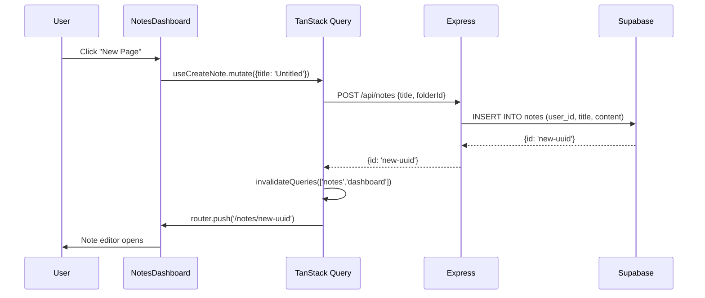
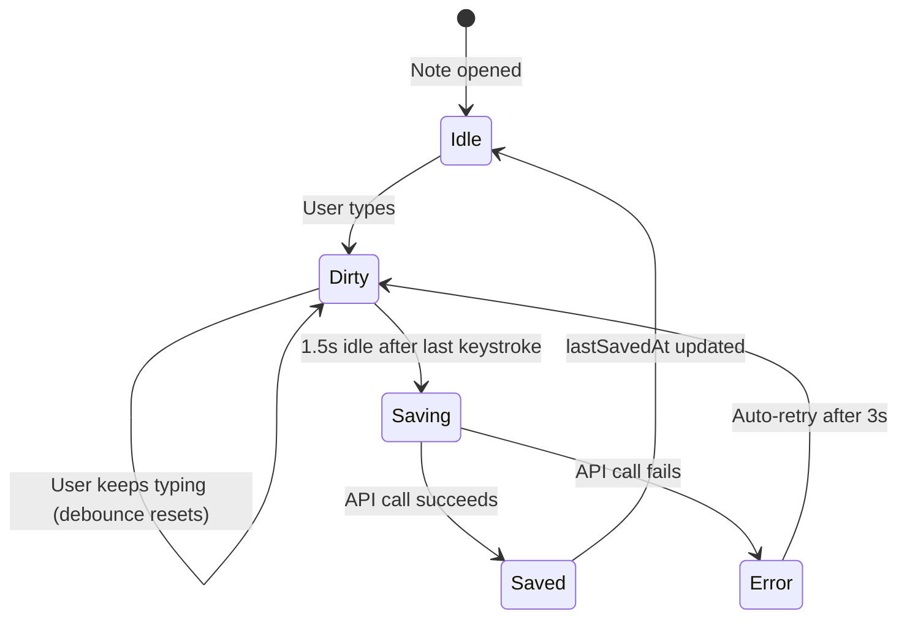
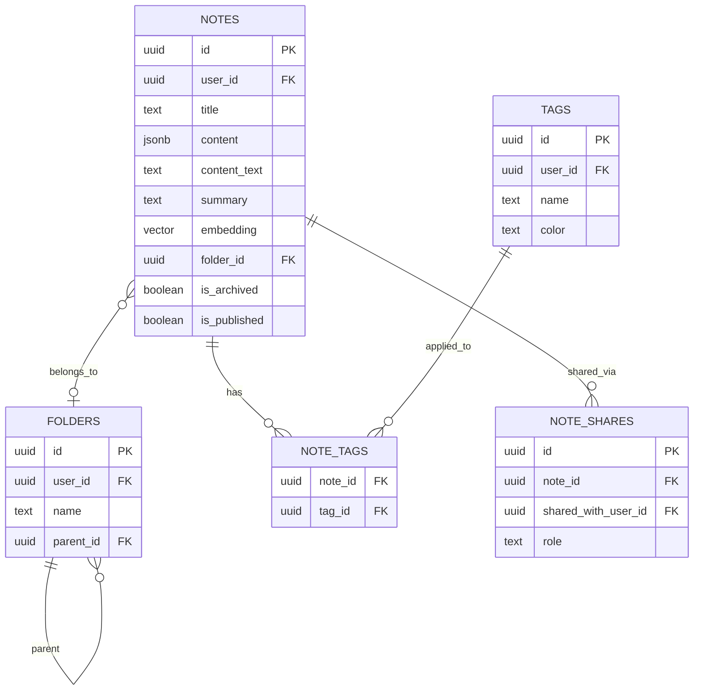

# Section 3 — Technical Reference
# Collaborative Note-taking System with Rich Text Editing

---

## 1. Overview

The Notes system is the primary workspace of Cortex. It provides students with a rich-text note editor built on Plate.js (Slate.js-based), organized with folders and tags, supporting note sharing with permission levels, archiving, public publishing, and AI-powered features. Every note is both human-readable and machine-readable — the content is stored as a structured Slate JSON AST, and a plain-text extraction is stored alongside it for AI processing.

---

## 2. Data Model

### 2.1 Notes Table

```sql
CREATE TABLE notes (
  id           UUID PRIMARY KEY DEFAULT gen_random_uuid(),
  user_id      UUID NOT NULL REFERENCES profiles(id) ON DELETE CASCADE,
  title        TEXT NOT NULL DEFAULT 'Untitled note',

  -- Rich text content (Plate.js / Slate JSON AST)
  content      JSONB,

  -- Plain-text extraction for full-text search and AI
  content_text TEXT,

  -- AI-generated fields
  summary      TEXT,
  embedding    vector(768),  -- Gemini text-embedding-004
  suggested_tags TEXT[],

  -- Organization
  folder_id    UUID REFERENCES folders(id) ON DELETE SET NULL,
  workspace_id UUID,         -- For future workspace/team features

  -- State
  is_archived  BOOLEAN NOT NULL DEFAULT FALSE,
  is_published BOOLEAN NOT NULL DEFAULT FALSE,

  created_at   TIMESTAMPTZ NOT NULL DEFAULT NOW(),
  updated_at   TIMESTAMPTZ NOT NULL DEFAULT NOW()
);
```

The **`content` JSONB column** stores the Plate.js document as a JSON array of block nodes. Example content for a note with a heading and paragraph:
```json
[
  {
    "type": "h1",
    "id": "block-1",
    "children": [{ "text": "CPU Scheduling Algorithms" }]
  },
  {
    "type": "p",
    "id": "block-2",
    "children": [
      { "text": "Round Robin is a " },
      { "text": "preemptive", "bold": true },
      { "text": " scheduling algorithm." }
    ]
  }
]
```

The **`content_text` column** is a plain-text extraction of the above, used by the AI embedding and summarization services. The backend walks the Slate JSON tree and concatenates all leaf text nodes.

### 2.2 Supporting Tables

```sql
CREATE TABLE folders (
  id          UUID PRIMARY KEY DEFAULT gen_random_uuid(),
  user_id     UUID NOT NULL REFERENCES profiles(id) ON DELETE CASCADE,
  name        TEXT NOT NULL,
  parent_id   UUID REFERENCES folders(id) ON DELETE CASCADE,
  workspace_id UUID,
  is_archived BOOLEAN NOT NULL DEFAULT FALSE,
  created_at  TIMESTAMPTZ DEFAULT NOW()
);

CREATE TABLE tags (
  id      UUID PRIMARY KEY DEFAULT gen_random_uuid(),
  user_id UUID NOT NULL REFERENCES profiles(id) ON DELETE CASCADE,
  name    TEXT NOT NULL,
  color   TEXT,
  created_at TIMESTAMPTZ DEFAULT NOW()
);

CREATE TABLE note_tags (
  note_id UUID NOT NULL REFERENCES notes(id) ON DELETE CASCADE,
  tag_id  UUID NOT NULL REFERENCES tags(id) ON DELETE CASCADE,
  PRIMARY KEY (note_id, tag_id)
);

CREATE TABLE note_shares (
  id                   UUID PRIMARY KEY DEFAULT gen_random_uuid(),
  note_id              UUID NOT NULL REFERENCES notes(id) ON DELETE CASCADE,
  shared_with_user_id  UUID NOT NULL REFERENCES profiles(id) ON DELETE CASCADE,
  role                 TEXT NOT NULL DEFAULT 'viewer'
                         CHECK (role IN ('viewer', 'editor')),
  created_at           TIMESTAMPTZ DEFAULT NOW(),
  UNIQUE (note_id, shared_with_user_id)
);
```

---

## 3. Backend Architecture

### 3.1 NoteService — Business Logic

```typescript
// backend/src/services/NoteService.ts (key methods)
export class NoteService {
  constructor(private repo: NoteRepository) {}

  async getDashboard(userId: string, workspaceId?: string) {
    // Parallel fetch: personal notes, shared notes, folders, tags
    const [notes, sharedNotes, folders, tags] = await Promise.all([
      this.repo.getDashboardNotes(userId, workspaceId),
      this.repo.getSharedNotes(userId),
      this.repo.getFolders(userId, workspaceId),
      this.repo.getTags(userId),
    ]);
    return { notes, sharedNotes, folders, tags };
  }

  async getNoteDetail(userId: string, noteId: string) {
    const note = await this.repo.getNoteDetail(userId, noteId);
    if (!note) throw new Error("Note not found.");

    const [folders, tags, noteTagsRaw] = await Promise.all([
      this.repo.getFolders(userId, note.workspace_id),
      this.repo.getTags(userId),
      this.repo.getNoteTags(noteId),
    ]);

    // Normalize junction table result
    const noteTags = noteTagsRaw.map((item: any) => ({
      tag_id: item.tag_id,
      tags: Array.isArray(item.tags) ? (item.tags[0] ?? null) : item.tags,
    }));

    return { note, folders, tags, noteTags };
  }

  async updateNote(userId: string, noteId: string, updatePayload: Record<string, unknown>) {
    // Repository enforces ownership via RLS
    await this.repo.updateNote(userId, noteId, updatePayload);
  }

  async updateNoteTags(noteId: string, tagIds: string[]) {
    // Delete all existing tags, then insert new ones (replace strategy)
    await this.repo.deleteNoteTags(noteId);
    if (tagIds.length > 0) {
      const rows = tagIds.map(tagId => ({ note_id: noteId, tag_id: tagId }));
      await this.repo.insertNoteTags(rows);
    }
  }

  async createShare(noteId: string, sharedWithUserId: string, role: 'viewer' | 'editor') {
    return this.repo.createShare({ noteId, sharedWithUserId, role });
  }

  async archiveNote(userId: string, noteId: string) {
    await this.repo.updateNote(userId, noteId, { is_archived: true });
  }

  async getPublicNote(noteId: string) {
    const note = await this.repo.getPublicNote(noteId);
    if (!note || !note.is_published) throw new Error("Note not found or not public.");
    return note;
  }
}
```

### 3.2 NoteRepository — Key Queries

```typescript
// NoteRepository.ts key query patterns
async getDashboardNotes(userId: string, workspaceId?: string) {
  let query = this.supabase
    .from('notes')
    .select('id, title, content_text, created_at, updated_at, folder_id, is_published, tags:note_tags(tag_id, tags(name, color))')
    .eq('user_id', userId)
    .eq('is_archived', false)
    .order('updated_at', { ascending: false });

  if (workspaceId) query = query.eq('workspace_id', workspaceId);

  const { data, error } = await query;
  if (error) throw error;
  return data;
}

async getNoteDetail(userId: string, noteId: string) {
  // Get full note with content — also works for shared notes (RLS handles this)
  const { data, error } = await this.supabase
    .from('notes')
    .select('*')
    .eq('id', noteId)
    .single();
  if (error) throw error;
  return data;
}

async createNote(userId: string, title: string, folderId: string | null, workspaceId?: string) {
  const { data, error } = await this.supabase
    .from('notes')
    .insert({
      user_id: userId,
      title: title || 'Untitled note',
      folder_id: folderId,
      workspace_id: workspaceId,
      content: [{ type: 'p', id: nanoid(), children: [{ text: '' }] }],
    })
    .select('id')
    .single();
  if (error) throw error;
  return data;
}
```

### 3.3 API Routes

```typescript
// backend/src/routes/notes.ts
const router = Router();
router.use(authenticate);  // All routes require valid JWT

router.get('/dashboard',           noteController.getDashboard);
router.get('/archive',             noteController.getArchived);
router.get('/public',              noteController.getPublicNotes);
router.get('/:id',                 noteController.getNoteDetail);
router.post('/',                   noteController.createNote);
router.patch('/:id',               noteController.updateNote);
router.delete('/:id/archive',      noteController.archiveNote);
router.post('/folders',            noteController.createFolder);
router.patch('/folders/:id',       noteController.updateFolder);
router.delete('/folders/:id',      noteController.deleteFolder);
router.post('/tags',               noteController.createTag);
router.put('/:id/tags',            noteController.updateNoteTags);
router.post('/:id/shares',         noteController.createShare);
router.delete('/:id/shares/:shareId', noteController.deleteShare);
router.get('/public/:id',          noteController.getPublicNoteById);
```

---

## 4. Frontend Architecture

### 4.1 Notes Dashboard

`frontend/app/notes/page.tsx` is a server component that checks authentication and renders the dashboard. It passes the initial data to `NotesDashboard`:

```typescript
// frontend/app/notes/page.tsx
export default async function NotesPage() {
  const session = await getServerSession();
  if (!session) redirect('/auth/login');
  return <NotesDashboard />;
}
```

`frontend/components/notes/notes-dashboard.tsx` is the main client component. It uses TanStack Query to manage:
- Notes list (grid or list view)
- Folder tree navigation
- Tag filter buttons
- Search input (debounced 300ms, filters `content_text`)
- Create note, create folder actions

Key state:
```typescript
const [viewMode, setViewMode] = useState<'grid' | 'list'>('grid');
const [selectedTagIds, setSelectedTagIds] = useState<string[]>([]);
const [searchQuery, setSearchQuery] = useState('');
const debouncedSearch = useDebounce(searchQuery, 300);

// TanStack Query
const { data, isLoading } = useNoteDashboard();
// data = { notes, sharedNotes, folders, tags }
```

### 4.2 TanStack Query Hooks (`use-notes.ts`)

Every operation in the notes system is wrapped in a TanStack Query hook:

```typescript
// useNoteDashboard — fetches all notes, folders, tags
export function useNoteDashboard() {
  return useQuery({
    queryKey: ['notes', 'dashboard'],
    queryFn: () => apiClient.get<DashboardResponse>('/notes/dashboard'),
    staleTime: 2 * 60 * 1000,   // Cached for 2 minutes
  });
}

// useNoteDetail — fetches single note with full content
export function useNoteDetail(noteId: string) {
  return useQuery({
    queryKey: ['notes', noteId],
    queryFn: () => apiClient.get<NoteDetailResponse>(`/notes/${noteId}`),
    enabled: !!noteId,
  });
}

// useCreateNote — creates a new note and navigates to it
export function useCreateNote() {
  const queryClient = useQueryClient();
  const router = useRouter();
  return useMutation({
    mutationFn: ({ title, folderId }) =>
      apiClient.post<{id: string}>('/notes', { title, folderId }),
    onSuccess: (data) => {
      queryClient.invalidateQueries({ queryKey: ['notes', 'dashboard'] });
      router.push(`/notes/${data.id}`);
    },
  });
}

// useUpdateNote — debounced auto-save
export function useUpdateNote(noteId: string) {
  return useMutation({
    mutationFn: (payload: Partial<Note>) =>
      apiClient.patch(`/notes/${noteId}`, payload),
  });
}
```

### 4.3 Note Editor Auto-Save System

The note editor (`note-editor-page.tsx`) implements a sophisticated auto-save mechanism:

```typescript
// Simplified auto-save logic in note-editor-page.tsx
const [dirty, setDirty] = useState(false);
const [lastSavedAt, setLastSavedAt] = useState<Date | null>(null);
const updateNote = useUpdateNote(noteId);

// Debounced save function — waits 1.5 seconds after last change
const debouncedSave = useDebouncedCallback(
  async (payload: { title?: string; content?: SlateNode[]; content_text?: string }) => {
    await updateNote.mutateAsync(payload);
    setDirty(false);
    setLastSavedAt(new Date());
  },
  1500
);

// Called on every content change
const handleContentChange = (newContent: SlateNode[], newText: string) => {
  setDirty(true);
  debouncedSave({ content: newContent, content_text: newText });
};

// Called on title change
const handleTitleChange = (newTitle: string) => {
  setTitle(newTitle);
  setDirty(true);
  debouncedSave({ title: newTitle });
};
```

The `dirty` flag is shown as "Saving..." in the UI, and `lastSavedAt` is displayed as "Saved 3 seconds ago" — giving the user confidence their work is not lost.

---

## 5. Plate.js Rich Text Editor

### 5.1 Plugin Architecture

Plate.js builds the editor from a list of plugins. Each plugin adds one capability. Cortex's editor (`frontend/app/editor/editor-content.tsx`) composes the following plugins:

**Block element plugins:**
- `ParagraphPlugin` — default paragraph blocks
- `HeadingPlugin` — H1 through H6 headings
- `BlockquotePlugin` — indented quote blocks
- `CodeBlockPlugin` — syntax-highlighted code blocks with language selector
- `HorizontalRulePlugin` — divider lines
- `TogglePlugin` — collapsible toggle blocks (like Notion's toggle)
- `TocPlugin` — auto-generated table of contents

**List plugins:**
- `ListPlugin` — ordered and unordered bullet lists with nesting
- `TodoListPlugin` — checkboxes that can be marked complete

**Inline mark plugins:**
- `BoldPlugin`, `ItalicPlugin`, `UnderlinePlugin`, `StrikethroughPlugin`
- `CodePlugin` — inline code spans
- `SuperscriptPlugin`, `SubscriptPlugin`
- `FontSizePlugin`, `FontColorPlugin`, `HighlightPlugin`

**Rich element plugins:**
- `LinkPlugin` — hyperlinks with toolbar for editing
- `ImagePlugin` — image upload and display (via UploadThing)
- `MediaEmbedPlugin` — YouTube, Vimeo, etc. embed support
- `TablePlugin` — full table with merge cells support
- `MentionPlugin` — @mention users (for collaboration)
- `EmojiPlugin` — emoji picker

**Behavior plugins:**
- `AutoformatPlugin` — markdown shortcuts: `**bold**`, `# heading`, `- list`
- `SlashPlugin` — `/` command menu for inserting any block type
- `DndPlugin` — drag and drop to reorder blocks
- `CursorOverlayPlugin` — collaborative cursor positions

**AI plugins:**
- `AICopilotPlugin` — inline text completion (ghost text as you type)
- `AIPlugin` — `/ai` command that opens the AI assistant panel

### 5.2 AI Command in the Editor

When a user types `/ai` or selects text and presses `Ctrl+J`, the AI command panel opens. This calls the Next.js Edge Route at `/api/ai/command`:

```typescript
// Simplified flow from the Plate AI plugin:
// 1. User types a prompt: "Explain this concept more clearly"
// 2. Plugin serializes the editor content to context:
const context = serializeMdNodes(editor.children);

// 3. POST to /api/ai/command with:
const response = await fetch('/api/ai/command', {
  method: 'POST',
  body: JSON.stringify({
    messages: [{ role: 'user', content: 'Explain this concept more clearly' }],
    system: context,        // The current note content as context
    model: 'google/gemini-1.5-flash',
    isSelecting: true,      // True if text is selected
  }),
});

// 4. Stream the response and update the editor in real-time
```

The route classifies the intent (generate / edit / comment) using Vercel AI SDK's `generateObject` with a Zod enum schema, then streams the response using `streamText`. The editor updates in real-time as tokens arrive.

### 5.3 Slash Command Menu

Typing `/` in the editor opens a searchable command menu with all available block types:

```typescript
// SlashPlugin configuration (simplified)
const slashItems = [
  { value: 'h1', label: 'Heading 1', icon: <Heading1Icon /> },
  { value: 'h2', label: 'Heading 2', icon: <Heading2Icon /> },
  { value: 'ul', label: 'Bullet List', icon: <ListIcon /> },
  { value: 'ol', label: 'Numbered List', icon: <ListOrderedIcon /> },
  { value: 'todo', label: 'To-do', icon: <CheckSquareIcon /> },
  { value: 'code_block', label: 'Code Block', icon: <CodeIcon /> },
  { value: 'table', label: 'Table', icon: <TableIcon /> },
  { value: 'image', label: 'Image', icon: <ImageIcon /> },
  { value: 'ai', label: 'Ask AI', icon: <SparklesIcon /> },
];
```

---

## 6. Note Organization Features

### 6.1 Folders — Hierarchical Structure

Folders can be nested (parent_id self-reference). The dashboard renders a recursive folder tree. Operations:
- Create folder: `POST /api/notes/folders`
- Rename folder: `PATCH /api/notes/folders/:id` with `{ name }`
- Delete folder: `DELETE /api/notes/folders/:id` (soft-delete via `is_archived`)
- Move note to folder: `PATCH /api/notes/:id` with `{ folder_id }`

### 6.2 Tags — Color-Coded Labels

Tags are user-defined labels with optional colors. The tag filter in the dashboard filters the displayed notes client-side (no extra API call needed):

```typescript
// Client-side tag filtering in notes-dashboard.tsx
const filteredNotes = useMemo(() => {
  let result = data?.notes ?? [];
  if (selectedTagIds.length > 0) {
    result = result.filter(note =>
      note.tags?.some(t => selectedTagIds.includes(t.tag_id))
    );
  }
  if (debouncedSearch) {
    result = result.filter(note =>
      note.title.toLowerCase().includes(debouncedSearch.toLowerCase()) ||
      note.content_text?.toLowerCase().includes(debouncedSearch.toLowerCase())
    );
  }
  return result;
}, [data?.notes, selectedTagIds, debouncedSearch]);
```

### 6.3 Note Sharing

Sharing is a controlled collaboration model:
- Sharer specifies a recipient (by user ID or email lookup) and a role
- `viewer`: can read the note, cannot edit
- `editor`: can read and edit (full Plate editor access)
- Shared notes appear in the recipient's dashboard under "Shared with me"
- RLS ensures shared notes are visible: `is_published = TRUE OR id IN (SELECT note_id FROM note_shares WHERE shared_with_user_id = auth.uid())`

### 6.4 Public Notes

Any note can be published with `is_published = TRUE`. Public notes are accessible without authentication at `/notes/public/:id`. This powers a community knowledge-sharing feature where students can publish their study notes for others to read.

---

## 7. Notes Views

### 7.1 Archive
- `GET /api/notes/archive` returns notes and folders where `is_archived = TRUE`
- Archive is a "soft delete" — notes are hidden from the dashboard but not deleted
- Users can restore from archive or permanently delete

### 7.2 Calendar View (`/notes/calendar`)
Notes are displayed on a calendar by their `created_at` date. Clicking a date shows notes created on that day. This gives students a temporal view of their study activity.

### 7.3 Public Notes (`/notes/public`)
A discovery feed of all published notes from all users. Students can find and read notes from their peers without creating an account.

---

## 8. Mermaid Diagrams

### Note Creation Flow


### Auto-Save State Machine


### Note Entity ERD

