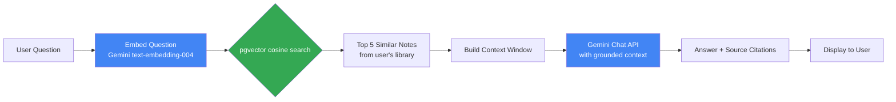
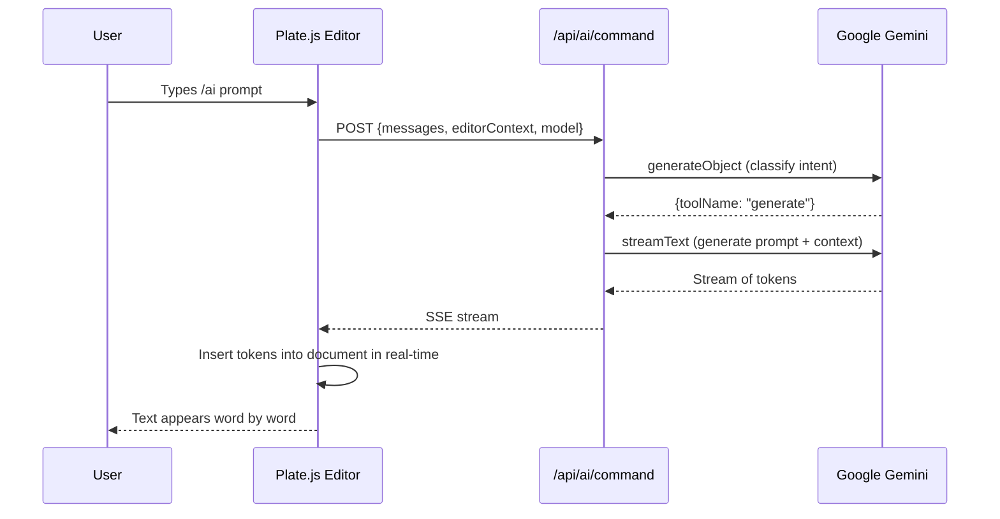
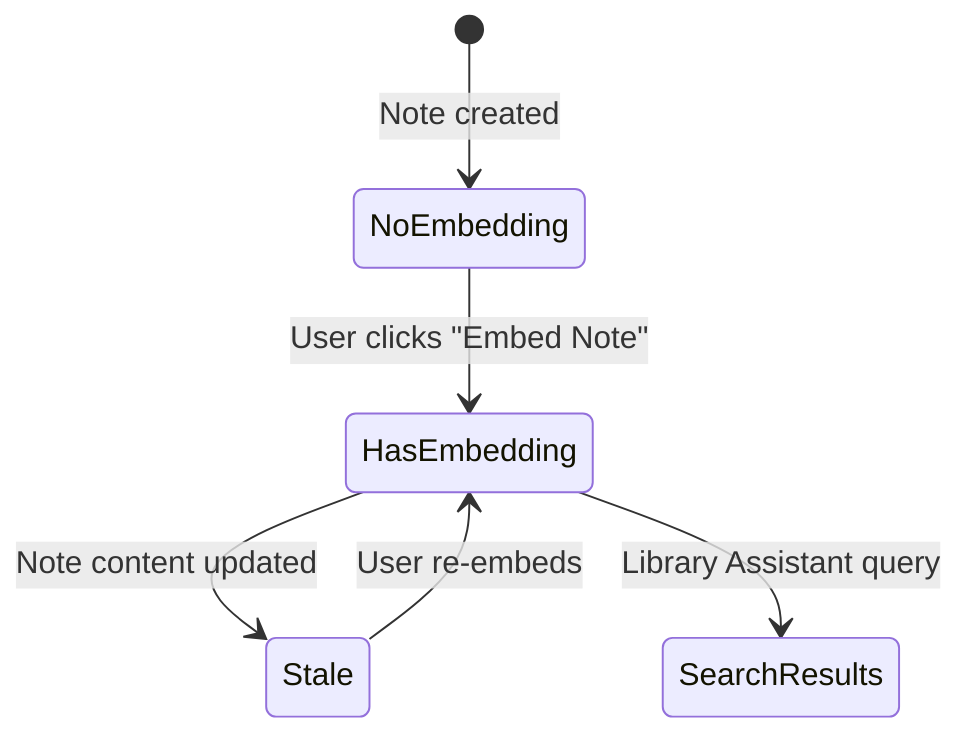

# Section 4 — Technical Reference
# AI-Powered Academic Assistant & Intelligent Note Features

---

## 1. Overview — Three AI Layers

Cortex integrates AI at three distinct levels, each serving a different use case:

| Layer | Where | Trigger | What it does |
|-------|-------|---------|--------------|
| **Editor AI** | Frontend (Vercel Edge) | `/ai` command or `Ctrl+J` | Inline generate/edit/comment/explain within the editor |
| **Note AI** | Backend (Express) | Sidebar buttons | Summarize note, suggest tags, embed note as vector |
| **Library Assistant** | Backend (Express) | Ask Library modal | Semantic Q&A over all user's notes using RAG |

Together, these three layers make Cortex the first academic tool where the AI genuinely knows your study materials — not just general knowledge.

---

## 2. Layer 1 — Editor AI (Vercel AI SDK Streaming)

### 2.1 Architecture

The editor AI runs on a Next.js Edge Route (`frontend/app/api/ai/command/route.ts`). Edge Functions run at network edge nodes closest to the user, reducing latency to the streaming AI response.

### 2.2 Multi-Model Support

Users can select their preferred AI model in Settings (`frontend/hooks/use-ai-settings.ts`). The route supports four providers via Vercel AI SDK:

```typescript
const getModel = (model: string) => {
  const [provider, modelName] = model.split('/');
  const apiKey = getApiKey(provider);  // From user settings or env

  switch (provider) {
    case 'google': {
      const google = createGoogleGenerativeAI({ apiKey });
      return google(modelName || 'gemini-1.5-flash');
    }
    case 'anthropic': {
      const anthropic = createAnthropic({ apiKey });
      return anthropic(modelName || 'claude-3-5-sonnet-latest');
    }
    case 'groq': {
      const groq = createGroq({ apiKey });
      return groq(modelName || 'llama-3.3-70b-versatile');
    }
    case 'openai':
    default: {
      const openai = createOpenAI({ apiKey });
      return openai(modelName || 'gpt-4o-mini');
    }
  }
};
```

### 2.3 Intent Classification

The first step of the AI command is classifying the user's intent. The system must determine whether the user wants to generate new content, edit existing content, or comment on it:

```typescript
// Step 1: Classify intent
const { object } = await generateObject({
  model: getModel(selectedModel),
  schema: z.object({
    toolName: z.enum(['generate', 'edit', 'comment']),
  }),
  mode: 'json',
  prompt: getChooseToolPrompt({ isSelecting, messages }) +
    '\n\nRespond with JSON: {"toolName": "generate" | "edit" | "comment"}',
});
```

- **generate**: Create new content (user has no text selected)
- **edit**: Modify selected text according to instructions
- **comment**: Add explanatory comments to selected text blocks

### 2.4 Streaming Response

After classification, the appropriate prompt is constructed from the editor's current state (serialized to markdown for context), and `streamText` produces a streaming response:

```typescript
const stream = createUIMessageStream({
  execute: async ({ writer }) => {
    // Tell the client which tool was chosen
    writer.write({ data: toolName, type: 'data-toolName' });

    // Get the appropriate prompt based on tool
    let prompt: string;
    if (toolName === 'generate') {
      prompt = getGeneratePrompt(editor, { isSelecting, messages });
    } else if (toolName === 'edit') {
      prompt = getEditPrompt(editor, { isSelecting, messages })[0];
    }

    const textStream = streamText({
      model: getModel(selectedModel),
      messages: [{ role: 'user', content: prompt }],
    });

    writer.merge(textStream.toUIMessageStream({ sendFinish: false }));
  },
});

return createUIMessageStreamResponse({ stream });
```

The frontend receives this stream and uses Plate.js's AI SDK integration to insert/replace text in the editor in real-time.

### 2.5 Comment Tool

The comment tool produces structured annotations — AI-identified passages with explanations attached:

```typescript
const commentSchema = z.object({
  blockId: z.string().describe("The Slate block ID to comment on"),
  comment: z.string().describe("A brief explanation"),
  content: z.string().describe("The exact text fragment being commented on"),
});

// Stream partial arrays of comments as they are generated
const { partialOutputStream } = streamText({
  model,
  output: Output.array({ element: commentSchema }),
  prompt: getCommentPrompt(editor, { messages }),
});
```

### 2.6 AI Copilot (Inline Text Completion)

`frontend/app/api/ai/copilot/route.ts` provides ghost-text completion. As a user types, the AI predicts the next words and shows them in gray — press Tab to accept:

```typescript
// Copilot route — called on every pause in typing
export async function POST(req: Request) {
  const { prompt, system } = await req.json();
  const result = streamText({
    model: getModel('google/gemini-1.5-flash'),
    system,    // Current note content
    prompt,    // Text preceding cursor
    maxTokens: 50,  // Keep completions short
  });
  return result.toDataStreamResponse();
}
```

---

## 3. Layer 2 — Note AI (Backend AIService)

### 3.1 Text Embedding

The foundation of all semantic AI features is text embedding. `embedText()` converts any text into a 768-dimensional vector:

```typescript
// backend/src/services/AIService.ts
export async function embedText(text: string): Promise<number[]> {
  const apiKey = process.env.GEMINI_API_KEY;
  if (!apiKey) throw new Error("Missing GEMINI_API_KEY");

  const response = await fetch(
    'https://generativelanguage.googleapis.com/v1beta/models/text-embedding-004:embedContent',
    {
      method: 'POST',
      headers: {
        'Content-Type': 'application/json',
        'X-goog-api-key': apiKey,
      },
      body: JSON.stringify({
        model: 'models/text-embedding-004',
        content: { parts: [{ text }] },
        taskType: 'RETRIEVAL_DOCUMENT',  // Optimized for document retrieval
      }),
    }
  );

  const payload = await response.json();
  if (!response.ok) throw new Error(payload.error?.message ?? "Embedding failed");
  return payload.embedding.values;  // 768 float values
}
```

The result is stored in the note's `embedding` column (`vector(768)`). Supabase uses the pgvector extension to store these vectors efficiently and perform fast cosine similarity queries.

### 3.2 Note Embedding

```typescript
async embedNote(noteId: string, userId: string) {
  const note = await this.repo.getNote(noteId);
  if (!note) throw new Error("Note not found.");
  const text = note.content_text?.trim() ?? "";
  if (!text) throw new Error("Note has no content to embed.");

  // Prefix with 'passage:' as recommended by Gemini's embedding docs
  const embedding = await embedText(`passage: ${text}`);
  await this.repo.updateNote(noteId, userId, { embedding });
  return { success: true, dimensions: embedding.length };
}
```

### 3.3 Extractive Summarization

The summarization feature does NOT call the Gemini API — it uses a local NLP algorithm called **extractive summarization**. This is faster, free, and private (note content never leaves the server):

```typescript
function buildExtractiveSummary(text: string, maxSentences = 5): string {
  if (!text?.trim()) return "";

  // 1. Split into sentences
  const sentences = text
    .split(/(?<=[.!?])\s+/)
    .map(s => s.trim())
    .filter(s => s.length > 20);  // Skip very short fragments

  if (sentences.length <= maxSentences) return sentences.join(' ');

  // 2. Tokenize all text to compute word frequencies (TF-style scoring)
  const wordFreq: Record<string, number> = {};
  const stopwords = new Set(['the','a','an','is','are','was','were','in','on','at','to','of','and','or','but','for','with','from','by','as','it','this','that']);

  for (const sentence of sentences) {
    const words = sentence.toLowerCase().split(/\W+/).filter(w => w.length > 2 && !stopwords.has(w));
    for (const word of words) {
      wordFreq[word] = (wordFreq[word] ?? 0) + 1;
    }
  }

  // 3. Score each sentence by sum of its word frequencies
  const scored = sentences.map((sentence, idx) => {
    const words = sentence.toLowerCase().split(/\W+/).filter(w => w.length > 2 && !stopwords.has(w));
    const score = words.reduce((sum, w) => sum + (wordFreq[w] ?? 0), 0);
    return { sentence, score, idx };
  });

  // 4. Pick top N sentences, preserve original order
  const topSentences = scored
    .sort((a, b) => b.score - a.score)
    .slice(0, maxSentences)
    .sort((a, b) => a.idx - b.idx)
    .map(s => s.sentence);

  return topSentences.join(' ');
}
```

### 3.4 Tag Suggestion

Similarly, tag suggestion uses local NLP rather than an API call:

```typescript
function suggestTagsFromText(text: string, maxTags = 5): string[] {
  if (!text?.trim()) return [];

  const stopwords = new Set(['the','a','an','in','on','at','to','of','and','or','is','are','was','this','that','with','from','by','as','it','for','be','been','have','has','had']);

  // Tokenize and count significant words
  const wordFreq: Record<string, number> = {};
  const words = text.toLowerCase().split(/\W+/).filter(w => w.length > 3 && !stopwords.has(w) && !/^\d+$/.test(w));

  for (const word of words) {
    wordFreq[word] = (wordFreq[word] ?? 0) + 1;
  }

  // Return top N words as suggested tags
  return Object.entries(wordFreq)
    .sort((a, b) => b[1] - a[1])
    .slice(0, maxTags)
    .map(([word]) => word);
}
```

Example: A note about "Round Robin scheduling algorithms" with frequent mentions of "scheduling", "process", "quantum", "CPU", "preemptive" would suggest tags: `['scheduling', 'process', 'quantum', 'cpu', 'preemptive']`

### 3.5 Library Assistant (RAG Pipeline)

The Library Assistant is the most sophisticated AI feature. It answers academic questions grounded in the user's own notes using **Retrieval-Augmented Generation (RAG)**:

```typescript
async askLibrary(question: string, userId: string) {
  const apiKey = process.env.GEMINI_API_KEY;

  // Step 1: Embed the question using 'query' task type
  const questionEmbedding = await embedText(`query: ${question}`);

  // Step 2: Find top-5 semantically similar notes using pgvector cosine distance
  const { data: similarNotes } = await this.supabase.rpc('search_notes_by_embedding', {
    query_embedding: questionEmbedding,
    user_id_filter: userId,
    match_count: 5,
    match_threshold: 0.6,  // Minimum similarity (0 = completely different, 1 = identical)
  });

  if (!similarNotes?.length) {
    // Fallback: answer from general knowledge
    return this.askGeneral(question);
  }

  // Step 3: Build context from retrieved notes
  const context = similarNotes.map((note: any, i: number) =>
    `[Note ${i+1}: "${note.title}"]\n${note.content_text}`
  ).join('\n\n---\n\n');

  // Step 4: Ask Gemini to answer grounded in the context
  const model = process.env.GEMINI_MODEL ?? 'gemini-flash-latest';
  const response = await fetch(
    `https://generativelanguage.googleapis.com/v1beta/models/${model}:generateContent`,
    {
      method: 'POST',
      headers: { 'Content-Type': 'application/json', 'X-goog-api-key': apiKey },
      body: JSON.stringify({
        systemInstruction: {
          parts: [{
            text: `You are an academic assistant helping a university student. 
Answer questions based ONLY on the provided notes. 
If the notes do not contain relevant information, say so clearly.
Be concise, accurate, and cite which note you are drawing from.`
          }]
        },
        contents: [{
          role: 'user',
          parts: [{
            text: `Student notes:\n${context}\n\nQuestion: ${question}`
          }]
        }],
        generationConfig: { temperature: 0.3, topP: 0.9 },
      }),
    }
  );

  const payload = await response.json();
  const answer = payload.candidates?.[0]?.content?.parts?.map((p: any) => p.text ?? '').join('').trim() ?? '';

  return {
    answer,
    sources: similarNotes.map((n: any) => ({ id: n.id, title: n.title })),
    model,
  };
}
```

### 3.6 Similarity Search SQL Function

The PostgreSQL RPC function that pgvector powers:

```sql
-- Migration: similarity search function
CREATE OR REPLACE FUNCTION search_notes_by_embedding(
  query_embedding vector(768),
  user_id_filter uuid,
  match_count int DEFAULT 5,
  match_threshold float DEFAULT 0.6
)
RETURNS TABLE (
  id uuid,
  title text,
  content_text text,
  similarity float
)
LANGUAGE sql STABLE
AS $$
  SELECT
    n.id,
    n.title,
    n.content_text,
    1 - (n.embedding <=> query_embedding) AS similarity
  FROM notes n
  WHERE
    n.user_id = user_id_filter
    AND n.is_archived = FALSE
    AND n.embedding IS NOT NULL
    AND 1 - (n.embedding <=> query_embedding) > match_threshold
  ORDER BY n.embedding <=> query_embedding
  LIMIT match_count;
$$;
```

The `<=>` operator is the **cosine distance** operator from pgvector. `1 - cosine_distance = cosine_similarity`. A similarity of 1.0 means identical; 0.6 is the threshold for "meaningfully related."

---

## 4. Layer 3 — Daily Log Embedding (AI in Daily Planning)

Every time a daily log is saved, `DailyService.syncLogEmbedding()` is called asynchronously to generate and store an embedding of the day's content:

```typescript
async syncLogEmbedding(userId: string, logId: string) {
  try {
    const log = await this.repo.getDailyLogById(userId, logId);
    if (!log) return;

    // Combine all textual content from the log
    const textParts: string[] = [];
    if (log.highlight) textParts.push(`Highlight: ${log.highlight}`);
    if (log.content_text) textParts.push(`Note: ${log.content_text}`);
    if (log.tasks?.length > 0) {
      const taskTexts = log.tasks
        .map((t: any) => `- [${t.is_completed ? 'x' : ' '}] ${t.text}`)
        .join('\n');
      textParts.push(`Tasks:\n${taskTexts}`);
    }

    const textForEmbedding = textParts.join('\n\n').trim();
    if (textForEmbedding) {
      const embedding = await embedText(`passage: ${textForEmbedding}`);
      await this.repo.updateDailyLog(userId, logId, { embedding });
    }
  } catch (e) {
    // Non-fatal: log error but don't fail the save
    console.error("Failed to sync daily log embedding:", e);
  }
}
```

This means a student can later ask the Library Assistant "what did I study last Tuesday?" and the system can find it semantically — even if the question uses different words than the log.

---

## 5. Frontend AI Components

### 5.1 Global Assistant Modal

`frontend/components/notes/global-assistant-modal.tsx` — the full Library Assistant UI:

```typescript
export function GlobalAssistantModal({ noteId, isOpen, onOpenChange, initialQuestion }) {
  const [question, setQuestion] = useState(initialQuestion ?? '');
  const [answer, setAnswer] = useState('');
  const [sources, setSources] = useState([]);
  const [isLoading, setIsLoading] = useState(false);

  const handleAsk = async () => {
    setIsLoading(true);
    const res = await apiClient.post('/ai/library-ask', { question, noteId });
    setAnswer(res.answer);
    setSources(res.sources);
    setIsLoading(false);
  };

  return (
    <Dialog open={isOpen} onOpenChange={onOpenChange}>
      <DialogContent className="max-w-2xl">
        <DialogHeader><DialogTitle>Ask Your Library</DialogTitle></DialogHeader>
        <Textarea value={question} onChange={e => setQuestion(e.target.value)} />
        <Button onClick={handleAsk} disabled={isLoading}>
          {isLoading ? 'Thinking...' : 'Ask'}
        </Button>
        {answer && (
          <>
            <div className="prose">{answer}</div>
            <div>Sources: {sources.map(s => <Badge key={s.id}>{s.title}</Badge>)}</div>
          </>
        )}
      </DialogContent>
    </Dialog>
  );
}
```

### 5.2 Note AI Sidebar Tools

In the note editor's properties sidebar, three AI tools are available:
- **Summarize** — calls `POST /api/ai/summarize/:noteId`, updates `note.summary`
- **Suggest Tags** — calls `POST /api/ai/suggest-tags/:noteId`, shows suggested tags to apply
- **Embed Note** — calls `POST /api/ai/embed/:noteId`, stores vector for future similarity search

---

## 6. Mermaid Diagrams

### 6.1 RAG Pipeline


### 6.2 Editor AI Flow


### 6.3 Embedding Lifecycle

