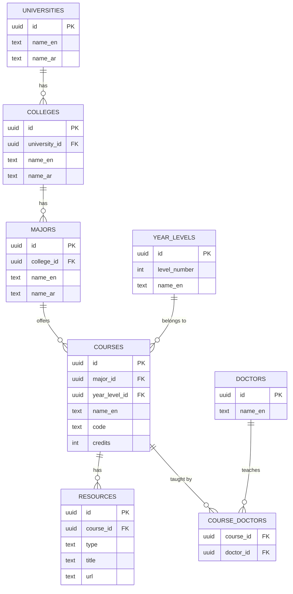
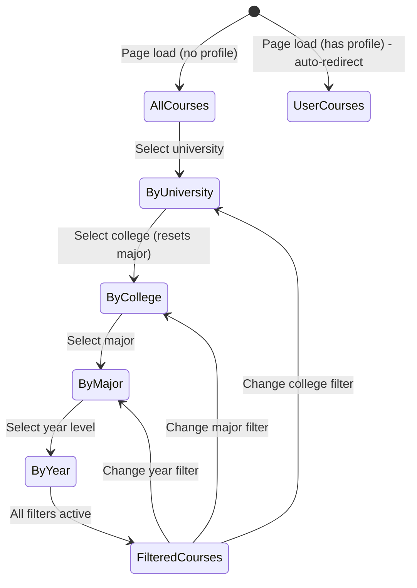
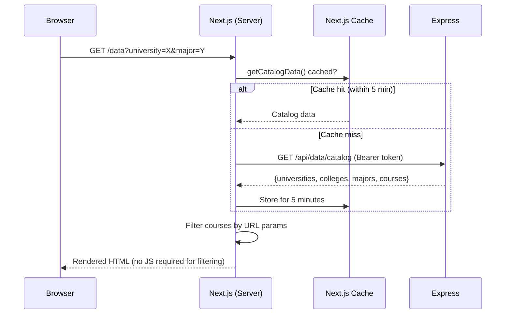

# Section 5 — Technical Reference
# Academic Resource Registry & University Data Catalog

---

## 1. Problem Statement

Egyptian university students have no structured, digital registry of their academic resources. Course materials — lecture PDFs, textbook links, lab guides — are scattered across:
- WhatsApp groups (expires, hard to search, not organized)
- Personal Google Drives with inconsistent naming
- University portals that are often outdated or inaccessible
- Random links bookmarked individually by each student

There is no single source of truth that says: "For Major X, Year 2, Course Y, here are the verified resources, and Dr. Z teaches it." Cortex's Data Catalog solves this.

---

## 2. Data Model — Hierarchical University Structure

The catalog follows the real Egyptian university structure: a university contains colleges, a college contains majors, a major has year levels, each year level has courses, and each course has resources and assigned doctors.

```
University
  └── College
        └── Major
              └── Year Level
                    └── Course ──── Resources
                    │                  (PDFs, links, etc.)
                    └── Course ──── Doctors (assigned professors)
```

### 2.1 Complete Schema

```sql
-- Top-level institution
CREATE TABLE universities (
  id       UUID PRIMARY KEY DEFAULT gen_random_uuid(),
  name_en  TEXT NOT NULL,
  name_ar  TEXT,
  created_at TIMESTAMPTZ DEFAULT NOW()
);

-- Faculty / college within a university
CREATE TABLE colleges (
  id             UUID PRIMARY KEY DEFAULT gen_random_uuid(),
  university_id  UUID NOT NULL REFERENCES universities(id) ON DELETE CASCADE,
  name_en        TEXT NOT NULL,
  name_ar        TEXT,
  created_at     TIMESTAMPTZ DEFAULT NOW()
);

-- Department / specialization within a college
CREATE TABLE majors (
  id         UUID PRIMARY KEY DEFAULT gen_random_uuid(),
  college_id UUID NOT NULL REFERENCES colleges(id) ON DELETE CASCADE,
  name_en    TEXT NOT NULL,
  name_ar    TEXT,
  created_at TIMESTAMPTZ DEFAULT NOW()
);

-- Academic year (Year 1, Year 2, Year 3, Year 4)
CREATE TABLE year_levels (
  id           UUID PRIMARY KEY DEFAULT gen_random_uuid(),
  level_number INT NOT NULL,
  name_en      TEXT,
  name_ar      TEXT
);

-- Course / subject
CREATE TABLE courses (
  id             UUID PRIMARY KEY DEFAULT gen_random_uuid(),
  major_id       UUID NOT NULL REFERENCES majors(id) ON DELETE CASCADE,
  year_level_id  UUID REFERENCES year_levels(id),
  name_en        TEXT NOT NULL,
  name_ar        TEXT,
  code           TEXT,          -- e.g., "CS301"
  description    TEXT,
  credits        INT,
  created_at     TIMESTAMPTZ DEFAULT NOW()
);

-- Learning resource linked to a course
CREATE TABLE resources (
  id           UUID PRIMARY KEY DEFAULT gen_random_uuid(),
  course_id    UUID NOT NULL REFERENCES courses(id) ON DELETE CASCADE,
  uploaded_by  UUID REFERENCES profiles(id),
  type         TEXT,            -- 'pdf', 'link', 'video', 'book', etc.
  title        TEXT NOT NULL,
  url          TEXT,            -- External link or UploadThing CDN URL
  file_path    TEXT,            -- Internal file path
  description  TEXT,
  created_at   TIMESTAMPTZ DEFAULT NOW()
);

-- Professor / teaching staff
CREATE TABLE doctors (
  id       UUID PRIMARY KEY DEFAULT gen_random_uuid(),
  name_en  TEXT NOT NULL,
  name_ar  TEXT,
  created_at TIMESTAMPTZ DEFAULT NOW()
);

-- Many-to-many: which doctors teach which courses
CREATE TABLE course_doctors (
  course_id  UUID NOT NULL REFERENCES courses(id) ON DELETE CASCADE,
  doctor_id  UUID NOT NULL REFERENCES doctors(id) ON DELETE CASCADE,
  PRIMARY KEY (course_id, doctor_id)
);
```

---

## 3. Backend Architecture

### 3.1 DataService

```typescript
// backend/src/services/DataService.ts
export class DataService {
  constructor(private repo: DataRepository) {}

  // Returns all catalog entities for building the frontend filter UI
  async getCatalog() {
    const [universities, colleges, majors, yearLevels, courses] = await Promise.all([
      this.repo.getUniversities(),
      this.repo.getColleges(),
      this.repo.getMajors(),
      this.repo.getYearLevels(),
      this.repo.getCourses(),
    ]);
    return { universities, colleges, majors, yearLevels, courses };
  }

  // Full course detail with related data
  async getCourseDetail(courseId: string) {
    const [course, resources, doctors, doctorAssignments] = await Promise.all([
      this.repo.getCourse(courseId),
      this.repo.getResources(courseId),
      this.repo.getDoctors(),
      this.repo.getCourseDoctors(courseId),
    ]);
    return { course, resources, doctors, doctorAssignments };
  }

  async createCourse(data: CreateCourseDTO) {
    const { major_id, year_level_id, name_en, name_ar, code, description, credits } = data;
    if (!major_id || !name_en) throw new Error("major_id and name_en are required.");
    return this.repo.createCourse({
      major_id,
      year_level_id: year_level_id ?? null,
      name_en: name_en.trim(),
      name_ar: name_ar?.trim() || null,
      code: code?.trim() || null,
      description: description?.trim() || null,
      credits: typeof credits === 'number' ? Math.trunc(credits) : null,
    });
  }

  async createResource(courseId: string, userId: string, data: CreateResourceDTO) {
    const { type, title, url, file_path, description } = data;
    if (!courseId || !title) throw new Error("courseId and title are required.");
    return this.repo.createResource({
      course_id: courseId,
      uploaded_by: userId,
      type: type?.trim() || null,
      title: title.trim(),
      url: url?.trim() || null,
      file_path: file_path?.trim() || null,
      description: description?.trim() || null,
    });
  }

  async assignDoctorToCourse(courseId: string, doctorId: string) {
    if (!courseId || !doctorId) throw new Error("courseId and doctorId are required.");
    return this.repo.assignDoctorToCourse(courseId, doctorId);
  }
}
```

### 3.2 DataRepository Key Queries

```typescript
// backend/src/repositories/DataRepository.ts
async getCourses() {
  const { data, error } = await this.supabase
    .from('courses')
    .select(`
      id, name_en, name_ar, code, description, credits,
      major_id, year_level_id,
      majors(name_en, name_ar, college_id, colleges(name_en, university_id, universities(name_en))),
      year_levels(level_number, name_en, name_ar)
    `)
    .order('name_en');
  if (error) throw error;
  return data;
}

async getResources(courseId: string) {
  const { data, error } = await this.supabase
    .from('resources')
    .select('*, profiles(name, avatar_url)')  // Include uploader profile
    .eq('course_id', courseId)
    .order('created_at', { ascending: false });
  if (error) throw error;
  return data;
}

async getCourseDoctors(courseId: string) {
  const { data, error } = await this.supabase
    .from('course_doctors')
    .select('doctor_id, doctors(name_en, name_ar)')
    .eq('course_id', courseId);
  if (error) throw error;
  return data;
}
```

### 3.3 API Routes

```typescript
// backend/src/routes/data.ts
const router = Router();
router.use(authenticate);

// Catalog browsing (all authenticated users)
router.get('/catalog',                   dataController.getCatalog);
router.get('/courses/:id',               dataController.getCourseDetail);

// Admin-only data management
router.post('/universities',             requireAdmin, dataController.createUniversity);
router.patch('/universities/:id',        requireAdmin, dataController.updateUniversity);
router.post('/colleges',                 requireAdmin, dataController.createCollege);
router.post('/majors',                   requireAdmin, dataController.createMajor);
router.post('/courses',                  requireAdmin, dataController.createCourse);
router.patch('/courses/:id',             requireAdmin, dataController.updateCourse);
router.delete('/courses/:id',            requireAdmin, dataController.deleteCourse);
router.post('/resources',                requireAdmin, dataController.createResource);
router.delete('/resources/:id',          requireAdmin, dataController.deleteResource);
router.post('/doctors',                  requireAdmin, dataController.createDoctor);
router.post('/courses/:id/doctors',      requireAdmin, dataController.assignDoctor);
router.delete('/courses/:id/doctors/:doctorId', requireAdmin, dataController.unassignDoctor);
```

---

## 4. Frontend Architecture

### 4.1 Data Browser Page (`frontend/app/data/page.tsx`)

The data page is a **Server Component** — this means the full catalog is fetched on the server before any HTML reaches the browser. No loading state is visible for the initial render:

```typescript
// frontend/app/data/page.tsx (Server Component)
export default async function DataPage({ searchParams }: PageProps) {
  const t = await getTranslations("dataPage");
  const params = await searchParams;

  // Fetch all catalog data server-side
  const { universities, colleges, majors, yearLevels, courses } = await getCatalogData();

  const session = await getServerSession();
  const isAdmin = session?.profile?.role === 'admin';

  // Profile-aware auto-redirect: if no filters set, redirect to user's profile
  if (Object.keys(params).length === 0) {
    const profile = session?.profile;
    const redirectParams = new URLSearchParams();
    if (profile?.university_id) redirectParams.set('university', profile.university_id);
    if (profile?.college_id) redirectParams.set('college', profile.college_id);
    if (profile?.major_id) redirectParams.set('major', profile.major_id);

    if (redirectParams.size > 0) {
      redirect(`/data?${redirectParams.toString()}`);
    }
  }

  // Extract filter values from URL params
  const selectedUniversityId = params.university === 'all' ? null : params.university ?? null;
  const selectedCollegeId = params.college === 'all' ? null : params.college ?? null;
  const selectedMajorId = params.major === 'all' ? null : params.major ?? null;
  const selectedYearLevelId = params.year === 'all' ? null : params.year ?? null;
  const searchQuery = params.q ?? '';

  // Filter courses based on URL params
  const filteredCourses = courses.filter(course => {
    const matchMajor = !selectedMajorId || course.major_id === selectedMajorId;
    const matchYear = !selectedYearLevelId || course.year_level_id === selectedYearLevelId;
    const matchSearch = !searchQuery ||
      course.name_en.toLowerCase().includes(searchQuery.toLowerCase()) ||
      (course.name_ar && course.name_ar.includes(searchQuery));
    return matchMajor && matchYear && matchSearch;
  });

  return (
    <div>
      <DataFilters
        universities={universities} colleges={colleges} majors={majors}
        yearLevels={yearLevels} selectedValues={params} isAdmin={isAdmin}
      />
      <CourseGrid courses={filteredCourses} isAdmin={isAdmin} />
    </div>
  );
}
```

### 4.2 Cascading Filters (`frontend/app/data/data-filters.tsx`)

The filter component is a **Client Component** because it needs interactivity. Filter changes are reflected in the URL as search params (not component state), making filtered views shareable via URL:

```typescript
// frontend/app/data/data-filters.tsx (Client Component)
'use client';

export function DataFilters({ universities, colleges, majors, yearLevels, selectedValues }) {
  const router = useRouter();
  const searchParams = useSearchParams();

  const handleFilterChange = (key: string, value: string) => {
    const params = new URLSearchParams(searchParams.toString());
    params.set(key, value);

    // Cascading: changing university resets college and major
    if (key === 'university') { params.delete('college'); params.delete('major'); }
    if (key === 'college') { params.delete('major'); }

    router.push(`/data?${params.toString()}`);
  };

  // Derive available options based on current selections
  const availableColleges = colleges.filter(c =>
    !selectedValues.university || c.university_id === selectedValues.university
  );
  const availableMajors = majors.filter(m =>
    !selectedValues.college || m.college_id === selectedValues.college
  );

  return (
    <div className="flex gap-4 flex-wrap">
      <Select value={selectedValues.university} onValueChange={v => handleFilterChange('university', v)}>
        <SelectTrigger><SelectValue placeholder="Select University" /></SelectTrigger>
        <SelectContent>
          <SelectItem value="all">All Universities</SelectItem>
          {universities.map(u => (
            <SelectItem key={u.id} value={u.id}>{u.name_en}</SelectItem>
          ))}
        </SelectContent>
      </Select>
      {/* Similar selects for college, major, year level */}
    </div>
  );
}
```

### 4.3 getCatalogData — Server-Side Data Fetching

```typescript
// frontend/lib/data/catalog.ts
export async function getCatalogData() {
  const session = await getServerSession();
  if (!session) throw new Error('Not authenticated');

  const response = await fetch(`${BACKEND_URL}/api/data/catalog`, {
    headers: { Authorization: `Bearer ${session.accessToken}` },
    next: { revalidate: 300 },  // Cache for 5 minutes (catalog changes rarely)
  });

  if (!response.ok) throw new Error('Failed to fetch catalog');
  return response.json();
}
```

The `next: { revalidate: 300 }` option is a Next.js 15 feature that caches the catalog response for 5 minutes. Since catalog data changes rarely (only when admins add courses), this dramatically reduces backend load.

### 4.4 Course Detail Page

`frontend/app/data/[courseId]/page.tsx` renders a full course page with:
- Course metadata (name, code, year, credits, description)
- List of resources with type icons (PDF, link, video)
- Assigned doctors
- Admin can add resources directly from this page

---

## 5. File Upload Integration

Resources can be actual files (PDFs, images) uploaded to UploadThing CDN, or external links. The upload flow:

```typescript
// frontend/app/api/uploadthing/route.ts
import { createUploadthing } from "uploadthing/next";

const f = createUploadthing();

export const ourFileRouter = {
  resourceUploader: f({ pdf: { maxFileSize: "32MB" }, image: { maxFileSize: "8MB" } })
    .middleware(async ({ req }) => {
      const session = await getServerSession();
      if (!session) throw new Error("Unauthorized");
      return { userId: session.user.id };
    })
    .onUploadComplete(async ({ metadata, file }) => {
      // File is on UploadThing CDN; URL is returned to the client
      return { url: file.url, uploadedBy: metadata.userId };
    }),
};
```

After upload, the client receives the CDN URL and saves it to the resource record via `POST /api/data/resources`.

---

## 6. Row-Level Security for Catalog

```sql
-- All authenticated users can read catalog data
CREATE POLICY "catalog_read" ON universities FOR SELECT TO authenticated USING (true);
CREATE POLICY "catalog_read" ON colleges FOR SELECT TO authenticated USING (true);
CREATE POLICY "catalog_read" ON majors FOR SELECT TO authenticated USING (true);
CREATE POLICY "catalog_read" ON courses FOR SELECT TO authenticated USING (true);
CREATE POLICY "catalog_read" ON resources FOR SELECT TO authenticated USING (true);

-- Only admins can write (enforced at API level AND DB level)
-- Note: Since backend uses Service Role Key, these policies protect
-- against any direct Supabase access attempts
CREATE POLICY "catalog_admin_write" ON courses FOR INSERT
  WITH CHECK (
    EXISTS (SELECT 1 FROM profiles WHERE id = auth.uid() AND role = 'admin')
  );
```

---

## 7. Mermaid Diagrams

### 7.1 Catalog Entity Hierarchy


### 7.2 Filter State Machine


### 7.3 Data Fetch Sequence (Server Component)

