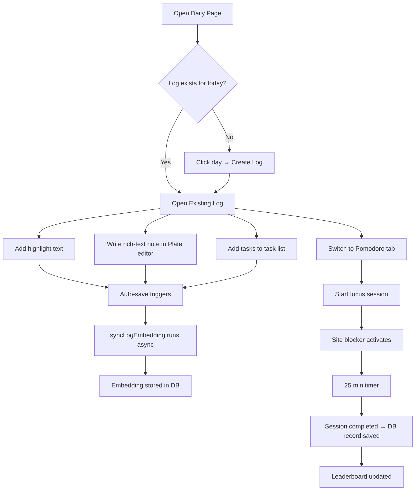
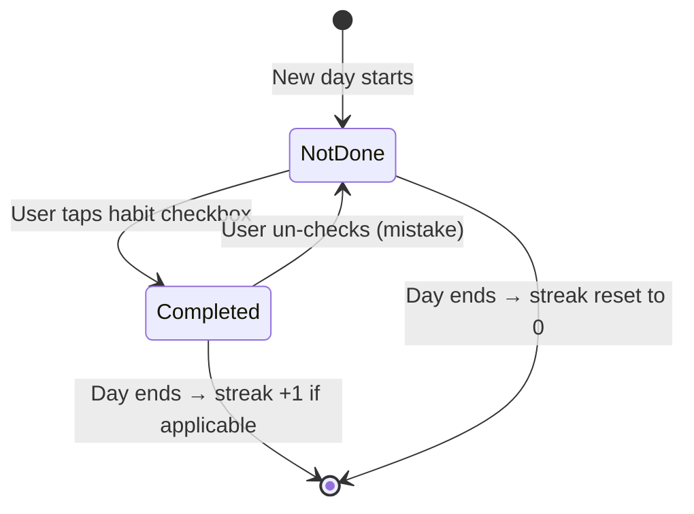
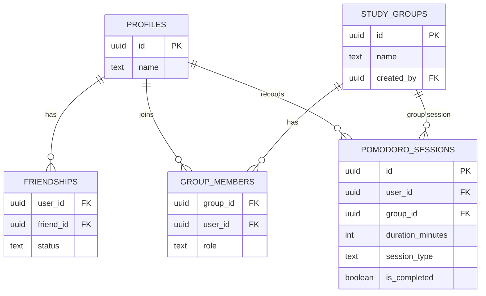

# Section 6 — Technical Reference
# Daily Planning System, Habit Tracking & Social Pomodoro

---

## 1. Overview

The Daily Planning system in Cortex is a four-layer productivity framework:
1. **Daily Journal** — a per-day rich-text log with tasks, highlight, and Plate.js content
2. **Habit Tracker** — streaked habits with flexible daily/weekly/monthly frequencies
3. **Pomodoro Timer** — the classic 25-5 focus/break cycle with session tracking
4. **Social Features** — friendships, study groups, and a weekly leaderboard

All four layers are designed to work together: a completed Pomodoro session updates the leaderboard, the daily log records what was studied, habits build long-term academic routines, and friends provide social accountability.

---

## 2. Daily Logs System

### 2.1 Database Schema

```sql
CREATE TABLE daily_logs (
  id            UUID PRIMARY KEY DEFAULT gen_random_uuid(),
  user_id       UUID NOT NULL REFERENCES profiles(id) ON DELETE CASCADE,
  date          DATE NOT NULL,
  workspace_id  UUID,

  -- Content
  highlight     TEXT,           -- "Best thing that happened today" or "Main achievement"
  content       JSONB,          -- Plate.js rich-text AST
  content_text  TEXT,           -- Plain text extraction for AI/search

  -- Task list (stored as JSONB array, not separate table for simplicity)
  tasks         JSONB NOT NULL DEFAULT '[]'::jsonb,
  -- Format: [{id: "uuid", text: "Write OS summary", is_completed: true}]

  -- AI embedding for semantic search
  embedding     vector(768),

  created_at    TIMESTAMPTZ DEFAULT NOW(),
  updated_at    TIMESTAMPTZ DEFAULT NOW(),

  -- Each user can only have one log per day
  UNIQUE(user_id, date)
);
```

### 2.2 DailyService — Key Methods

```typescript
// backend/src/services/DailyService.ts

export class DailyService {
  constructor(private repo: DailyRepository) {}

  async getDailyLogs(userId: string, monthStart: string, monthEnd: string, workspaceId?: string) {
    // Returns all logs in a date range (for calendar rendering)
    return this.repo.getDailyLogs(userId, monthStart, monthEnd, workspaceId);
  }

  async createDailyLog(userId: string, date: string, workspaceId?: string) {
    // Create a new daily log for a given date
    // UNIQUE constraint prevents duplicates
    return this.repo.createDailyLog(userId, date, workspaceId);
  }

  async updateDailyLog(userId: string, logId: string, payload: Record<string, any>) {
    const finalPayload = { ...payload };

    // Normalize: camelCase from frontend → snake_case for DB
    if ('contentText' in payload) {
      finalPayload.content_text = payload.contentText;
      delete finalPayload.contentText;
    }

    // If Plate content was sent without content_text, extract it
    if (payload.content && !finalPayload.content_text) {
      finalPayload.content_text = extractPlateText(payload.content);
    }

    await this.repo.updateDailyLog(userId, logId, finalPayload);

    // Async: generate and store embedding (non-blocking)
    this.syncLogEmbedding(userId, logId).catch(console.error);
  }

  async createDailyTask(userId: string, logId: string, text: string) {
    const log = await this.repo.getDailyLogById(userId, logId);
    if (!log) throw new Error("Daily log not found.");

    const newTask = {
      id: crypto.randomUUID(),
      text: text.trim(),
      is_completed: false,
    };

    const updatedTasks = [...(log.tasks ?? []), newTask];
    await this.repo.updateDailyLog(userId, logId, { tasks: updatedTasks });
    return newTask;
  }

  async toggleTaskCompletion(userId: string, logId: string, taskId: string) {
    const log = await this.repo.getDailyLogById(userId, logId);
    if (!log) throw new Error("Daily log not found.");

    const updatedTasks = log.tasks.map((task: any) =>
      task.id === taskId
        ? { ...task, is_completed: !task.is_completed }
        : task
    );

    await this.repo.updateDailyLog(userId, logId, { tasks: updatedTasks });
  }

  async syncLogEmbedding(userId: string, logId: string) {
    try {
      const log = await this.repo.getDailyLogById(userId, logId);
      if (!log) return;

      const textParts: string[] = [];
      if (log.highlight) textParts.push(`Highlight: ${log.highlight}`);
      if (log.content_text) textParts.push(`Note: ${log.content_text}`);
      if (log.tasks?.length > 0) {
        const taskTexts = log.tasks
          .map((t: any) => `- [${t.is_completed ? 'x' : ' '}] ${t.text}`)
          .join('\n');
        textParts.push(`Tasks:\n${taskTexts}`);
      }

      const textForEmbedding = textParts.join('\n\n').trim();
      if (textForEmbedding) {
        const embedding = await embedText(`passage: ${textForEmbedding}`);
        await this.repo.updateDailyLog(userId, logId, { embedding });
      }
    } catch (e) {
      console.error("Failed to sync daily log embedding:", e);
    }
  }
}
```

### 2.3 Plate Text Extraction

When the frontend sends Plate.js JSON content, the backend extracts plain text using a recursive tree walker:

```typescript
function extractPlateText(nodes: any[]): string {
  if (!Array.isArray(nodes)) return "";
  const parts: string[] = [];

  const walk = (node: any) => {
    // Leaf node: has text property
    if (typeof node?.text === "string") {
      parts.push(node.text);
    }
    // Branch node: has children array
    else if (Array.isArray(node?.children)) {
      node.children.forEach(walk);
    }
  };

  nodes.forEach(walk);
  return parts.join(" ").trim();
}
```

---

## 3. Frontend Daily Planner

### 3.1 Component Architecture

```
frontend/app/daily/
├── page.tsx                    Server component: auth check, initial data
├── layout.tsx                  Shared layout with tab navigation
└── [date]/page.tsx             Individual day view

frontend/components/daily/
├── daily-layout-client.tsx     Main client component with tabs
├── full-calendar/              Calendar UI (react-big-calendar or custom)
│   └── index.tsx               Month calendar with day indicators
├── daily-log-view.tsx          Day log editing (Plate editor + tasks + highlight)
├── daily-log-modal.tsx         Modal for creating/editing a day log
├── habits-modal.tsx            Habit management UI
└── views/
    ├── pomodoro-view.tsx       Pomodoro timer + subtabs
    ├── friends-view.tsx        Friends list with status
    ├── groups-view.tsx         Study groups management
    └── leaderboard-view.tsx    Weekly Pomodoro ranking
```

### 3.2 use-daily.ts — TanStack Query Hooks

```typescript
// All daily planning operations as TanStack Query hooks

// Fetch all logs for a month (for calendar dot indicators)
export function useDailyLogs(monthStart: string, monthEnd: string) {
  return useQuery({
    queryKey: ['daily', 'logs', monthStart, monthEnd],
    queryFn: () => apiClient.get(`/daily/logs?start=${monthStart}&end=${monthEnd}`),
    staleTime: 60 * 1000,  // 1 minute
  });
}

// Fetch detail for a single day
export function useDailyLogDetail(date: string) {
  return useQuery({
    queryKey: ['daily', 'log', date],
    queryFn: () => apiClient.get(`/daily/logs/${date}`),
    enabled: !!date,
  });
}

// Create a log for a date (opens the modal)
export function useCreateDailyLog() {
  const queryClient = useQueryClient();
  return useMutation({
    mutationFn: ({ date }) => apiClient.post('/daily/logs', { date }),
    onSuccess: (_, { date }) => {
      queryClient.invalidateQueries({ queryKey: ['daily', 'logs'] });
      queryClient.invalidateQueries({ queryKey: ['daily', 'log', date] });
    },
  });
}

// Update log content with debounce (auto-save)
export function useUpdateDailyLog(logId: string) {
  return useMutation({
    mutationFn: (payload) => apiClient.patch(`/daily/logs/${logId}`, payload),
  });
}

// Task operations
export function useCreateTask(logId: string) {
  const queryClient = useQueryClient();
  return useMutation({
    mutationFn: ({ text }) => apiClient.post(`/daily/logs/${logId}/tasks`, { text }),
    onSuccess: () => queryClient.invalidateQueries({ queryKey: ['daily', 'log'] }),
  });
}

export function useToggleTask(logId: string) {
  const queryClient = useQueryClient();
  return useMutation({
    mutationFn: ({ taskId }) => apiClient.patch(`/daily/logs/${logId}/tasks/${taskId}/toggle`),
    onMutate: async ({ taskId }) => {
      // Optimistic update: toggle immediately in UI
      await queryClient.cancelQueries({ queryKey: ['daily', 'log'] });
      const previous = queryClient.getQueryData(['daily', 'log']);
      queryClient.setQueryData(['daily', 'log'], (old: any) => ({
        ...old,
        tasks: old.tasks.map((t: any) =>
          t.id === taskId ? { ...t, is_completed: !t.is_completed } : t
        ),
      }));
      return { previous };
    },
    onError: (_, __, context) => {
      queryClient.setQueryData(['daily', 'log'], context?.previous);
    },
  });
}
```

---

## 4. Habits System

### 4.1 Database Schema

```sql
CREATE TABLE habits (
  id           UUID PRIMARY KEY DEFAULT gen_random_uuid(),
  user_id      UUID NOT NULL REFERENCES profiles(id) ON DELETE CASCADE,
  name         TEXT NOT NULL,
  color        TEXT,           -- Hex color for UI
  icon         TEXT,           -- Emoji or icon name
  frequency    TEXT NOT NULL DEFAULT 'daily'
               CHECK (frequency IN ('daily', 'weekly', 'monthly')),
  -- For weekly: array of day numbers [0=Sun, 1=Mon, ... 6=Sat]
  -- For monthly: array of date numbers [1-31]
  -- For daily: null (applies every day)
  target_days  JSONB,
  streak_count INT NOT NULL DEFAULT 0,
  created_at   TIMESTAMPTZ DEFAULT NOW()
);

CREATE TABLE habit_completions (
  habit_id        UUID NOT NULL REFERENCES habits(id) ON DELETE CASCADE,
  user_id         UUID NOT NULL REFERENCES profiles(id) ON DELETE CASCADE,
  completed_date  DATE NOT NULL,
  created_at      TIMESTAMPTZ DEFAULT NOW(),
  PRIMARY KEY (habit_id, completed_date)
);
```

### 4.2 Frequency Logic

```typescript
// In DailyService or HabitService
function shouldHabitApplyToday(habit: Habit, date: Date): boolean {
  switch (habit.frequency) {
    case 'daily':
      return true;  // Daily habits apply every day

    case 'weekly': {
      // target_days: [1, 3, 5] = Monday, Wednesday, Friday
      const dayOfWeek = date.getDay();  // 0=Sun, 6=Sat
      return (habit.target_days as number[]).includes(dayOfWeek);
    }

    case 'monthly': {
      // target_days: [1, 15] = 1st and 15th of each month
      const dayOfMonth = date.getDate();  // 1-31
      return (habit.target_days as number[]).includes(dayOfMonth);
    }

    default:
      return false;
  }
}
```

### 4.3 Streak Calculation

```typescript
async calculateStreak(userId: string, habitId: string): Promise<number> {
  const habit = await this.repo.getHabit(habitId);
  if (!habit) return 0;

  // Get all completions, ordered by date descending
  const completions = await this.repo.getHabitCompletions(userId, habitId);
  const completionDates = new Set(completions.map(c => c.completed_date));

  let streak = 0;
  let currentDate = new Date();

  while (true) {
    const dateStr = currentDate.toISOString().split('T')[0];

    // Should this habit apply on this date?
    if (!shouldHabitApplyToday(habit, currentDate)) {
      // Skip this date (habit doesn't apply)
      currentDate.setDate(currentDate.getDate() - 1);
      continue;
    }

    // Did the user complete it on this date?
    if (completionDates.has(dateStr)) {
      streak++;
      currentDate.setDate(currentDate.getDate() - 1);
    } else {
      break;  // Streak is broken
    }
  }

  return streak;
}
```

---

## 5. Pomodoro Timer System

### 5.1 Database Schema

```sql
CREATE TABLE pomodoro_sessions (
  id               UUID PRIMARY KEY DEFAULT gen_random_uuid(),
  user_id          UUID NOT NULL REFERENCES profiles(id) ON DELETE CASCADE,
  started_at       TIMESTAMPTZ NOT NULL,
  ended_at         TIMESTAMPTZ,
  duration_minutes INT,        -- How long the session was planned (25, 5, 15)
  session_type     TEXT NOT NULL DEFAULT 'focus'
                   CHECK (session_type IN ('focus', 'short_break', 'long_break')),
  subject          TEXT,       -- What the student was studying
  is_completed     BOOLEAN NOT NULL DEFAULT FALSE,
  group_id         UUID REFERENCES study_groups(id),  -- For group sessions
  created_at       TIMESTAMPTZ DEFAULT NOW()
);
```

### 5.2 Pomodoro Sequence

The classic Pomodoro Technique:
```
[25 min Focus] → [5 min Short Break] → [25 min Focus] → [5 min Short Break]
    → [25 min Focus] → [5 min Short Break] → [25 min Focus] → [15 min Long Break]
```

When a session ends:
1. Frontend calls `POST /api/daily/pomodoro-sessions` to record the completed session
2. The backend stores it with `is_completed = TRUE` and `ended_at = NOW()`
3. The leaderboard query aggregates total focus minutes for the week

### 5.3 Leaderboard — PostgreSQL RPC

The leaderboard is calculated in a single SQL function:

```sql
CREATE OR REPLACE FUNCTION get_friends_leaderboard(target_user_id UUID)
RETURNS TABLE (
  user_id    UUID,
  name       TEXT,
  avatar_url TEXT,
  minutes    BIGINT,
  rank       BIGINT
)
LANGUAGE sql STABLE SECURITY DEFINER
AS $$
  WITH friend_ids AS (
    -- Get all accepted friends of the user
    SELECT friend_id AS id FROM friendships
    WHERE user_id = target_user_id AND status = 'accepted'
    UNION
    SELECT user_id AS id FROM friendships
    WHERE friend_id = target_user_id AND status = 'accepted'
    UNION
    SELECT target_user_id  -- Include the user themselves
  ),
  weekly_minutes AS (
    -- Sum focus minutes for the current ISO week
    SELECT
      ps.user_id,
      COALESCE(SUM(ps.duration_minutes), 0) AS total_minutes
    FROM pomodoro_sessions ps
    JOIN friend_ids fi ON ps.user_id = fi.id
    WHERE
      ps.session_type = 'focus'
      AND ps.is_completed = TRUE
      AND date_trunc('week', ps.ended_at) = date_trunc('week', NOW())
    GROUP BY ps.user_id
  )
  SELECT
    p.id AS user_id,
    COALESCE(p.name, split_part(p.email, '@', 1)) AS name,
    p.avatar_url,
    COALESCE(wm.total_minutes, 0) AS minutes,
    RANK() OVER (ORDER BY COALESCE(wm.total_minutes, 0) DESC) AS rank
  FROM friend_ids fi
  JOIN profiles p ON p.id = fi.id
  LEFT JOIN weekly_minutes wm ON wm.user_id = fi.id
  ORDER BY minutes DESC;
$$;
```

---

## 6. Social Features

### 6.1 Schema

```sql
CREATE TABLE friendships (
  user_id    UUID NOT NULL REFERENCES profiles(id) ON DELETE CASCADE,
  friend_id  UUID NOT NULL REFERENCES profiles(id) ON DELETE CASCADE,
  status     TEXT NOT NULL DEFAULT 'pending'
             CHECK (status IN ('pending', 'accepted', 'blocked')),
  created_at TIMESTAMPTZ DEFAULT NOW(),
  PRIMARY KEY (user_id, friend_id)
);

CREATE TABLE study_groups (
  id          UUID PRIMARY KEY DEFAULT gen_random_uuid(),
  name        TEXT NOT NULL,
  description TEXT,
  created_by  UUID REFERENCES profiles(id),
  created_at  TIMESTAMPTZ DEFAULT NOW()
);

CREATE TABLE group_members (
  group_id   UUID NOT NULL REFERENCES study_groups(id) ON DELETE CASCADE,
  user_id    UUID NOT NULL REFERENCES profiles(id) ON DELETE CASCADE,
  role       TEXT NOT NULL DEFAULT 'member' CHECK (role IN ('admin', 'member')),
  joined_at  TIMESTAMPTZ DEFAULT NOW(),
  PRIMARY KEY (group_id, user_id)
);
```

### 6.2 Friend Request Flow

```typescript
// Send a friend request
async sendFriendRequest(userId: string, friendId: string) {
  if (userId === friendId) throw new Error("Cannot friend yourself.");

  // Check if already friends or pending
  const existing = await this.repo.getFriendship(userId, friendId);
  if (existing) throw new Error(`Friendship already exists: ${existing.status}`);

  await this.repo.createFriendship(userId, friendId, 'pending');
}

// Accept a friend request
async acceptFriendRequest(userId: string, requesterId: string) {
  // The request was sent from requesterId to userId
  const friendship = await this.repo.getFriendship(requesterId, userId);
  if (!friendship || friendship.status !== 'pending') {
    throw new Error("No pending request found.");
  }
  await this.repo.updateFriendship(requesterId, userId, 'accepted');
}
```

---

## 7. Chrome Extension Integration

The Chrome Extension (separate codebase in `extension/`) integrates with the daily planning system:

- **Timer sync:** When a focus session completes in the extension, it calls `POST /api/daily/pomodoro-sessions` on the Railway backend with the completed session data
- **Site blocker:** During focus sessions, `chrome.declarativeNetRequest` rules block distracting domains
- **Social status:** The extension can show which friends are currently in a focus session (via polling or Supabase Realtime)

The extension uses the same JWT token as the web app — stored in `chrome.storage.local` — so no separate login is needed.

---

## 8. Mermaid Diagrams

### 8.1 Daily Planning Workflow


### 8.2 Habit Completion State Machine


### 8.3 Social Feature ERD

