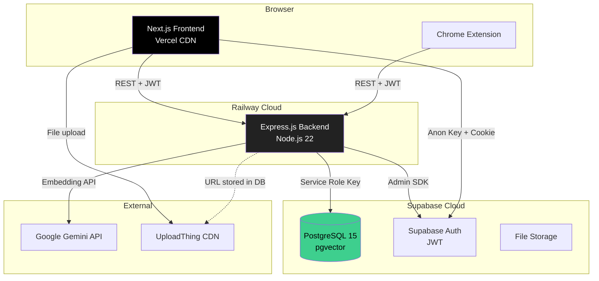
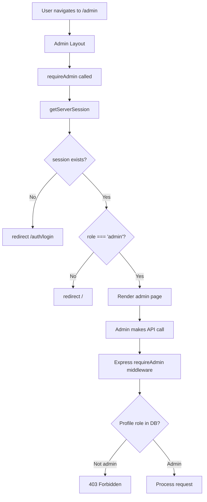

# Section 7 — Technical Reference
# Admin Panel, Deployment Infrastructure, Internationalization & Browser Extension

---

## 1. Overview

This section covers four cross-cutting concerns that support the entire Cortex platform:
1. **Admin Panel** — role-gated management interface for users and catalog data
2. **Internationalization (i18n)** — full Arabic/English bilingual support with RTL
3. **Chrome Extension** — Manifest V3 browser extension for Pomodoro and site blocking
4. **Deployment Architecture** — Vercel, Railway, Supabase, and the environment configuration

---

## 2. Admin Panel

### 2.1 Access Control Architecture

Admin access is gated at multiple layers:

**Layer 1 — Frontend server guard:**
```typescript
// frontend/lib/require-admin.ts
import { getServerSession } from "@/lib/auth";
import { redirect } from "next/navigation";

export async function requireAdmin() {
  const session = await getServerSession();
  if (!session) redirect('/auth/login');
  if (session.profile?.role !== 'admin') redirect('/');
  return session;
}
```

**Layer 2 — Admin layout applies the guard to all admin pages:**
```typescript
// frontend/app/admin/layout.tsx
import { requireAdmin } from "@/lib/require-admin";

export default async function AdminLayout({ children }: { children: React.ReactNode }) {
  await requireAdmin();  // Throws redirect if not admin → children never render
  return (
    <div className="admin-layout">
      <AdminSidebar />
      <main>{children}</main>
    </div>
  );
}
```

**Layer 3 — Backend admin middleware:**
```typescript
// backend/src/middleware/admin.ts
export const requireAdmin = async (req: Request, res: Response, next: NextFunction) => {
  // req.user is already set by the auth middleware
  const { data: profile, error } = await supabase
    .from('profiles')
    .select('role')
    .eq('id', req.user!.id)
    .single();

  if (error || profile?.role !== 'admin') {
    return res.status(403).json({
      error: 'Forbidden: Admin role required',
      code: 'ADMIN_REQUIRED',
    });
  }
  next();
};
```

**Layer 4 — Database RLS write policies:**
```sql
-- Only admins can insert into catalog tables
CREATE POLICY "admin_only_insert" ON courses
  FOR INSERT WITH CHECK (
    EXISTS (
      SELECT 1 FROM profiles
      WHERE id = auth.uid() AND role = 'admin'
    )
  );
```

### 2.2 Admin Dashboard (`frontend/app/admin/page.tsx`)

The admin dashboard is a Server Component that renders platform statistics:

```typescript
export default async function AdminPage() {
  const session = await requireAdmin();

  // Parallel fetch of all admin stats
  const [stats] = await Promise.all([
    getAdminStats(session.accessToken),
  ]);

  return (
    <div className="grid grid-cols-4 gap-6">
      <StatCard title="Total Users" value={stats.totalUsers} icon={<UsersIcon />} />
      <StatCard title="Total Notes" value={stats.totalNotes} icon={<FileTextIcon />} />
      <StatCard title="Active Today" value={stats.activeToday} icon={<ActivityIcon />} />
      <StatCard title="Total Resources" value={stats.totalResources} icon={<DatabaseIcon />} />
    </div>
  );
}
```

### 2.3 User Management (`frontend/components/admin/users-manager.tsx`)

The users manager is a full data table with:
- Paginated list of all users (ID, name, email, role, created_at)
- Role change: dropdown to change user from 'user' to 'admin' and vice versa
- View user profile details
- Search by name/email

```typescript
// users-manager.tsx (key logic)
export function UsersManager({ initialUsers }) {
  const [users, setUsers] = useState(initialUsers);
  const changeRole = useAdminChangeRole();

  const handleRoleChange = async (userId: string, newRole: string) => {
    await changeRole.mutateAsync({ userId, role: newRole });
    setUsers(prev => prev.map(u => u.id === userId ? { ...u, role: newRole } : u));
    toast.success(`Role updated to ${newRole}`);
  };

  return (
    <Table>
      <TableHeader>
        <TableRow>
          <TableHead>Name</TableHead>
          <TableHead>Email</TableHead>
          <TableHead>Role</TableHead>
          <TableHead>Joined</TableHead>
          <TableHead>Actions</TableHead>
        </TableRow>
      </TableHeader>
      <TableBody>
        {users.map(user => (
          <TableRow key={user.id}>
            <TableCell>{user.name}</TableCell>
            <TableCell>{user.email}</TableCell>
            <TableCell>
              <Select
                value={user.role}
                onValueChange={v => handleRoleChange(user.id, v)}
              >
                <SelectTrigger><SelectValue /></SelectTrigger>
                <SelectContent>
                  <SelectItem value="user">User</SelectItem>
                  <SelectItem value="admin">Admin</SelectItem>
                </SelectContent>
              </Select>
            </TableCell>
            <TableCell>{formatDate(user.created_at)}</TableCell>
          </TableRow>
        ))}
      </TableBody>
    </Table>
  );
}
```

### 2.4 Data Manager (`frontend/components/admin/data-manager.tsx`)

The data manager provides a tabbed interface for CRUD operations on every catalog entity:

- **Tab: Universities** — Create, edit universities (name_en, name_ar)
- **Tab: Colleges** — Create colleges, select parent university
- **Tab: Majors** — Create majors, select parent college
- **Tab: Courses** — Full form: name, code, year_level, credits, description (both languages)
- **Tab: Doctors** — Create doctor profiles (name_en, name_ar)
- **Tab: Resources** — Upload file or add link to a course
- **Tab: Doctor Assignments** — Assign/unassign doctors from courses

Each tab fetches its data with TanStack Query and uses optimistic updates for smooth UX.

### 2.5 Admin API Layer (`frontend/lib/api/admin.ts`)

```typescript
export async function getAdminStats(token: string) {
  const res = await fetch(`${BACKEND_URL}/api/admin/stats`, {
    headers: { Authorization: `Bearer ${token}` },
  });
  if (!res.ok) throw new Error('Failed to fetch admin stats');
  return res.json();
}

export async function getAllUsers(token: string) {
  const res = await fetch(`${BACKEND_URL}/api/admin/users`, {
    headers: { Authorization: `Bearer ${token}` },
  });
  if (!res.ok) throw new Error('Failed to fetch users');
  return res.json();
}

export async function updateUserRole(userId: string, role: string, token: string) {
  const res = await fetch(`${BACKEND_URL}/api/admin/users/${userId}/role`, {
    method: 'PATCH',
    headers: {
      'Content-Type': 'application/json',
      Authorization: `Bearer ${token}`,
    },
    body: JSON.stringify({ role }),
  });
  if (!res.ok) throw new Error('Failed to update role');
  return res.json();
}
```

---

## 3. Internationalization (next-intl)

### 3.1 Architecture Overview

Cortex uses **next-intl** for bilingual Arabic/English support. The library is designed specifically for Next.js App Router and supports both server and client components natively.

**Key files:**
```
frontend/
├── messages/
│   ├── en.json          ← English strings (all UI text)
│   └── ar.json          ← Arabic translations
├── i18n/
│   └── request.ts       ← next-intl configuration
├── middleware.ts         ← Locale detection + routing
└── lib/
    └── i18n.ts          ← Routing configuration
```

### 3.2 Configuration (`i18n/request.ts`)

```typescript
import { getRequestConfig } from 'next-intl/server';
import { routing } from '@/lib/i18n';

export default getRequestConfig(async ({ requestLocale }) => {
  let locale = await requestLocale;

  // Validate against supported locales
  if (!locale || !routing.locales.includes(locale as any)) {
    locale = routing.defaultLocale;
  }

  return {
    locale,
    messages: (await import(`../../messages/${locale}.json`)).default,
  };
});
```

### 3.3 Routing Configuration (`lib/i18n.ts`)

```typescript
import { defineRouting } from 'next-intl/routing';

export const routing = defineRouting({
  locales: ['en', 'ar'],
  defaultLocale: 'en',
  // URL structure: /en/notes, /ar/notes
  // Default locale can optionally be pathless: /notes (English)
});
```

### 3.4 Using Translations in Server Components

```typescript
// In any Server Component
import { getTranslations } from 'next-intl/server';

export default async function NotesPage() {
  const t = await getTranslations('notes');  // Namespace

  return (
    <div>
      <h1>{t('title')}</h1>           {/* "My Notes" / "ملاحظاتي" */}
      <p>{t('emptyState')}</p>        {/* "No notes yet" / "لا توجد ملاحظات" */}
      <button>{t('createNote')}</button>  {/* "Create Note" / "إنشاء ملاحظة" */}
    </div>
  );
}
```

### 3.5 Using Translations in Client Components

```typescript
// In any Client Component
'use client';
import { useTranslations } from 'next-intl';

export function NotesToolbar() {
  const t = useTranslations('notes');

  return (
    <div className="flex gap-2">
      <Button>{t('newNote')}</Button>
      <Button>{t('newFolder')}</Button>
    </div>
  );
}
```

### 3.6 Message File Structure (`messages/en.json`)

```json
{
  "auth": {
    "login": "Sign In",
    "signup": "Create Account",
    "email": "Email address",
    "password": "Password",
    "loginButton": "Sign In",
    "noAccount": "Don't have an account?",
    "signupLink": "Create one"
  },
  "notes": {
    "title": "My Notes",
    "createNote": "New Note",
    "createFolder": "New Folder",
    "emptyState": "No notes yet. Create your first note to get started.",
    "searchPlaceholder": "Search notes...",
    "archive": "Archive",
    "share": "Share",
    "publish": "Publish"
  },
  "dataPage": {
    "title": "Course Catalog",
    "allUniversities": "All Universities",
    "selectCollege": "Select College",
    "noCourses": "No courses found for the selected filters."
  },
  "daily": {
    "title": "Daily Planner",
    "today": "Today",
    "highlight": "Today's highlight",
    "tasks": "Tasks",
    "addTask": "Add a task...",
    "startPomodoro": "Start Focus Session"
  }
}
```

Arabic equivalent (`messages/ar.json`):
```json
{
  "auth": {
    "login": "تسجيل الدخول",
    "signup": "إنشاء حساب",
    "email": "البريد الإلكتروني",
    "password": "كلمة المرور",
    "loginButton": "دخول"
  },
  "notes": {
    "title": "ملاحظاتي",
    "createNote": "ملاحظة جديدة",
    "emptyState": "لا توجد ملاحظات بعد. أنشئ ملاحظتك الأولى للبدء."
  }
}
```

### 3.7 RTL Support

When Arabic locale is active, the HTML `dir` attribute is set to `rtl`:

```typescript
// frontend/app/[locale]/layout.tsx
export default async function LocaleLayout({ children, params }) {
  const { locale } = await params;
  const direction = locale === 'ar' ? 'rtl' : 'ltr';

  return (
    <html lang={locale} dir={direction}>
      <body className={cn(
        'min-h-screen',
        locale === 'ar' && 'font-arabic'  // Switch to Arabic font (Noto Kufi Arabic)
      )}>
        {children}
      </body>
    </html>
  );
}
```

Tailwind CSS provides RTL utilities:
```css
/* Tailwind RTL utilities used in components: */
/* rtl:space-x-reverse — flip horizontal spacing in RTL */
/* rtl:rotate-180 — flip icons (e.g., chevron arrows) */
/* rtl:text-right → text-left in LTR, text-right in RTL */
/* ms-auto (margin-inline-start) — automatically adapts to LTR/RTL */
/* ps-4 (padding-inline-start) — adapts to RTL */
```

### 3.8 Locale Switcher

```typescript
// Locale switcher component
'use client';
import { useRouter, usePathname } from 'next/navigation';

export function LocaleSwitcher({ currentLocale }) {
  const router = useRouter();
  const pathname = usePathname();

  const switchLocale = (newLocale: string) => {
    // Replace locale prefix in path
    const newPath = pathname.replace(`/${currentLocale}`, `/${newLocale}`);
    router.push(newPath);
    // Persist preference in cookie
    document.cookie = `NEXT_LOCALE=${newLocale}; path=/; max-age=31536000`;
  };

  return (
    <button onClick={() => switchLocale(currentLocale === 'en' ? 'ar' : 'en')}>
      {currentLocale === 'en' ? 'العربية' : 'English'}
    </button>
  );
}
```

---

## 4. Chrome Extension Architecture

### 4.1 Manifest V3 (`extension/manifest.json`)

```json
{
  "manifest_version": 3,
  "name": "Cortex Focus",
  "version": "1.0.0",
  "description": "Pomodoro timer with site blocking and social study features",
  "permissions": [
    "storage",
    "alarms",
    "declarativeNetRequest",
    "declarativeNetRequestWithHostAccess"
  ],
  "host_permissions": ["<all_urls>"],
  "background": {
    "service_worker": "background/service-worker.js",
    "type": "module"
  },
  "action": {
    "default_popup": "popup/popup.html",
    "default_icon": { "32": "icons/icon32.png" }
  },
  "icons": { "128": "icons/icon128.png" }
}
```

### 4.2 Service Worker (`extension/src/background/service-worker.ts`)

```typescript
import { Storage } from '../lib/storage';
import { API } from '../lib/api';
import { Blocker } from '../lib/blocker';

// Runs on extension install
chrome.runtime.onInstalled.addListener(async () => {
  await Storage.initialize();
  console.log('Cortex Focus extension installed');
});

// Timer tick via Chrome alarms (fires even when popup is closed)
chrome.alarms.onAlarm.addListener(async (alarm) => {
  if (alarm.name === 'pomodoro-tick') {
    const state = await Storage.getTimerState();
    if (!state.isRunning) return;

    const remaining = state.remainingSeconds - 1;

    if (remaining <= 0) {
      // Session complete
      await Storage.updateTimerState({ isRunning: false, remainingSeconds: 0 });
      await API.recordSession(state.sessionId, state.sessionType, state.subject);
      chrome.notifications.create({
        type: 'basic',
        iconUrl: 'icons/icon128.png',
        title: state.sessionType === 'focus' ? 'Focus session complete! 🍅' : 'Break time over!',
        message: state.sessionType === 'focus'
          ? 'Great work! Time for a break.'
          : 'Ready for another focus session?',
      });
      if (state.sessionType === 'focus') {
        await Blocker.disableBlocking();
      }
    } else {
      await Storage.updateTimerState({ remainingSeconds: remaining });
    }
  }
});

// Start timer
chrome.runtime.onMessage.addListener(async (message, sender, sendResponse) => {
  if (message.type === 'START_TIMER') {
    const { duration, sessionType, subject } = message.payload;
    const sessionId = crypto.randomUUID();

    await Storage.updateTimerState({
      isRunning: true,
      remainingSeconds: duration * 60,
      sessionId,
      sessionType,
      subject,
      startedAt: new Date().toISOString(),
    });

    // Create alarm to tick every second
    chrome.alarms.create('pomodoro-tick', { periodInMinutes: 1/60 });

    if (sessionType === 'focus') {
      await Blocker.enableBlocking();
    }

    sendResponse({ success: true, sessionId });
  }
});
```

### 4.3 Site Blocker (`extension/src/lib/blocker.ts`)

```typescript
export const Blocker = {
  // Blocking is implemented via declarativeNetRequest dynamic rules
  async enableBlocking() {
    const blockedSites = await Storage.getBlockedSites();
    const rules = blockedSites.map((site, index) => ({
      id: index + 1,
      priority: 1,
      action: { type: 'block' as const },
      condition: {
        urlFilter: `||${site}`,
        resourceTypes: ['main_frame', 'sub_frame'],
      },
    }));

    await chrome.declarativeNetRequest.updateDynamicRules({
      removeRuleIds: rules.map(r => r.id),
      addRules: rules,
    });
  },

  async disableBlocking() {
    // Remove all dynamic rules
    const existingRules = await chrome.declarativeNetRequest.getDynamicRules();
    await chrome.declarativeNetRequest.updateDynamicRules({
      removeRuleIds: existingRules.map(r => r.id),
    });
  },

  async addSite(domain: string) {
    const sites = await Storage.getBlockedSites();
    if (!sites.includes(domain)) {
      await Storage.setBlockedSites([...sites, domain]);
    }
  },

  async removeSite(domain: string) {
    const sites = await Storage.getBlockedSites();
    await Storage.setBlockedSites(sites.filter(s => s !== domain));
  },
};
```

### 4.4 API Integration (`extension/src/lib/api.ts`)

```typescript
export const API = {
  async recordSession(sessionId: string, sessionType: string, subject: string) {
    const token = await Storage.getAuthToken();
    if (!token) return;  // Not logged in, skip

    const startedAt = await Storage.getTimerState().then(s => s.startedAt);

    await fetch(`${BACKEND_URL}/api/daily/pomodoro-sessions`, {
      method: 'POST',
      headers: {
        'Content-Type': 'application/json',
        Authorization: `Bearer ${token}`,
      },
      body: JSON.stringify({
        id: sessionId,
        session_type: sessionType,
        subject,
        started_at: startedAt,
        ended_at: new Date().toISOString(),
        duration_minutes: sessionType === 'focus' ? 25 : sessionType === 'short_break' ? 5 : 15,
        is_completed: true,
      }),
    });
  },

  async getFriendsStatus(token: string) {
    const res = await fetch(`${BACKEND_URL}/api/daily/friends-status`, {
      headers: { Authorization: `Bearer ${token}` },
    });
    return res.json();
  },
};
```

---

## 5. Deployment Architecture

### 5.1 Production Services

| Service | Provider | What it runs |
|---------|----------|-------------|
| Frontend | Vercel | Next.js 15 (SSR, Edge Functions, CDN) |
| Backend | Railway | Express.js (Node.js 22, Docker container) |
| Database | Supabase Cloud | PostgreSQL 15, Auth, Storage, Realtime |
| File CDN | UploadThing | Resource file storage (PDFs, images) |

### 5.2 Vercel Configuration

**`vercel.json`** (if needed):
```json
{
  "functions": {
    "app/api/ai/command/route.ts": {
      "runtime": "edge",
      "maxDuration": 60
    },
    "app/api/ai/copilot/route.ts": {
      "runtime": "edge",
      "maxDuration": 30
    }
  }
}
```

AI routes use the Edge Runtime for lowest latency. Data routes use Node.js Runtime (default) for full Node.js API support.

**Environment variables on Vercel:**
```
NEXT_PUBLIC_SUPABASE_URL=https://xxx.supabase.co
NEXT_PUBLIC_SUPABASE_ANON_KEY=eyJhbGc...
BACKEND_URL=https://cortex-backend.up.railway.app
UPLOADTHING_SECRET=sk_live_xxx
```

### 5.3 Railway Configuration

Express backend is deployed as a Node.js service. Railway auto-detects the `package.json` and runs `npm start`. Health check endpoint:

```typescript
// backend/src/routes/health.ts
app.get('/health', (req, res) => {
  res.json({
    status: 'ok',
    timestamp: new Date().toISOString(),
    version: process.env.npm_package_version,
  });
});
```

**Environment variables on Railway:**
```
SUPABASE_URL=https://xxx.supabase.co
SUPABASE_SERVICE_ROLE_KEY=eyJhbGc...  ← CRITICAL: never on Vercel
GEMINI_API_KEY=AIzaSy...
PORT=3001
NODE_ENV=production
```

### 5.4 Frontend → Backend Proxy

The frontend never exposes the Railway backend URL to the browser (for CORS control). Instead, it uses a Next.js route rewrite:

```typescript
// frontend/next.config.ts
export default {
  async rewrites() {
    return [
      {
        source: '/api/backend/:path*',
        destination: `${process.env.BACKEND_URL}/:path*`,
      },
    ];
  },
};
```

The `BACKEND_URL` environment variable is server-only (no `NEXT_PUBLIC_` prefix). The browser only sees `/api/backend/...` URLs — the actual Railway URL is never exposed.

### 5.5 Database Migrations

All 44 migrations are SQL files in `supabase/migrations/`:
```
supabase/migrations/
├── 001_initial_schema.sql
├── 002_profiles_and_auth.sql
├── ...
├── 031_daily_feature_tables.sql
├── 032_habits_custom_days.sql
├── 035_pomodoro_sessions.sql
├── 038_social_features.sql
├── 039_group_friends_leaderboard.sql
└── 044_fix_search_daily_logs_search_path.sql
```

Deployment command:
```bash
supabase db push  # Applies all pending migrations
```

---

## 6. Performance & SEO

### 6.1 Next.js Metadata API

Every page exports metadata for SEO:
```typescript
// frontend/app/notes/page.tsx
export const metadata = {
  title: 'My Notes | Cortex',
  description: 'Manage and organize your academic notes with AI-powered features.',
  openGraph: {
    title: 'Cortex — Academic Workspace',
    description: 'Your bilingual AI-powered academic workspace.',
  },
};
```

### 6.2 TanStack Query Cache Configuration

```typescript
const queryClient = new QueryClient({
  defaultOptions: {
    queries: {
      staleTime: 60 * 1000,       // Data considered fresh for 1 minute
      gcTime: 5 * 60 * 1000,      // Cached in memory for 5 minutes
      retry: 1,                    // Retry failed queries once
      refetchOnWindowFocus: true,  // Refresh when tab becomes active
    },
  },
});
```

---

## 7. Mermaid Diagrams

### 7.1 Deployment Architecture


### 7.2 i18n Message Resolution Flow
```mermaid
flowchart LR
    A[Request arrives] --> B{Locale in URL?}
    B -->|Yes /ar/notes| C[Use 'ar' locale]
    B -->|No /notes| D{NEXT_LOCALE cookie?}
    D -->|Yes| E[Use cookie locale]
    D -->|No| F[Use 'en' default]
    C & E & F --> G[Load messages/locale.json]
    G --> H[getTranslations or useTranslations]
    H --> I[t('key') returns localized string]
```

### 7.3 Admin Access Control Flow

