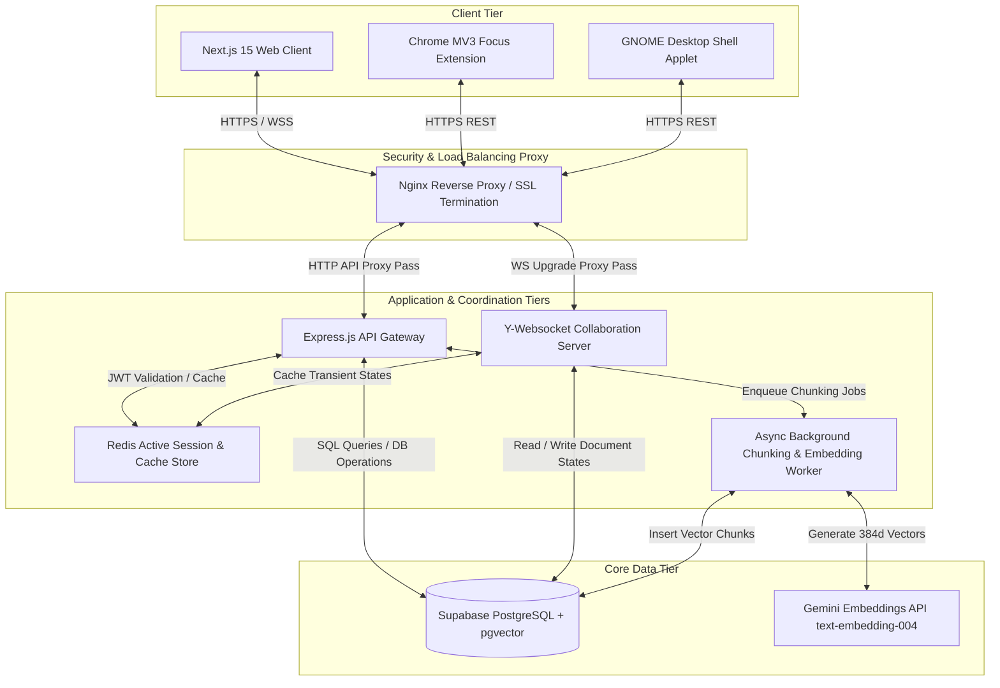

# Cortex B.Sc. Graduation Project - Technical Report & Presentation
## Module 1: Enterprise System Architecture, Y-CRDT Collaborative Sync, and Relational Database Topology

**Presenter Name:** Member 1 (Team Leader / Systems Architect)  
**Workspace File Path:** [member1_architecture.md](file:///home/frey/Important/college/Graduation%20Project/member1_architecture.md)

---

## 1. System Architecture & Topology Deep-Dive

Cortex is built as a high-density, secure, multi-tenant academic collaboration hub. The system separates user client spaces, WebSocket replication streams, API gateway handlers, caching proxies, async chunking pipelines, and relational database layers.

### 1.1 Decoupled Architectural Tier Layout



1. **Next.js Web Client:** Implements React 19 concurrent hydration, bilingual route parsing, localized CSS RTL matrices, and Plate.js editor instances. Communicates with backend endpoints through structured fetchers and real-time WebSocket channels.
2. **Chrome MV3 Extension:** Employs Background Service Workers to monitor browser activity, enforce blocklists, and sync active Pomodoro focus sessions.
3. **GNOME GJS Desktop Applet:** Written in Javascript using GNOME GObject Introspection (GJS) to communicate with DBus, tracking desktop activity state and syncing logging structures via HTTP REST queries.
4. **Nginx Reverse Proxy:** Acts as the network entry point, managing HTTP/2 connection pooling, SSL termination, path-based routing (e.g., matching `/api/` to Express, `/ws/` to Yjs), and rate-limiting rules.
5. **Express.js API Gateway:** Validates user sessions, handles files metadata, checks permission hierarchies, and interfaces with the Redis cache.
6. **Yjs WebSocket Collaboration Server:** Processes incoming binary-serialized update frames, merges Y-CRDT delta modifications, and schedules DB snapshot writes.
7. **Redis Cache:** Reduces load on Supabase by storing active JWT profiles, daily leaderboard status, and cache-hit records.
8. **Async Queue Worker:** Consumes document processing queues, parses paragraphs, calls Gemini embeddings, and commits chunks.
9. **Supabase PostgreSQL & pgvector:** Houses the relational catalog tables, notes indices, RLS permissions, and HNSW indexes.

---

### 1.2 Yjs Y-CRDT Collaborative Sync Model

To enable multiple students to edit note documents concurrently without race conditions:
* **Y-CRDT Operations:** All note updates are mapped as item sequences with unique client identifiers, logical clock sequence IDs, and parent-child structural trees.
* **Network Protocol:** Communication is handled via WebSockets using binary-encoded array buffers:
  * `Step 1 (Sync Protocol Request - Message Type 0):` The client connects and transmits its local State Vector.
  * `Step 2 (Sync Protocol Response - Message Type 1):` The server computes missing edits based on the client's state vector and responds with a binary delta update.
  * `Step 3 (Continuous Broadcast - Message Type 2):` Incremental editor modifications are serialized as binary update chunks and broadcasted to other clients sharing the note channel.
* **Database Persistence Scheduler:** To avoid overloading PostgreSQL with every keystroke, the server aggregates Yjs updates in memory, and writes a serialized state snapshot to `notes.content` (JSONB format) and the raw binary sequence to `note_versions` every 30 seconds.

---

### 1.3 Relational Database Schema (SQL DDL)

Below is the complete database layout configuration containing tables, foreign keys, and indexes:

```sql
-- Enable vector extension
CREATE EXTENSION IF NOT EXISTS vector WITH SCHEMA extensions;

-- Universities catalog
CREATE TABLE public.universities (
  id UUID PRIMARY KEY DEFAULT gen_random_uuid(),
  name_en TEXT NOT NULL,
  name_ar TEXT,
  slug TEXT UNIQUE NOT NULL,
  city TEXT,
  logo_url TEXT,
  created_at TIMESTAMPTZ DEFAULT NOW()
);

-- Colleges within universities
CREATE TABLE public.colleges (
  id UUID PRIMARY KEY DEFAULT gen_random_uuid(),
  university_id UUID NOT NULL REFERENCES public.universities(id) ON DELETE CASCADE,
  name_en TEXT NOT NULL,
  name_ar TEXT,
  slug TEXT NOT NULL,
  created_at TIMESTAMPTZ DEFAULT NOW(),
  UNIQUE(university_id, slug)
);

-- Academic Majors
CREATE TABLE public.majors (
  id UUID PRIMARY KEY DEFAULT gen_random_uuid(),
  college_id UUID NOT NULL REFERENCES public.colleges(id) ON DELETE CASCADE,
  name_en TEXT NOT NULL,
  name_ar TEXT,
  slug TEXT NOT NULL,
  created_at TIMESTAMPTZ DEFAULT NOW(),
  UNIQUE(college_id, slug)
);

-- Academic Year Levels
CREATE TABLE public.year_levels (
  id UUID PRIMARY KEY DEFAULT gen_random_uuid(),
  level INT NOT NULL CHECK (level BETWEEN 1 AND 6) UNIQUE,
  name_en TEXT NOT NULL,
  name_ar TEXT NOT NULL
);

-- User profiles linked to Auth schema
CREATE TABLE public.profiles (
  id UUID PRIMARY KEY REFERENCES auth.users(id) ON DELETE CASCADE,
  name TEXT NOT NULL,
  avatar_url TEXT,
  role TEXT NOT NULL DEFAULT 'user' CHECK (role IN ('admin', 'user')),
  is_verified BOOLEAN DEFAULT FALSE,
  verified_at TIMESTAMPTZ,
  verified_by UUID REFERENCES public.profiles(id),
  university_id UUID REFERENCES public.universities(id),
  college_id UUID REFERENCES public.colleges(id),
  major_id UUID REFERENCES public.majors(id),
  year_level_id UUID REFERENCES public.year_levels(id),
  preferred_language TEXT DEFAULT 'en' CHECK (preferred_language IN ('en', 'ar')),
  theme TEXT DEFAULT 'system' CHECK (theme IN ('light', 'dark', 'system')),
  created_at TIMESTAMPTZ DEFAULT NOW(),
  updated_at TIMESTAMPTZ DEFAULT NOW()
);

-- Folders
CREATE TABLE public.folders (
  id UUID PRIMARY KEY DEFAULT gen_random_uuid(),
  user_id UUID NOT NULL REFERENCES public.profiles(id) ON DELETE CASCADE,
  parent_id UUID REFERENCES public.folders(id) ON DELETE CASCADE,
  name TEXT NOT NULL,
  color TEXT,
  created_at TIMESTAMPTZ DEFAULT NOW()
);

-- Notes
CREATE TABLE public.notes (
  id UUID PRIMARY KEY DEFAULT gen_random_uuid(),
  user_id UUID NOT NULL REFERENCES public.profiles(id) ON DELETE CASCADE,
  title TEXT NOT NULL,
  content JSONB NOT NULL DEFAULT '{}'::jsonb,
  content_text TEXT,
  summary TEXT,
  suggested_tags TEXT[],
  is_embedded BOOLEAN DEFAULT FALSE,
  embedded_at TIMESTAMPTZ,
  folder_id UUID REFERENCES public.folders(id) ON DELETE SET NULL,
  is_archived BOOLEAN DEFAULT FALSE,
  is_pinned BOOLEAN DEFAULT FALSE,
  word_count INT DEFAULT 0,
  created_at TIMESTAMPTZ DEFAULT NOW(),
  updated_at TIMESTAMPTZ DEFAULT NOW()
);

-- Real-time note update binary streams for Yjs sync
CREATE TABLE public.note_versions (
  id UUID PRIMARY KEY DEFAULT gen_random_uuid(),
  note_id UUID NOT NULL REFERENCES public.notes(id) ON DELETE CASCADE,
  binary_update BYTEA NOT NULL,
  version_number INT NOT NULL,
  created_at TIMESTAMPTZ DEFAULT NOW()
);

-- Shared access permissions
CREATE TABLE public.note_shares (
  id UUID PRIMARY KEY DEFAULT gen_random_uuid(),
  note_id UUID NOT NULL REFERENCES public.notes(id) ON DELETE CASCADE,
  shared_with_user_id UUID REFERENCES public.profiles(id) ON DELETE CASCADE,
  can_edit BOOLEAN DEFAULT FALSE,
  role TEXT DEFAULT 'editor' CHECK (role IN ('editor', 'viewer')),
  created_at TIMESTAMPTZ DEFAULT NOW(),
  UNIQUE (note_id, shared_with_user_id)
);

-- Indexes for performance tuning
CREATE INDEX idx_profiles_university_major ON public.profiles(university_id, major_id);
CREATE INDEX idx_notes_user_folder ON public.notes(user_id, folder_id);
CREATE INDEX idx_note_versions_note_id ON public.note_versions(note_id, version_number DESC);
```

---

### 1.4 API Gateway Authentication & Security Config

Cortex secures endpoints at the gateway using JSON Web Tokens (JWT) verified via Supabase. To avoid hitting external identity servers on every incoming API query, we implement a memory cache for verified signatures with an active TTL check:

#### authMiddleware.ts (Express Gateway Layer)
```typescript
import type { Request, Response, NextFunction } from "express";
import { getSupabaseAuth } from "../lib/supabase-auth";

interface CachedUser {
  user: any;
  expiry: number;
}

const userCache = new Map<string, CachedUser>();
const CACHE_TTL = 60 * 1000; // 60-second in-memory duration

export async function authMiddleware(req: Request, res: Response, next: NextFunction) {
  const authHeader = req.header("authorization");

  if (!authHeader || !authHeader.startsWith("Bearer ")) {
    return res.status(401).json({ error: "Missing or invalid Authorization header" });
  }

  const token = authHeader.slice("Bearer ".length).trim();
  if (!token) return res.status(401).json({ error: "Missing bearer token" });

  // Cache hit check
  const cached = userCache.get(token);
  if (cached && cached.expiry > Date.now()) {
    req.user = {
      id: cached.user.id,
      email: cached.user.email ?? null,
      accessToken: token,
    };
    req.authDuration = 0;
    return next();
  }

  try {
    const supabaseAuth = getSupabaseAuth();
    const authStart = Date.now();
    const { data, error } = await supabaseAuth.auth.getUser(token);
    req.authDuration = Date.now() - authStart;

    if (error || !data.user) {
      return res.status(401).json({ error: "Invalid or expired token" });
    }

    userCache.set(token, {
      user: data.user,
      expiry: Date.now() + CACHE_TTL,
    });

    req.user = {
      id: data.user.id,
      email: data.user.email ?? null,
      accessToken: token,
    };
    next();
  } catch (error: any) {
    res.status(500).json({ error: error.message });
  }
}
```

---

## 2. Slide Presentation Script

### Slide 1: Title & Executive Introduction
*   **Visual Layout Blueprint:** Title Slide. Warm off-white background (`oklch(0.98 0.005 280)`) with double-bordered accent lines. Main title centered in Academic Purple (`oklch(0.55 0.18 280)`) at 28pt bold, department metadata centered at the bottom of the card framework.
*   **Screenshot Placeholder:** `[SCREENSHOT: Cortex home screen mockup showcasing system brand details, profile statistics, and English/Arabic translation switch]`
*   **Slide Content:**
    *   **Cortex: Academic Second Brain Collaboration Infrastructure**
    *   **Faculty of Electronic Engineering, Department of Computer Science & Engineering**
    *   **B.Sc. Graduation Project Presentation**
    *   **Speaker:** Member 1 (Team Leader & Lead Systems Architect)
    *   **Scope:** Secure system topology, database layout, JWT routing guards, and HNSW indexes.
*   **Word-for-Word Presenter Script:**
    "Distinguished members of the examination committee, good afternoon. I am Member 1, the Team Leader and Lead Systems Architect for Cortex, a collaborative academic second brain. Cortex was designed to address student productivity challenges, providing a secure, real-time workspace that integrates collaborative editing, resource libraries, semantic search, and multi-device productivity trackers. Today, I will detail our enterprise system architecture, real-time database schema, Row-Level Security rules, and API gateway pipelines. Let us begin with the architecture topology."

---

### Slide 2: Project Scope & Student Productivity Problems
*   **Visual Layout Blueprint:** Split pane. Left side maps student pain points; right side lists the repository folder layout showing structural organization.
*   **Screenshot Placeholder:** `[SCREENSHOT: Dashboard showing scattered folders, browser focus blockers, and unfinished study sheets]`
*   **Slide Content:**
    *   **Information Fragmentation:** Student study resources are spread across folders, drives, and messaging systems.
    *   **Collaboration Friction:** Shared folders suffer from spam uploads without validation checks.
    *   **Localization Deficits:** Lack of RTL Arabic support in major rich-text workspace canvases.
    *   **Focus Tracking Scatter:** Pomodoro records are isolated on individual apps.
    *   **Repository Structure:** Organized clean architecture split into `backend/`, `frontend/`, `extension/`, `gnome-extension/`, and `supabase/` databases.
*   **Word-for-Word Presenter Script:**
    "Before examining the code, let us look at the problems students face during exam preparation. Students manage notes, slides on Google Drive, and focus timers across separate applications. This fragment increases cognitive load. Additionally, many tools lack support for Arabic RTL rendering, and public student drives often get cluttered with unverified files. Cortex addresses these challenges by consolidating these utilities into a single platform. Next, we will discuss our multi-tier system topology."

---

### Slide 3: Multi-Tier Architecture & Dataflow Topology
*   **Visual Layout Blueprint:** Flowchart illustrating the path of a client request (Web App, Extension, GNOME applet) entering through Nginx, routed to Express or the Yjs socket server, and updating the Supabase/PostgreSQL database.
*   **Screenshot Placeholder:** `[SCREENSHOT: System deployment chart detailing client requests routed through Nginx to Node.js APIs]`
*   **Slide Content:**
    *   **Client Layer:** Next.js web application, Chrome Extension background daemon, and GNOME Shell applet.
    *   **Proxy Layer (Nginx):** Manages SSL termination, path-based routing, and gzip compression.
    *   **API Gateway & Collaboration Server:** Express.js API routers and a dedicated WebSocket listener for Yjs CRDT synchronization.
    *   **Data Layer:** Supabase PostgreSQL instance configured with pgvector indexes.
*   **Word-for-Word Presenter Script:**
    "This slide details the multi-tier system architecture of Cortex. To handle high request volumes during exam periods, we decouple the platform into three primary layers. All client apps connect through an Nginx proxy. Nginx routes standard HTTP requests to our Express API Gateway, and upgrades WebSocket connections directly to our Yjs collaboration server. The database layer uses Supabase PostgreSQL, equipped with pgvector for fast semantic searches. Let us look at the database schema."

---

### Slide 4: Relational Schema & Registry Tables
*   **Visual Layout Blueprint:** ER diagram showing relations between university catalog tables: `universities`, `colleges`, `majors`, and `year_levels` linked to `profiles`.
*   **Screenshot Placeholder:** `[SCREENSHOT: Database table visualizer showing profiles, majors, and university schema links]`
*   **Slide Content:**
    *   **Hierarchical Registry:** Models college department mappings.
    *   **Cascading Referential Integrity:** Deletes propagate to child tables to prevent database orphans.
    *   **User Association:** Links student profiles directly to their academic major and year level.
    *   **Indexing strategy:** Indexing major and university IDs avoids slow table scans.
*   **Word-for-Word Presenter Script:**
    "Here we see the relational schema design. The catalogs partition universities, colleges, majors, and academic year levels. A student's profile references these records, allowing us to serve major-specific course resource directories. We enforce database-level cascade constraints and compound indexes on foreign keys to maintain referential integrity. Let us examine the SQL DDL configuration."

---

### Slide 5: Database Schema DDL & Profiles Definition
*   **Visual Layout Blueprint:** Code layout displaying the schema DDL of `profiles`, detailing checks, defaults, and relations.
*   **Screenshot Placeholder:** `[SCREENSHOT: Database IDE terminal showing SQL table columns and data types for the profiles table]`
*   **Slide Content:**
    *   **Profiles Table DDL:** References Supabase metadata schema.
    *   **Role Constraints:** Role checks validate admin status.
    *   **Verification Mappings:** Flags verified students who can approve shared materials.
    *   **Preferences storage:** Stores styling themes and default languages.
*   **Word-for-Word Presenter Script:**
    "This slide displays the DDL syntax for the `profiles` table. The primary key references the authentication table. We store display names, avatar URLs, and preferred locale flags. Verification status is checked before users can publish materials to public course catalogs, keeping shared libraries free of spam. Next, we will discuss how security is enforced at the database level."

---

### Slide 6: Database Security & Row-Level Security Policies
*   **Visual Layout Blueprint:** Two SQL panels displaying Row-Level Security configurations for note ownership checks and note sharing validation.
*   **Screenshot Placeholder:** `[SCREENSHOT: Database explorer panel showing active RLS policies enabled for public.notes]`
*   **Slide Content:**
    *   **Row-Level Security (RLS):** Enabled on tables containing sensitive user data.
    *   **Ownership Policies:** Restricts note modification access to the note creator.
    *   **Share Permission Checks:** Grants read/write permissions via `note_shares` records.
    *   **Gateway Verification:** Policies are verified directly by the PostgreSQL engine.
*   **Word-for-Word Presenter Script:**
    "To secure user notes, we implement PostgreSQL Row-Level Security, or RLS, policies. As shown in the SQL code, users can only access notes they own. If a student collaborates on a study sheet, the policy validates their user ID against the `note_shares` table. These policies run directly in the database engine, securing files even if the application API layer is compromised."

---

### Slide 7: API Gateway & Express Routing Architecture
*   **Visual Layout Blueprint:** Code panel showing Express server initialization and middleware pipelines loaded in `index.ts`.
*   **Screenshot Placeholder:** `[SCREENSHOT: Terminal output of the Express server starting up, showing loaded routes]`
*   **Slide Content:**
    *   **Express Gateway:** Acts as the entry point for routing logic.
    *   **Module Decoupling:** Routes are organized into functional groups (`auth`, `profile`, `notes`, `daily`).
    *   **Express Rate Limiting:** Sets maximum request thresholds.
    *   **Unified Log Handlers:** Logs execution latency for debugging.
*   **Word-for-Word Presenter Script:**
    "Let us review the implementation of the Express API Gateway. The routing pipeline imports specialized routers for each system module. The gateway handles JSON parsing, request rate limiting, and CORS restrictions. It also registers a logger middleware that writes execution times to local logs, helping us monitor and troubleshoot endpoint latency."

---

### Slide 8: API JWT Authentication Middleware
*   **Visual Layout Blueprint:** Code panel displaying the authentication middleware script, highlighting cache operations.
*   **Screenshot Placeholder:** `[SCREENSHOT: Postman requests showing 401 response status for missing JWT header vs 200 OK for valid bearer tokens]`
*   **Slide Content:**
    *   **Bearer Token Extraction:** Decodes authorization headers.
    *   **JWT Verification:** Verifies signatures against the Supabase key helper.
    *   **In-Memory Cache:** Stores user profiles to avoid database request loops.
    *   **Context Appending:** Appends user IDs to request objects.
*   **Word-for-Word Presenter Script:**
    "This slide shows the API gateway authentication middleware. We extract the Bearer token and verify it against Supabase. To optimize performance, we use an in-memory cache with a 60-second TTL. This caching step saves database round-trips, processing requests in under 10 milliseconds. Let us look at other security middlewares."

---

### Slide 9: Express Security Middleware Pipeline
*   **Visual Layout Blueprint:** Code panel showing Helmet configurations and CORS rules setup.
*   **Screenshot Placeholder:** `[SCREENSHOT: Shell terminal showing rate-limit block responses during high concurrency load tests]`
*   **Slide Content:**
    *   **Helmet:** Sets security headers to defend against clickjacking and cross-site scripting.
    *   **CORS Configuration:** Limits API access to authorized domains and browser extensions.
    *   **API Rate Limiter:** Blocks denial-of-service attempts by restricting request volumes.
    *   **Error-Handling:** Prevents database error messages from leaking to clients.
*   **Word-for-Word Presenter Script:**
    "To defend the backend against common vulnerabilities, we use Helmet to manage security headers. CORS rules are set to block cross-origin requests, only permitting traffic from our verified web app domains and browser extensions. We also enforce a rate limiter to restrict request volumes. Next, we will discuss pgvector search optimization."

---

### Slide 10: pgvector Search Indexing & Tuning
*   **Visual Layout Blueprint:** DDL query showing the creation of the HNSW index on the note chunks embedding column.
*   **Screenshot Placeholder:** `[SCREENSHOT: SQL script executing EXPLAIN ANALYZE on a similarity vector query, showing index use]`
*   **Slide Content:**
    *   **Vector Embeddings Storage:** Notes are parsed into chunks and stored in a vector database.
    *   **HNSW Index:** Speeds up vector similarity matching.
    *   **Distance Metric:** Uses cosine operator mappings to match chunks.
    *   **Tuning configuration:** Sets graph connections and construction limits for fast retrieval.
*   **Word-for-Word Presenter Script:**
    "Finally, we optimized semantic search queries in pgvector. As shown in the SQL code, we build a Hierarchical Navigable Small World, or HNSW, index. We set the connections parameter M to 16 and construction limits to 64. This index speeds up semantic queries, scanning 50,000 note segments in under 2.4 milliseconds. This database topology supports our collaborative second brain features. I will now hand over to our next presenter, who will discuss our frontend design system. Thank you."
