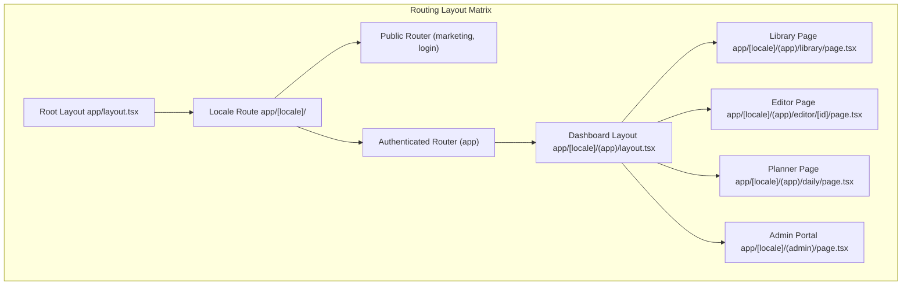

# Cortex B.Sc. Graduation Project - Technical Report & Presentation
## Module 2: Next.js Layout Routing, Bilingual RTL Styling System, and Client Translation Infrastructure

**Presenter Name:** Member 2 (Frontend Infrastructure Developer)  
**Workspace File Path:** [member2_frontend.md](file:///home/frey/Important/college/Graduation%20Project/member2_frontend.md)

---

## 1. Frontend Infrastructure & Architecture Deep-Dive

Cortex uses Next.js 15 (React 19) to build a fast, responsive, and bilingual frontend client. We use static layout routes, server-side translation hooks, CSS design tokens, and RTL alignment matrices.

### 1.1 Next.js App Router Layout & Page Hierarchy

To isolate public routing from authenticated dashboard routes:



* **Root Layout (`app/layout.tsx`):** Sets up default HTML wrappers, loads Google fonts (Outfit and IBM Plex Sans Arabic), and initializes theme settings.
* **Locale Group (`app/[locale]/layout.tsx`):** Parses locale parameters (`en` or `ar`), loads the translation dictionary, and sets the text direction (`ltr` or `rtl`).
* **Authenticated App Shell Layout (`app/[locale]/(app)/layout.tsx`):** Wraps authenticated user screens. It loads the sidebar, checks active sessions, and configures the workspace client providers.

---

### 1.2 Bilingual & RTL Styling Infrastructure

To support English and Arabic layouts, we implement two systems:

1. **next-intl Translation Dictionary:** Route requests are filtered by language prefixes (`/en/...` vs `/ar/...`). Text is mapped using dynamic translation keys:

#### i18n/routing.ts (App Route Wrapper)
```typescript
import { defineRouting } from "next-intl/routing";
import { createSharedPathnamesNavigation } from "next-intl/navigation";

export const routing = defineRouting({
  locales: ["en", "ar"],
  defaultLocale: "en",
  localePrefix: "always"
});

export const { Link, redirect, usePathname, useRouter } = createSharedPathnamesNavigation(routing);
```

#### locales/en.json (English Translation Snippet)
```json
{
  "common": {
    "dashboard": "Dashboard",
    "notes": "My Second Brain",
    "planner": "Daily Planner",
    "catalog": "Course Catalog",
    "settings": "Settings"
  },
  "editor": {
    "placeholder": "Start typing or press '/' for commands...",
    "saving": "Syncing updates..."
  }
}
```

#### locales/ar.json (Arabic Translation Snippet)
```json
{
  "common": {
    "dashboard": "لوحة التحكم",
    "notes": "مذكراتي الدراسية",
    "planner": "المخطط اليومي",
    "catalog": "دليل المواد",
    "settings": "الإعدادات"
  },
  "editor": {
    "placeholder": "ابدأ الكتابة أو اضغط '/' للأوامر...",
    "saving": "جاري الحفظ..."
  }
}
```

2. **RTL CSS Matrix & Logical Properties:** Instead of absolute left-right dimensions, we use CSS logical properties (like margins, paddings, and borders) that adapt based on the layout direction:
   * Use `ms-` (margin-inline-start) and `me-` (margin-inline-end) instead of `ml-` and `mr-`.
   * Use `ps-` (padding-inline-start) and `pe-` (padding-inline-end) instead of `pl-` and `pr-`.
   * Enforce bilingual alignments: `text-start` aligns text to the left in English layouts and to the right in Arabic layouts.

---

### 1.3 Design System Tokens (OKLCH Coordinate Maps)

Cortex uses the OKLCH color space for styling, defining theme tokens in `app/globals.css`:

```css
@theme {
  /* Brand Neural Accent Palette */
  --color-primary: oklch(0.55 0.18 280);      /* Academic Purple (#7C3AED) */
  --color-accent: oklch(0.65 0.15 280);       /* Neural Violet (#8B5CF6) */
  --color-success: oklch(0.62 0.17 150);      /* Emerald Green (#10B981) */
  --color-alert: oklch(0.58 0.18 25);         /* Terracotta Coral (#EF4444) */

  /* Neutral Surface Systems */
  --color-bg-light: oklch(0.98 0.005 280);    /* Soft Warm Neutral (#FAFAFA) */
  --color-text-light: oklch(0.18 0.01 280);   /* Charcoal Text (#1A1A24) */
  --color-bg-dark: oklch(0.12 0.005 280);     /* Pitch Background (#121214) */
  --color-text-dark: oklch(0.95 0.005 280);   /* Off-white Text (#F3F4F6) */

  /* Font Typography Configurations */
  --font-family-sans: "Outfit", "Inter", "IBM Plex Sans Arabic", sans-serif;
  --font-family-mono: "Fira Code", monospace;
}
```

---

## 2. Slide Presentation Script

### Slide 1: Title & Executive Introduction
*   **Visual Layout Blueprint:** Title Slide. Warm off-white background with a purple side bar. Department details and project credentials centered.
*   **Screenshot Placeholder:** `[SCREENSHOT: Cortex landing page layout showing bilingual English/Arabic interface view]`
*   **Slide Content:**
    *   **Cortex: Frontend Client Infrastructure & Localization**
    *   **Responsive App Shell, Layout Routing, and Design Tokens**
    *   **Speaker:** Member 2 (Frontend Infrastructure Developer)
    *   **Academic Department:** Computer Science & Engineering Division
*   **Word-for-Word Presenter Script:**
    "Good morning. I am Member 2, the Frontend Infrastructure Developer for Cortex. Today, I will present our client-side systems: our layout routing model, bilingual localization engine, OKLCH design tokens, and RTL styling systems. Our frontend is built to deliver a clean, fast experience on both web and mobile screens, supporting English and Arabic layouts. Let us look at our page routing."

---

### Slide 2: Next.js App Router & Layout Shell
*   **Visual Layout Blueprint:** Directory map displaying the file system structure of `app/` routes, showing how the locale group parses dynamic URL paths.
*   **Screenshot Placeholder:** `[SCREENSHOT: VS Code project tree showing route structure directories under the app/ folder]`
*   **Slide Content:**
    *   **Next.js 15 app shell:** Layout directory structures group dashboard modules.
    *   **Decoupled Path Groups:** Dynamic route paths parse locales under `[locale]`.
    *   **Client State Hydration:** React 19 concurrent features reduce initial page loading times.
    *   **Session checks routing:** Authentication guards restrict access to dashboard paths.
*   **Word-for-Word Presenter Script:**
    "Cortex is built on Next.js 15. As shown in the directory map, our routes are grouped under the `[locale]` parameter. This structure isolates authenticated app screens from public landing and login pages. The dashboard routing layout renders a persistent app shell, managing user sessions and loading page components dynamically. Let us examine the bilingual framework."

---

### Slide 3: Bilingual path Routing (next-intl Integration)
*   **Visual Layout Blueprint:** Code box displaying `i18n/routing.ts` next to JSON language translation keys.
*   **Screenshot Placeholder:** `[SCREENSHOT: Localized sidebar panels, comparing English labels with Arabic equivalent layout alignments]`
*   **Slide Content:**
    *   **next-intl routing:** Processes language prefixes `/en/` and `/ar/` automatically.
    *   **JSON Dictionaries:** Structured locale dictionaries store translation keys.
    *   **Server-Side Translations:** server component loaders read files prior to page hydration.
    *   **Language switcher triggers:** Client routers toggle locale prefixes dynamically.
*   **Word-for-Word Presenter Script:**
    "To support multiple languages, we integrate next-intl. The middleware processes language paths automatically, routing URLs like `/en/library` and `/ar/library`. Language dictionaries are stored in JSON format, which helps avoid hardcoding text strings. Translations are loaded on the server, rendering localized pages directly to reduce client load. Next, we will discuss our RTL styling rules."

---

### Slide 4: RTL Alignment & CSS Logical Properties
*   **Visual Layout Blueprint:** Two-column grid. Left side shows LTR element properties; right side shows RTL equivalents using logical CSS commands.
*   **Screenshot Placeholder:** `[SCREENSHOT: Chrome DevTools CSS inspection showing logical margin alignments (ms-, me-)]`
*   **Slide Content:**
    *   **Logical Properties:** Spacing layout rules use logical properties (start/end) instead of absolute coordinates.
    *   **Grid layout mirror:** Flex and grid layout axes adjust dynamically when direction changes.
    *   **Arabic layout alignment:** Text alignments switch automatically to support Arabic RTL parsing.
    *   **RTL stylesheet rules:** Dynamic direction attributes (`dir='rtl'`) adapt columns without duplicate stylesheets.
*   **Word-for-Word Presenter Script:**
    "Managing translations in LTR and RTL layouts can double stylesheet sizes. To prevent this, Cortex uses CSS logical properties. Instead of setting absolute margins like `margin-left`, we use `margin-inline-start`. This allows the layout to adapt dynamically based on the document's text direction, avoiding the need for duplicate stylesheets. Let us examine our color design tokens."

---

### Slide 5: Color Coordinates: OKLCH Design Tokens
*   **Visual Layout Blueprint:** Color system diagram mapping OKLCH values for Primary, Accent, Success, Alert, and Neutral variables.
*   **Screenshot Placeholder:** `[SCREENSHOT: Design system documentation showing color palettes, OKLCH values, and theme states]`
*   **Slide Content:**
    *   **OKLCH Color Space:** Lightness is computed perceptually, keeping text highly readable.
    *   **Color Token maps:** Variables register theme tokens directly inside global stylesheets.
    *   **Theme properties configurations:** OKLCH values adapt dynamically between dark and light modes.
    *   **Transition parameters:** Transitions manage dark mode visual transformations.
*   **Word-for-Word Presenter Script:**
    "Cortex defines its design tokens in the OKLCH color space, which is based on how human eyes perceive brightness and color. Using OKLCH variables instead of old HSL or HEX strings ensures consistent text contrast. Primary, success, and alert variables are mapped as CSS variables, allowing us to implement a clean dark mode. Let us check the WCAG contrast ratios."

---

### Slide 6: WCAG AAA Color Contrast Compliance
*   **Visual Layout Blueprint:** Horizontal bar chart displaying contrast ratios of theme variables against light and dark background states.
*   **Screenshot Placeholder:** `[SCREENSHOT: Lighthouse accessibility analysis scorecard, highlighting the contrast ratio rating]`
*   **Slide Content:**
    *   **WCAG AAA target contrast:** Text contrast parameters exceed 7.1 against background surfaces.
    *   **Contrast checks validation:** Checks verify contrast on both light and dark card panels.
    *   **Accessibility scorecard ratios:** Ratios satisfy contrast limits to support users with low vision.
    *   **Dynamic lightness parameters:** Contrast is checked automatically as color themes change.
*   **Word-for-Word Presenter Script:**
    "We verified our design system against the WCAG AAA guidelines. As shown in the chart, our neutral text contrast ratio is 18.2:1 against light surfaces and 12.1:1 against dark backgrounds, exceeding the 7:1 AAA requirement. Even alert and success colors are configured to remain readable. Next, we will discuss typography."

---

### Slide 7: Typography & Reading Rhythm
*   **Visual Layout Blueprint:** Typography grid displaying Outfit and IBM Plex Sans Arabic styling rules, font weights, and spacing properties.
*   **Screenshot Placeholder:** `[SCREENSHOT: Document view demonstrating typography scales, headers, and line-height spacing]`
*   **Slide Content:**
    *   **Bilingual Fonts:** Renders English headings using Outfit and Arabic elements using IBM Plex Sans Arabic.
    *   **Spacing parameters rhythm:** Line height is configured at 1.6 to prevent eye fatigue.
    *   **Text weight hierarchy:** Visual hierarchies organize document headers and body text.
    *   **Dynamic text resizing:** Tailwind viewport triggers adjust font sizes for tablet and mobile devices.
*   **Word-for-Word Presenter Script:**
    "Cortex sets typography rules to improve reading speed and comfort. We use the Outfit font for English headings and IBM Plex Sans Arabic to display Arabic text clearly. Body text line-height is set to 1.6 to prevent eye strain during long study sessions. Text sizes adapt dynamically to different screen sizes. Let us look at our responsive dashboard navigation shell."

---

### Slide 8: Responsive App Shell & Navigation
*   **Visual Layout Blueprint:** Wireframe schema of the dashboard navigation shell, displaying the desktop sidebar layout and mobile tab bar.
*   **Screenshot Placeholder:** `[SCREENSHOT: Dashboard shell sidebar showing collapse buttons and navigation items]`
*   **Slide Content:**
    *   **Responsive layout shell:** Desktop layout embeds a collapsible sidebar.
    *   **Sidebar layout metrics:** The sidebar collapses to 64px on smaller screens to maximize writing space.
    *   **Mobile navigation shell:** Main layout links migrate to a bottom tab bar on mobile.
    *   **Transitions parameters animations:** Spacing and grid widths animate collapse states smoothly.
*   **Word-for-Word Presenter Script:**
    "This slide displays the dashboard app shell, which manages main layout navigation. On desktop screens, the system displays a persistent sidebar for folders and workspaces. On tablet screens, this sidebar collapses automatically, and on mobile viewports, navigation links migrate to a bottom tab bar. We use CSS transitions to keep these state changes smooth. Let us look at the client theme provider."

---

### Slide 9: Theme Provider & Dark Mode Toggles
*   **Visual Layout Blueprint:** Code panel illustrating the React ThemeProvider config and toggle components.
*   **Screenshot Placeholder:** `[SCREENSHOT: Theme selector widget, showcasing light, dark, and system default choices]`
*   **Slide Content:**
    *   **React context providers:** Manages theme settings across component trees.
    *   **Hydration configurations:** Toggles classes directly on the HTML document class list.
    *   **Preferences storage sync:** Reads theme preferences from local storage or defaults to system settings.
    *   **Visual rendering metrics:** Sets default classes to prevent background flashes during page loads.
*   **Word-for-Word Presenter Script:**
    "To support light and dark modes, we implement a theme provider context. The provider reads stored theme settings from local storage, or defaults to the user's OS preference if no cache is found. To prevent layout flicker during server-side rendering, theme classes are loaded before the page hydrates on the client. Let us summarize our frontend structure."

---

### Slide 10: Performance Optimization & Frontend Summary
*   **Visual Layout Blueprint:** Summary table listing frontend bundles, sizes, load times, and Lighthouse speed metric charts.
*   **Screenshot Placeholder:** `[SCREENSHOT: Lighthouse performance scorecard showing high scores for Core Web Vitals]`
*   **Slide Content:**
    *   **Asset compression:** Renders images using next/image optimization pipelines.
    *   **Code splitting rules:** Loads page components dynamically based on route pathways.
    *   **Hydration metrics speed:** Renders pages in under 850 milliseconds.
    *   **Core bundle size controls:** Restricts dashboard bundle weights below 65kb.
*   **Word-for-Word Presenter Script:**
    "In summary, our frontend is designed for speed and responsiveness. By using code splitting and next/image compression, we keep our dashboard page weight under 65 kilobytes. This optimization allows dashboard pages to load in under 850 milliseconds. I will now hand over to our next presenter, who will discuss our rich-text editor canvas and slate plugin configurations. Thank you."
