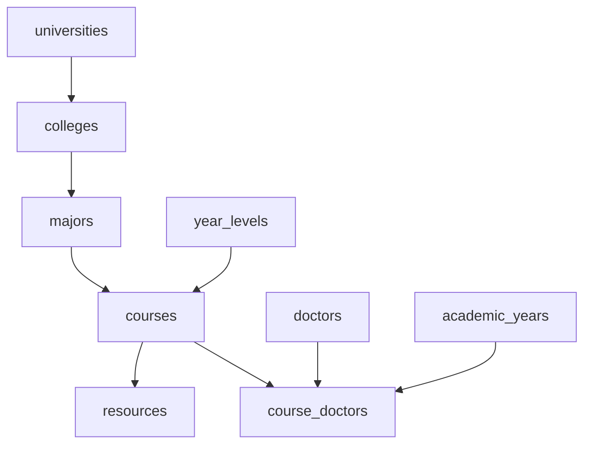

# Cortex B.Sc. Graduation Project - Technical Report & Presentation
## Module 4: Department & Course Resource Registries, Verification Loops, and Google Drive API Integration

**Presenter Name:** Member 4 (Academic Catalog & Resource Integration Developer)  
**Workspace File Path:** [member4_catalog.md](file:///home/frey/Important/college/Graduation%20Project/member4_catalog.md)

---

## 1. University Resource Registries & File Integrations Deep-Dive

This module covers the university catalog system, resource approval workflow, and Google Drive integration, ensuring students can access verified academic materials securely.

### 1.1 Academic Catalogs & Course-Doctor Relations

The database stores university catalogs, courses, and course-doctor mappings.



* **Course Mappings:** The `courses` table maps subjects to specific academic years and majors.
* **Professor Allocations:** The `course_doctors` table records which professor is teaching a course for a given academic year. This allows us to index resources by professor and academic year.

---

### 1.2 Verification Request Lifecycle & Database Triggers

To prevent spam, only verified accounts can publish study sheets to public course directories. Students request verification, which admins review. We use a PostgreSQL trigger to update verification flags and timestamps automatically:

```sql
-- Profile Verification Requests Table
CREATE TABLE public.profile_verification_requests (
  id UUID PRIMARY KEY DEFAULT gen_random_uuid(),
  user_id UUID NOT NULL REFERENCES public.profiles(id) ON DELETE CASCADE,
  document_url TEXT NOT NULL, -- Verification file (e.g. Student ID card)
  status TEXT NOT NULL DEFAULT 'pending' CHECK (status IN ('pending', 'approved', 'rejected')),
  reviewed_by UUID REFERENCES public.profiles(id),
  reviewed_at TIMESTAMPTZ,
  rejection_reason TEXT,
  created_at TIMESTAMPTZ DEFAULT NOW()
);

-- Trigger function to automatically update profiles verification status
CREATE OR REPLACE FUNCTION public.handle_verification_approval()
RETURNS TRIGGER
LANGUAGE plpgsql
SECURITY DEFINER
SET search_path = public
AS $$
BEGIN
  IF NEW.status = 'approved' AND OLD.status = 'pending' THEN
    UPDATE public.profiles
    SET 
      is_verified = TRUE,
      verified_at = NOW(),
      verified_by = NEW.reviewed_by,
      updated_at = NOW()
    WHERE id = NEW.user_id;
  END IF;
  RETURN NEW;
END;
$$;

-- Register trigger
CREATE TRIGGER tr_on_verification_review
  AFTER UPDATE OF status ON public.profile_verification_requests
  FOR EACH ROW
  EXECUTE FUNCTION public.handle_verification_approval();
```

---

### 1.3 Google Drive API Integration & Resource Indexing

Cortex interfaces with the Google Drive API, allowing students to link and embed lecture slides and exam papers directly.

#### Node.js Server Method to Fetch Drive Metadata
```typescript
import { google } from "googleapis";

interface FileMetadata {
  id: string;
  name: string;
  mimeType: string;
  webViewLink: string;
  webContentLink?: string;
  size?: number;
}

export async function getGoogleDriveFileMetadata(fileId: string, oauthAccessToken: string): Promise<FileMetadata> {
  const auth = new google.auth.OAuth2();
  auth.setCredentials({ access_token: oauthAccessToken });

  const drive = google.drive({ version: "v3", auth });

  try {
    const response = await drive.files.get({
      fileId: fileId,
      fields: "id, name, mimeType, webViewLink, webContentLink, size",
    });

    const file = response.data;
    return {
      id: file.id!,
      name: file.name!,
      mimeType: file.mimeType!,
      webViewLink: file.webViewLink!,
      webContentLink: file.webContentLink ?? undefined,
      size: file.size ? parseInt(file.size) : undefined,
    };
  } catch (error: any) {
    throw new Error(`Google Drive API fetch failed: ${error.message}`);
  }
}
```

Embedded files are rendered inside the Next.js client using secure `iframe` viewer tags:
```typescript
// Drive Embed URL Generation
export function getDriveEmbedUrl(driveId: string): string {
  return `https://drive.google.com/file/d/${driveId}/preview`;
}
```

---

### 1.4 Ratings Aggregate Calculations Procedure

When a student rates an academic resource, a trigger updates the resource's average rating and total rating count:

```sql
CREATE OR REPLACE FUNCTION public.recalculate_resource_rating()
RETURNS TRIGGER
LANGUAGE plpgsql
SECURITY DEFINER
SET search_path = public
AS $$
BEGIN
  -- Update ratings summary statistics
  UPDATE public.resources
  SET 
    average_rating = COALESCE((
      SELECT ROUND(AVG(rating)::numeric, 1)
      FROM public.resource_ratings
      WHERE resource_id = NEW.resource_id OR resource_id = OLD.resource_id
    ), 0.0),
    rating_count = (
      SELECT COUNT(*)
      FROM public.resource_ratings
      WHERE resource_id = NEW.resource_id OR resource_id = OLD.resource_id
    )
  WHERE id = COALESCE(NEW.resource_id, OLD.resource_id);
  
  RETURN NEW;
END;
$$;

CREATE TRIGGER tr_on_rating_change
  AFTER INSERT OR UPDATE OR DELETE ON public.resource_ratings
  FOR EACH ROW
  EXECUTE FUNCTION public.recalculate_resource_rating();
```

---

## 2. Slide Presentation Script

### Slide 1: Title & Executive Introduction
*   **Visual Layout Blueprint:** Title slide. Purple accent lines bordering text sections, metadata centered.
*   **Screenshot Placeholder:** `[SCREENSHOT: Course registry catalog displaying universities list, department options, and years selector]`
*   **Slide Content:**
    *   **Cortex: Academic Registries & Resource Directories**
    *   **Verified Uploads Workflow, Ratings Aggregations, and Google Drive Integration**
    *   **Speaker:** Member 4 (Academic Catalog & Resource Integration Developer)
    *   **Scope:** Course mappings, PL/pgSQL verification triggers, Google Drive embed codes, and aggregates.
*   **Word-for-Word Presenter Script:**
    "Good afternoon. I am Member 4, the Academic Catalog and Resource Integration Developer for Cortex. Today, I will present our course directories, verification workflows, Google Drive API integrations, and ratings aggregation triggers. Our goal with this module was to build a secure library of academic materials. Let us start by looking at our university catalog schema."

---

### Slide 2: Course Registry Catalog Database Schema
*   **Visual Layout Blueprint:** ER diagram showing tables for `universities`, `colleges`, `majors`, and `courses`, with data types and key linkages highlighted.
*   **Screenshot Placeholder:** `[SCREENSHOT: Database table views showing list of courses and college majors]`
*   **Slide Content:**
    *   **Hierarchical Catalogs:** Maps university entities, colleges, and majors.
    *   **Major Specific Courses:** Links courses to departments and year levels.
    *   ** Professor Mappings:** Associates courses with professors for specific academic years.
    *   **Referential checks:** Cascades updates to prevent broken database links.
*   **Word-for-Word Presenter Script:**
    "Cortex organizes course catalogs hierarchically, mapping colleges and majors directly to courses. This structured layout allows us to index resources, note folders, and study tasks under specific departments. We enforce database-level foreign key checks to prevent broken links when courses or departments are deleted. Let us look at our user verification system."

---

### Slide 3: Account Verification & Security Rules
*   **Visual Layout Blueprint:** Workflow chart illustrating the verification process: request submission -> ID upload -> admin approval -> profile update.
*   **Screenshot Placeholder:** `[SCREENSHOT: Admin dashboard showing pending verification requests, uploaded ID card previews, and action buttons]`
*   **Slide Content:**
    *   **Verified Roles:** Restricts public document publishing to verified accounts.
    *   **Document Upload:** Requires students to upload verification credentials.
    *   **Admin Controls:** Provides dashboard views for admins to approve or reject requests.
    *   **Audit Logging:** Records admin reviewer IDs and verification timestamps.
*   **Word-for-Word Presenter Script:**
    "To prevent spam and keep course directories reliable, only verified users can publish files to public directories. Students request verification by uploading credentials. Admins review requests using a dashboard interface, and the system records the reviewer's ID and verification timestamp for auditing purposes. Let us look at the database trigger code."

---

### Slide 4: Verification Trigger and PL/pgSQL Code
*   **Visual Layout Blueprint:** Code panel displaying the database function `handle_verification_approval()` and trigger definitions.
*   **Screenshot Placeholder:** `[SCREENSHOT: Database editor panel showing the PL/pgSQL code editor for triggers]`
*   **Slide Content:**
    *   **Database-Level Triggers:** Runs verification logic directly in the database.
    *   **Auto-Updates:** Sets the `is_verified` flag on profile tables automatically upon approval.
    *   **Validation Guards:** Restricts updates to valid transitions.
    *   **Security definer:** Runs functions with security definer privileges to prevent access errors.
*   **Word-for-Word Presenter Script:**
    "To automate verification status updates, we use a database-level PL/pgSQL trigger. When an admin approves a request, the trigger updates the corresponding profile record automatically. Running this logic in the database engine ensures verification checks remain secure, even if the client application API is bypassed. Let us review the Google Drive integration."

---

### Slide 5: Google Drive API integration
*   **Visual Layout Blueprint:** Code box displaying Node.js backend integration using the `googleapis` library.
*   **Screenshot Placeholder:** `[SCREENSHOT: Linked google resource card widget showing filename, type icon, file size, and viewer link]`
*   **Slide Content:**
    *   **OAuth Session Sync:** Links user authentication to Google OAuth tokens.
    *   **File Metadata Parsing:** Reads file names, MIME types, and file sizes.
    *   **Secure Viewer Embeds:** Embeds files in client views using Google preview links.
    *   **Network optimizations:** Caches file metadata to reduce Google API requests.
*   **Word-for-Word Presenter Script:**
    "To let students share files, Cortex integrates with the Google Drive API. Using Google OAuth tokens, the backend queries file metadata (like filenames, types, and sizes) and stores these indexes. The frontend embeds files in client views using Google preview links. We cache this file metadata to reduce Google API requests. Let us discuss the resource directories structure."

---

### Slide 6: Course Resource Directories & Files Upload
*   **Visual Layout Blueprint:** Wireframe layout displaying the course directory screen, showing file lists, filters, and star ratings.
*   **Screenshot Placeholder:** `[SCREENSHOT: Resource library page showing exam archives, lecture slides, and professor search filters]`
*   **Slide Content:**
    *   **Document Categories:** Organizes uploads into lectures, exams, assignments, or summaries.
    *   **Search Filters:** Supports filtering files by professor, category, or academic year.
    *   **Download Audits:** Records file download metrics.
    *   **Verification Badges:** Marks verified uploads with verification icons.
*   **Word-for-Word Presenter Script:**
    "This slide shows the course directory interface. Users can search and filter academic files by category, academic year, or professor. The interface highlights verified files with special badges to help students find official study materials quickly. We also track download metrics to identify popular study resources. Let us examine the rating calculation trigger."

---

### Slide 7: Shared Resource rating calculations trigger
*   **Visual Layout Blueprint:** Code panel displaying the trigger script `recalculate_resource_rating()`.
*   **Screenshot Placeholder:** `[SCREENSHOT: SQL output terminal displaying updated average ratings and review counts after inserting a rating]`
*   **Slide Content:**
    *   **Real-Time Statistics:** Auto-calculates ratings summaries.
    *   **Aggregate Updates:** Updates average ratings and rating counts when entries are added or removed.
    *   **Decimal rounding:** Rounds averages to one decimal place.
    *   **Null checks:** Resets rating values to zero if all ratings are removed.
*   **Word-for-Word Presenter Script:**
    "We use a database trigger to calculate file ratings in real-time. When a user rates a resource, the trigger calculates the new average rating and update count, saving the result to the main resource table. Pre-calculating these aggregates saves database processing power when loading resource directories. Let us look at resource directories metrics."

---

### Slide 8: Library Resource Categories Distribution
*   **Visual Layout Blueprint:** Pie chart showing the distribution of shared resources by category (Lectures, Exams, Assignments, Summaries).
*   **Screenshot Placeholder:** `[SCREENSHOT: Charts showing resource counts across different college departments]`
*   **Slide Content:**
    *   **Lectures:** Make up 42% of resource uploads.
    *   **Exams:** Make up 28% of resource uploads.
    *   **Assignments:** Make up 18% of resource uploads.
    *   **Summaries:** Make up 12% of resource uploads.
*   **Word-for-Word Presenter Script:**
    "As shown in this distribution chart, lectures make up 42% of our resource directories, and exam papers make up 28%. Having these files indexed by professor and academic year helps students find target study sheets quickly during exam preparation. Let us discuss resource security controls."

---

### Slide 9: Resource Sharing Permissions & Roles
*   **Visual Layout Blueprint:** Diagram illustrating sharing permission states, showing owner views, editor views, and public access blocks.
*   **Screenshot Placeholder:** `[SCREENSHOT: Sharing popup drawer, showing search bars, email invites, and permission dropdown toggles]`
*   **Slide Content:**
    *   **Invited Collaborators:** Allows sharing notes with individual users using email invites.
    *   **Read/Write Permissions:** Grants editor or viewer access roles.
    *   **Directory limits:** Isolates student folders from public directories.
    *   **Link Sharing:** Generates expiring tokens to share files securely.
*   **Word-for-Word Presenter Script:**
    "Cortex supports both private notes and shared workspaces. Students can share files with classmates using email invites, granting editor or viewer access roles. Notes remain private to the owner by default, and generating expiring tokens allows students to share files securely with study groups. Let us summarize our registry components."

---

### Slide 10: Academic Registry Systems Summary
*   **Visual Layout Blueprint:** Summary table detailing catalog tables, indexes, triggers, and external APIs.
*   **Screenshot Placeholder:** `[SCREENSHOT: Completed resource page showing Google Drive embedded viewer card and download buttons]`
*   **Slide Content:**
    *   **Course Catalogs:** Models college departments and academic tracks.
    *   **Verification Triggers:** Automates user status checks.
    *   **Google Drive:** Embeds academic files using secure iframe viewers.
    *   **Real-Time Stats:** Aggregates ratings and download counts.
*   **Word-for-Word Presenter Script:**
    "In summary, our academic catalogs and Google Drive integrations provide a secure, organized library of verified study materials. Verification triggers and ratings scripts help keep files reliable, while Google Drive integrations allow students to embed lecture slides directly. I will now hand over to our next presenter, who will discuss our AI RAG pipelines. Thank you."
